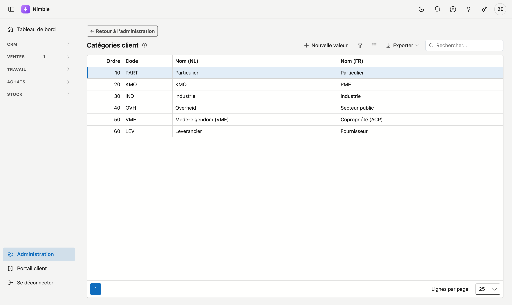

# Catégories de clients

Les **catégories de clients** vous permettent de structurer votre fichier par type : particulier,
architecte, entrepreneur, syndic … Vous choisissez vous-même les catégories utiles à votre métier.

## Ouvrir l'écran

1. Cliquez sur **Administration** en bas de la barre latérale.
2. Dans le groupe **Relations**, cliquez sur la tuile **Catégories client**.

## Où la catégorie est utilisée

- Sur la **fiche client**, dans le bloc Classification.
- Sur un **lead**, dans le bloc Contact. Si vous convertissez le lead en client, la catégorie suit — vous
  ne devez donc pas la choisir à nouveau.

La catégorie sert uniquement à votre propre classement : Nimble n'en calcule rien et aucun prix ou remise
n'y est lié. Elle est pratique pour filtrer et pour voir avec quel type de clients vous travaillez.

## Ajouter ou modifier une catégorie

Cliquez sur **Nouvelle valeur**, ou double-cliquez sur une ligne existante. Une fenêtre s'ouvre avec les champs ci-dessous et les boutons **Enregistrer** et **Annuler** ; pour une valeur existante, **Supprimer** figure aussi à droite. **Exporter**, au-dessus de la liste, récupère la liste dans un fichier.

| Champ | Remarque |
|---|---|
| **Ordre** | Détermine la place dans la liste de choix ; le plus petit chiffre en haut |
| **Code** | Votre propre clé courte — obligatoire et unique |
| **Nom (NL)** et **Nom (FR)** | Le nom dans la langue de base de votre entreprise est obligatoire ; l'autre langue porte la mention *optionnel*. Si elle reste vide, le nom dans la langue de base s'affiche |

!!! info "L'ordre détermine la liste de choix"
    Placez en haut les catégories que vous utilisez le plus souvent. Cela évite de faire défiler à chaque
    nouveau client.

## Supprimer une catégorie

**Supprimer** archive la catégorie : elle disparaît des listes de choix, mais les clients qui la portent
déjà la conservent. Les anciennes informations restent ainsi lisibles. La [corbeille](recycle-bin.md) permet de la
récupérer.

## Erreurs fréquentes

!!! warning
    - **Trop de catégories** — une liste de trente est en pratique une liste que personne ne remplit de
      façon cohérente. Commencez petit et ajoutez ce qui vous manque réellement.
    - **Confondre catégorie et type** — le fait qu'une relation soit client ou fournisseur figure
      séparément sur la fiche. La catégorie indique de quel *type* de client il s'agit.

## Voir aussi

- [Relations](../relations.md)
- [Leads](../crm/leads.md)
