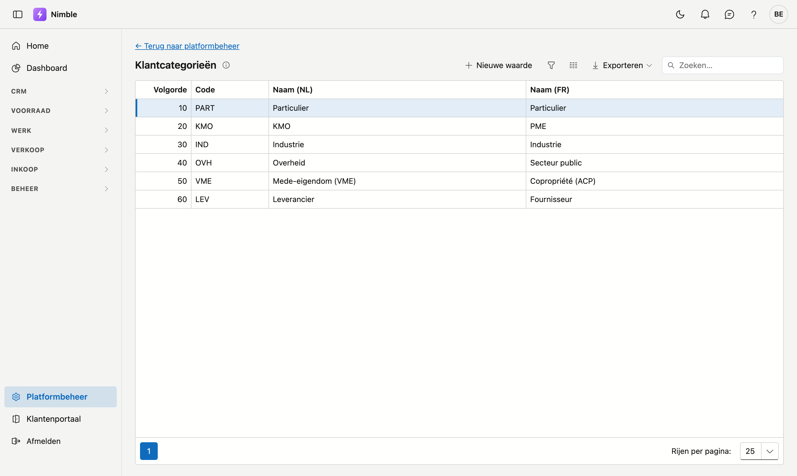

# Klantcategorieën

Met **klantcategorieën** deelt u uw klantenbestand in naar soort: particulier, architect, aannemer,
syndicus … U kiest zelf welke categorieën zinvol zijn voor uw werk.

## Het scherm openen

1. Klik onderaan in de zijbalk op **Platformbeheer**.
2. Klik in de groep **Relaties** op de tegel **Klantcategorieën**.

## Waar de categorie gebruikt wordt

- Op de **klantenfiche**, in het blok Classificatie.
- Op een **lead**, in het blok Contact. Zet u de lead om naar klant, dan gaat de categorie mee — u hoeft
  ze dus niet opnieuw te kiezen.

De categorie is puur voor uw eigen indeling: Nimble rekent er niets mee en er hangt geen prijs of korting
aan. Ze is handig om te filteren en om te zien met wat voor klanten u werkt.

## Een categorie toevoegen of wijzigen

Klik **Nieuwe waarde**, of dubbelklik een bestaande rij.

| Veld | Opmerking |
|---|---|
| **Volgorde** | Bepaalt de plaats in de keuzelijst; laagste getal bovenaan |
| **Code** | Uw eigen korte sleutel — verplicht en uniek |
| **Naam (NL)** | Verplicht; dit is wat men ziet op een Nederlandstalig scherm |
| **Naam (FR)** | Optioneel; leeg laten betekent dat de Nederlandse naam ook in het Frans verschijnt |

!!! info "Volgorde bepaalt de keuzelijst"
    Zet de categorieën die u het vaakst gebruikt bovenaan. Dat scheelt scrollen bij elke nieuwe klant.

## Een categorie verwijderen

**Verwijderen** archiveert de categorie: ze verdwijnt uit de keuzelijsten, maar klanten die ze al dragen
houden ze gewoon. Zo blijft oude informatie leesbaar. Terughalen kan via de prullenbak.

## Veelgemaakte fouten

!!! warning
    - **Te veel categorieën** — een lijst van dertig is in de praktijk een lijst die niemand consequent
      invult. Begin klein en voeg toe wat u echt mist.
    - **Categorie verwarren met type** — of iemand klant of leverancier is, staat apart op de fiche. De
      categorie zegt wat voor *soort* klant het is.

## Zie ook

- [Relaties](../relations.md)
- [Leads](../crm/leads.md)
