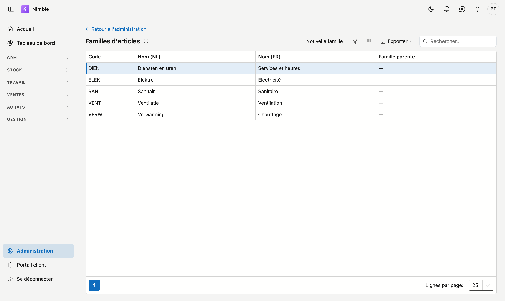

# Familles d'articles

Les **familles d'articles** organisent votre catalogue en groupes : familles et (optionnellement) sous-familles, deux niveaux maximum. Vous filtrez et rapportez ainsi plus facilement par type d'article.

## Ouvrir l'écran

1. Cliquez sur **Administration** en bas de la barre latérale.
2. Dans le groupe **Articles**, cliquez sur la tuile **Familles d'articles**.

## La liste

| Colonne | Signification |
|---|---|
| **Code** | Code court et unique de la famille |
| **Nom (NL)** | Nom néerlandais (obligatoire) |
| **Nom (FR)** | Nom français (optionnel) |
| **Famille parente** | La famille principale dont dépend cette sous-famille ; `—` = famille principale |

Double-cliquez une ligne pour modifier, ou cliquez sur **Nouvelle famille**.

## Créer ou modifier une famille

1. Remplissez le **Code** et le **Nom (NL)** — les deux sont obligatoires.
2. Remplissez optionnellement le **Nom (FR)** ; il s'affiche pour les utilisateurs francophones.
3. Choisissez éventuellement une **famille parente**. Vide = famille principale.
4. Cliquez sur **Enregistrer**.

!!! tip "Deux niveaux"
    Seules les familles principales peuvent servir de famille parente. Une sous-famille ne peut pas avoir de sous-familles.

## Supprimer

Ouvrez la famille et cliquez sur **Supprimer**. La famille est archivée (corbeille) et disparaît des listes ; les articles existants sont conservés.

## Erreurs fréquentes

!!! warning
    - **Nom français oublié** — les utilisateurs francophones voient alors le nom néerlandais en secours.
    - **Tout sur un seul niveau** — utilisez des sous-familles pour un classement plus fin plutôt que de multiplier les familles principales.

## Voir aussi

- [Administration](platform-management.md)
- [Unités de mesure](units.md)
