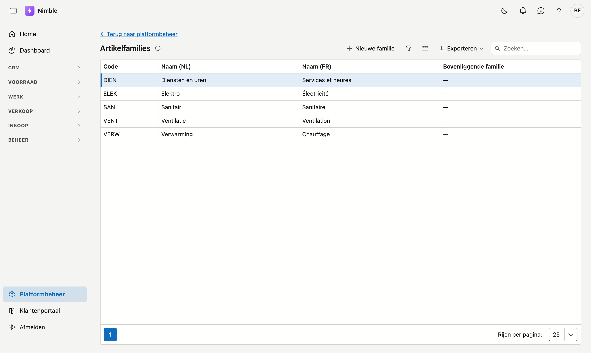

# Artikelfamilies

Met **artikelfamilies** deelt u uw artikelcatalogus in groepen in: families en (optioneel) subfamilies, maximaal twee niveaus. Zo filtert en rapporteert u makkelijker op soorten artikelen.

## Het scherm openen

1. Klik onderaan in de zijbalk op **Platformbeheer**.
2. Klik in de groep **Artikelen** op de tegel **Artikelfamilies**.

## De lijst

| Kolom | Betekenis |
|---|---|
| **Code** | Korte, unieke code van de familie |
| **Naam (NL)** | Nederlandstalige naam (verplicht) |
| **Naam (FR)** | Franstalige naam (optioneel) |
| **Bovenliggende familie** | De hoofdfamilie waaronder deze subfamilie valt; `—` = zelf een hoofdfamilie |

Dubbelklik op een rij om te bewerken, of klik op **Nieuwe familie**.

## Een familie aanmaken of bewerken

1. Vul de **Code** en de **Naam (NL)** in — beide zijn verplicht.
2. Vul optioneel de **Naam (FR)** in; die verschijnt voor Franstalige gebruikers.
3. Kies eventueel een **bovenliggende familie**. Leeg laten = hoofdfamilie.
4. Klik op **Opslaan**.

!!! tip "Twee niveaus"
    Enkel hoofdfamilies zijn kiesbaar als bovenliggende familie. Een subfamilie kan zelf geen subfamilies hebben.

## Verwijderen

Open de familie en klik op **Verwijderen**. De familie wordt gearchiveerd (prullenbak) en verdwijnt uit de lijsten; bestaande artikelen blijven behouden.

## Veelgemaakte fouten

!!! warning
    - **Franse naam vergeten** — Franstalige gebruikers zien dan de Nederlandse naam als terugval.
    - **Alles op één niveau** — gebruik subfamilies voor een fijnere indeling in plaats van heel veel hoofdfamilies.

## Zie ook

- [Platformbeheer](platform-management.md)
- [Eenheden](units.md)
