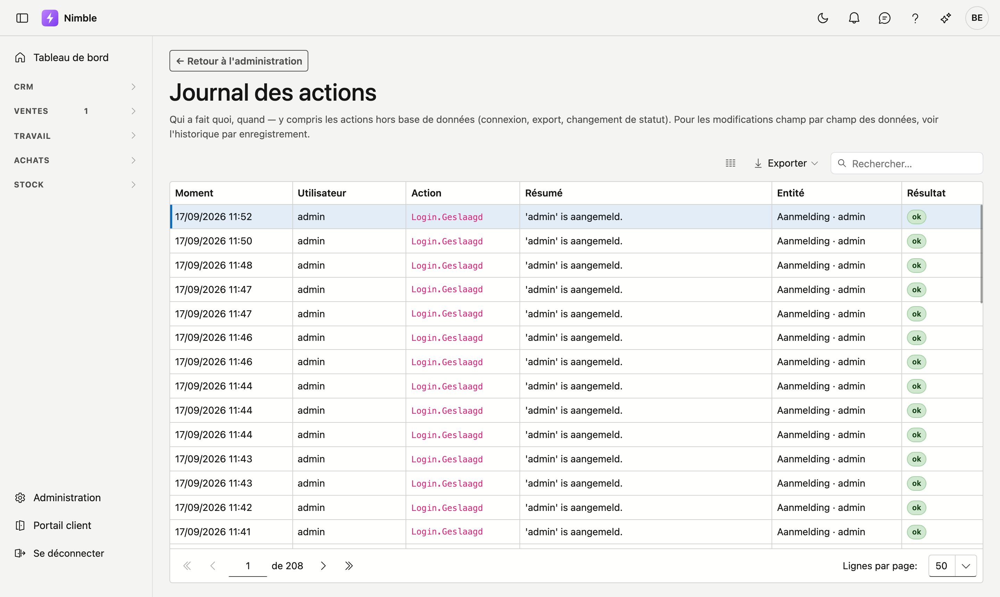

# Journal d'audit

!!! info "Pour les opérateurs ADM"
    Cet écran n'est aujourd'hui visible que pour les collaborateurs d'ADM-Concept. En tant que client de
    Nimble, vous ne voyez pas la tuile.

Le journal montre qui a fait quoi, et quand, dans Nimble : connexions, modifications, changements de statut,
paiements, livraisons. Vous le consultez lorsque vous voulez comprendre comment une donnée est arrivée dans son
état actuel.

## Ouvrir l'écran

1. Cliquez sur **Administration** en bas de la barre latérale.
2. Dans le groupe **Données et accès**, cliquez sur la tuile **Journal d'audit**. L'écran s'intitule
   **Journal des actions**.

## La liste

| Colonne | Ce que vous voyez |
|---|---|
| **Moment** | Quand l'action a eu lieu |
| **Utilisateur** | Qui l'a effectuée |
| **Action** | Le nom technique de l'action, p. ex. `Login.Geslaagd` ou `Quote.Updated` |
| **Résumé** | Une courte description, p. ex. *Offerte 'OFF-2026-0007' bewerkt* |
| **Entité** | Le type d'enregistrement et lequel, p. ex. *Quote · OFF-2026-0007* |
| **Résultat** | **ok** si l'action a abouti, **échoué** sinon |

Les actions les plus récentes figurent en haut. Le champ de recherche en haut à droite cherche dans toutes les
colonnes ; **Exporter** récupère la liste dans un fichier. Si rien ne s'est encore produit, la mention
**Aucune action journalisée pour l'instant.** s'affiche.

!!! tip "Champ par champ"
    Le journal indique *qu'un* enregistrement a été modifié. Les champs qui ont changé se voient dans
    l'historique de l'enregistrement lui-même, sur sa fiche.

## À quoi cela sert

- **Examiner une connexion échouée.** Plusieurs lignes **échoué** d'affilée sur le même utilisateur indiquent un mot de passe oublié — ou quelqu'un qui tente d'entrer.
- **Retrouver une modification.** Cherchez sur le numéro ou le nom de l'enregistrement et lisez les résumés.
- **Vérifier une suppression.** Le journal indique qui a supprimé ; la [Corbeille](recycle-bin.md) vous permet de restaurer.

## Erreurs fréquentes

!!! info
    **Le journal est un écran de consultation.** Vous ne pouvez rien y modifier ni supprimer — c'est voulu. Un journal modifiable ne prouve rien.

## Voir aussi

- [Utilisateurs](users.md) — déverrouiller un utilisateur bloqué
- [Corbeille](recycle-bin.md) — restaurer un enregistrement supprimé
