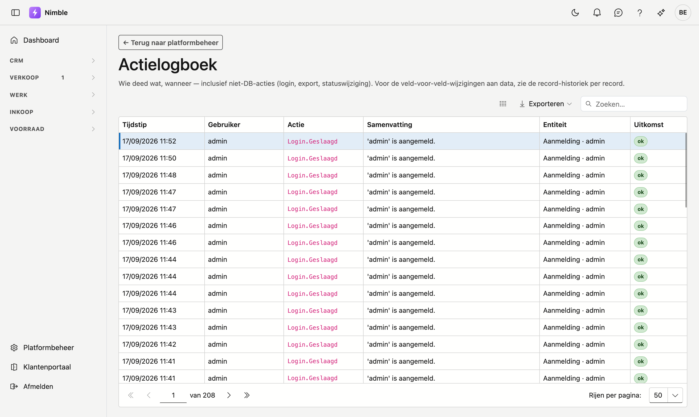

# Actielogboek

!!! info "Wie ziet dit scherm, en hoeveel ervan"
    De tegel staat er voor wie het recht **Actielogboek bekijken** heeft; bij de standaardinstelling is dat
    een beheerder. U ziet daarbij **enkel de regels van uw eigen bedrijf**. Medewerkers van ADM-Concept die u
    ondersteunen, zien de regels van alle klanten — daarmee gaan zij een melding na.

Het actielogboek toont wie wat wanneer deed in Nimble: aanmeldingen, wijzigingen, statuswijzigingen,
betalingen, leveringen. U raadpleegt het wanneer u wilt nagaan hoe een gegeven in zijn huidige toestand
geraakt is.

## Het scherm openen

1. Klik onderaan in de zijbalk op **Platformbeheer**.
2. Klik in de groep **Gegevens en toegang** op de tegel **Actielogboek**.

## De lijst

| Kolom | Wat u ziet |
|---|---|
| **Tijdstip** | Wanneer de actie plaatsvond |
| **Gebruiker** | Wie ze uitvoerde |
| **Actie** | De technische naam van de actie, bv. `Login.Geslaagd` of `Quote.Updated` |
| **Samenvatting** | Een korte omschrijving in gewone taal, bv. *Offerte 'OFF-2026-0007' bewerkt* |
| **Entiteit** | Het soort record en welk record, bv. *Quote · OFF-2026-0007* |
| **Uitkomst** | **ok** als de actie lukte, **mislukt** als ze niet lukte |

De nieuwste acties staan bovenaan. Met het zoekvak rechtsboven zoekt u in alle kolommen; met **Exporteren**
haalt u de lijst binnen in een bestand. Is er nog niets gebeurd, dan staat er **Nog geen acties gelogd.**

!!! tip "Veld voor veld"
    Het actielogboek zegt *dát* een record gewijzigd is. Welke velden er precies veranderden, ziet u in de
    historiek van dat record zelf, op zijn fiche.

## Waarvoor u het gebruikt

- **Een mislukte aanmelding onderzoeken.** Meerdere regels met **mislukt** achter elkaar op dezelfde gebruiker wijzen op een vergeten wachtwoord — of op iemand die probeert binnen te raken.
- **Een wijziging terugvinden.** Zoek op het nummer of de naam van het record en lees de samenvattingen.
- **Een verwijdering natrekken.** Het logboek zegt wie iets verwijderde; de [Prullenbak](recycle-bin.md) laat u het terugzetten.

## Veelgemaakte fouten

!!! info
    **Het actielogboek is een leesscherm.** U kunt er niets in wijzigen of verwijderen — dat is de bedoeling. Een logboek dat aanpasbaar is, bewijst niets.

## Zie ook

- [Gebruikers](users.md) — een vergrendelde gebruiker ontgrendelen
- [Prullenbak](recycle-bin.md) — een verwijderd record terugzetten
