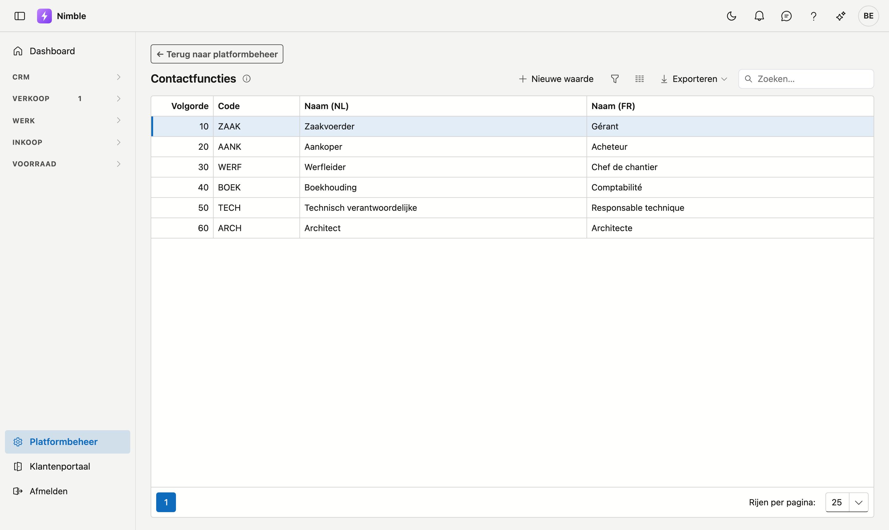

# Contactfuncties

**Contactfuncties** zijn de functietitels die u aan een contactpersoon kunt hangen: zaakvoerder, werfleider, boekhouder, architect … De lijst voedt het veld **Functie** op de contactfiche.

!!! note "Functie is niet hetzelfde als rol"
    De **functie** is wat de persoon *is* en staat op de persoon zelf. De **rol** is wat hij bij één bepaald bedrijf doet en staat op de koppeling tussen persoon en bedrijf. Dezelfde boekhouder kan bij de ene klant "boekhouder" zijn en bij de andere "contactpersoon facturatie". Zie [Contactpersonen](../crm/contactpersonen.md).

## Het scherm openen

1. Klik onderaan in de zijbalk op **Platformbeheer**.
2. Klik in de groep **Relaties** op de tegel **Contactfuncties**.

## De lijst

| Kolom | Betekenis |
|---|---|
| **Volgorde** | Bepaalt de volgorde in de keuzelijsten (laag = bovenaan) |
| **Code** | Korte, unieke code |
| **Naam (NL)** | Nederlandstalige naam |
| **Naam (FR)** | Franstalige naam |

Dubbelklik op een rij om ze te bewerken, of klik op **Nieuwe waarde**. Met **Exporteren** haalt u de lijst binnen in een bestand.

## Een functie aanmaken of bewerken

Er opent een venster **Nieuwe waarde** of **Bewerken**.

1. De **Volgorde** wordt automatisch voorgesteld (hoogste + 10); pas ze aan om de waarde te verplaatsen.
2. Vul de **Code** in — verplicht.
3. Vul de naam in de **basistaal van uw bedrijf** in — verplicht. De andere taal draagt het label **optioneel**.
4. Klik op **Bewaren**, of op **Annuleren** om het venster te sluiten zonder te bewaren.

!!! tip "Stappen van 10"
    De volgorde springt standaard met 10 (10, 20, 30 …). Zo kunt u later makkelijk een waarde tussenvoegen zonder alles te hernummeren.

## Verwijderen

Open de functie en klik rechts in het venster op **Verwijderen**. Na bevestiging komt de functie in de [prullenbak](recycle-bin.md); bestaande contactpersonen die ze gebruiken behouden hun functie. Terughalen kan via de prullenbak.

## Veelgemaakte fouten

!!! warning
    - **Franse naam vergeten** — Franstalige gebruikers zien dan de naam in de basistaal.
    - **Een functie per klant aanmaken** — dat hoort niet hier maar in het veld **Rol** op de koppeling met dat bedrijf. Deze lijst blijft zo kort en bruikbaar.
    - **Functies verwijderen die nog in gebruik zijn** — bestaande contactpersonen behouden hun functie, maar nieuwe kunnen ze niet meer kiezen.

## Zie ook

- [Platformbeheer](platform-management.md)
- [Contactpersonen](../crm/contactpersonen.md) — waar deze functies gebruikt worden
- [Stamgegevens](master-data.md) — de andere sorteerbare lijsten
