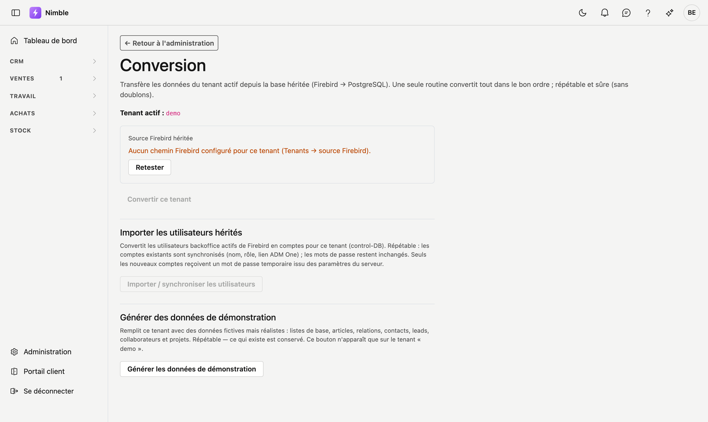

# Conversion

Sur l'écran **Conversion**, vous transférez les données du **tenant actif** depuis la base héritée (Firebird) vers Nimble (PostgreSQL).

!!! warning "Réservé aux opérateurs"
    Cet écran est destiné aux opérateurs ADM (sans tenant fixe). Les utilisateurs liés à un tenant ne le voient pas.

## Ouvrir l'écran

1. Choisissez le bon tenant via **Configuration → Tenants → Utiliser**.
2. Cliquez dans la barre latérale sur **Configuration → Conversion**.

## Source Firebird héritée

En haut, vous voyez l'état de la connexion Firebird pour le tenant actif :

- **Connecté (lecture seule)** — la source est accessible ; le nombre de lignes `CRM_ACCOUNTS` peut s'afficher.
- **Aucun chemin Firebird** — configurez d'abord le chemin via **Tenants → source Firebird**.
- **Retester** — relance le test de connexion.

Nimble lit l'héritage en **lecture seule**. L'héritage reste le seul écrivain tant que la migration est en cours.

## Lancer la conversion

Cliquez sur **Convertir ce tenant**. Nimble exécute tous les éléments de conversion dans le bon ordre.

À la fin, vous voyez pour chaque élément :

| Colonne | Signification |
|---|---|
| **Élément** | Quelle partie des données (p. ex. Relations / `CRM_ACCOUNTS`) |
| **Nombre** | Combien de lignes ont été traitées |
| **Statut** | OK ou Échec (survolez Échec pour le message d'erreur) |

## Que deviennent les relations ?

L'élément **Relations (CRM_ACCOUNTS)** convertit les comptes actifs en relations Nimble :

- **Upsert** sur la clé héritée (source + table + id) — répétable, sans doublons.
- Les relations existantes sont **mises à jour** ; les nouvelles sont ajoutées.
- Les lignes sans nom utilisable sont ignorées.

!!! tip "Répétable"
    Vous pouvez relancer la conversion après une correction de mapping ou de nouvelles données Firebird. Les identifiants Nimble existants sont conservés.

## Erreurs fréquentes

!!! warning
    - **Aucun tenant choisi** — choisissez d'abord un tenant dans Tenants.
    - **Aucun chemin Firebird** — configurez la source sur la fiche tenant.
    - **Connexion échouée** — vérifiez que le serveur Firebird est joignable (dev : port 3052).

## Voir aussi

- [Relations](../relations.md) — l'écran où apparaissent les données importées
