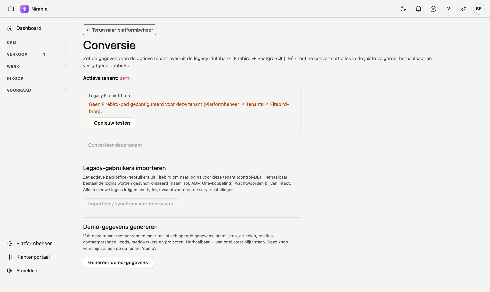

# Conversie

Op het scherm **Conversie** zet u de gegevens van de **actieve tenant** over uit de legacy-databank (Firebird) naar Nimble (PostgreSQL).

!!! warning "Enkel voor operators"
    Dit scherm is bedoeld voor ADM-operators (zonder vaste tenant). Gewone tenant-gebruikers zien het niet.

## Het scherm openen

1. Kies de juiste tenant via **Beheer → Tenants → Gebruiken**.
2. Klik in de zijbalk op **Beheer → Conversie**.

## Legacy Firebird-bron

Bovenaan ziet u de status van de Firebird-koppeling voor de actieve tenant:

- **Verbonden (read-only)** — de bron is bereikbaar; eventueel ziet u het aantal rijen in `CRM_ACCOUNTS`.
- **Geen Firebird-pad** — stel eerst het Firebird-pad in bij **Tenants → Firebird-bron**.
- **Opnieuw testen** — herlaadt de verbindingstest.

Nimble leest de legacy **alleen-lezen**. De legacy blijft de enige schrijver zolang de migratie loopt.

## Conversie starten

Klik op **Converteer deze tenant**. Nimble voert alle conversie-onderdelen uit in de juiste volgorde.

Na afloop ziet u per onderdeel:

| Kolom | Betekenis |
|---|---|
| **Onderdeel** | Welk stuk data (bv. Relaties / `CRM_ACCOUNTS`) |
| **Aantal** | Hoeveel rijen verwerkt zijn |
| **Status** | OK of Mislukt (houd de muis over Mislukt voor de foutmelding) |

## Wat gebeurt er met relaties?

Het onderdeel **Relaties (CRM_ACCOUNTS)** zet actieve accounts om naar Nimble-relaties:

- **Upsert** op de legacy-sleutel (bron + tabel + id) — herhaalbaar, geen dubbels.
- Bestaande relaties worden **bijgewerkt**; nieuwe worden toegevoegd.
- Rijen zonder bruikbare naam worden overgeslagen.

!!! tip "Herhaalbaar"
    U mag de conversie gerust opnieuw starten na een fix in de mapping of na nieuwe data in Firebird. Bestaande Nimble-id's blijven behouden.

## Veelgemaakte fouten

!!! warning
    - **Geen tenant gekozen** — kies eerst een tenant bij Tenants.
    - **Geen Firebird-pad** — configureer de bron op de tenantfiche.
    - **Verbinding mislukt** — controleer of de Firebird-server bereikbaar is (dev: poort 3052).

## Zie ook

- [Relaties](../relations.md) — het scherm waar de geïmporteerde data verschijnt
