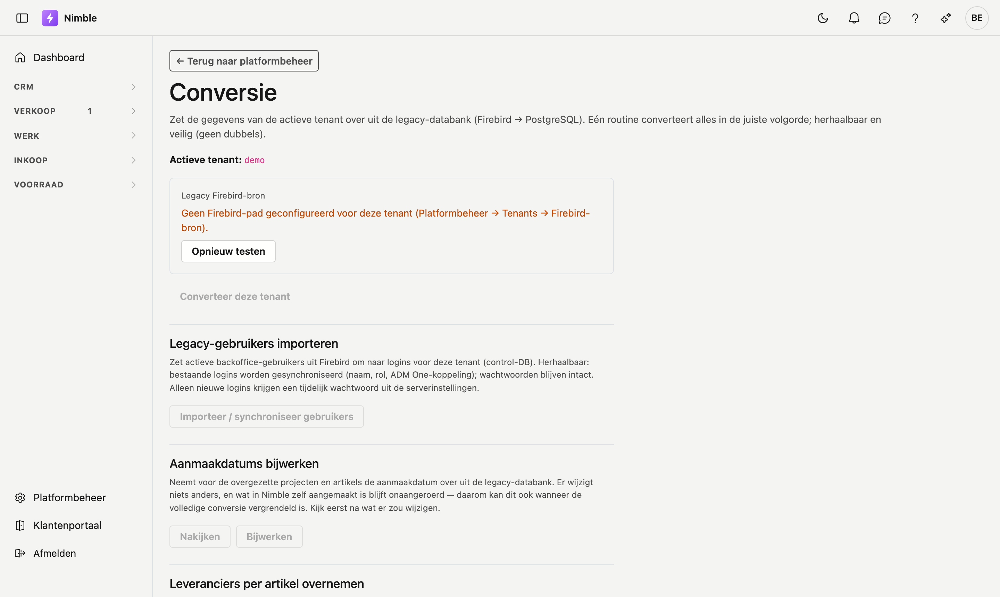

# Conversie

!!! info "Voor ADM-operators"
    Dit scherm is voorbehouden aan medewerkers van ADM-Concept. Als klant van Nimble ziet u het niet.

Op het scherm **Conversie** zet u de gegevens van de **actieve tenant** over uit de databank van het vorige
pakket (Firebird) naar Nimble (PostgreSQL). Eén routine converteert alles in de juiste volgorde; ze is
herhaalbaar en maakt geen dubbels.

## Het scherm openen

1. Klik onderaan in de zijbalk op **Platformbeheer**.
2. Kies de juiste tenant: tegel **Tenants** in de groep **ADM-beheer** → **Gebruiken →**.
3. Ga terug naar **Platformbeheer** en klik in de groep **ADM-beheer** op de tegel **Conversie**.

Bovenaan staat **Actieve tenant:** met de code van de tenant. Is er geen gekozen, dan staat er **geen — kies er
eerst één bij Tenants**, met de melding **Kies eerst een tenant (Platformbeheer → Tenants → Gebruiken) en stel
zijn Firebird-bron in.**

## Legacy Firebird-bron

Dit blok toont of Nimble de Firebird-databank van de actieve tenant kan lezen:

- **Controleren…** — de test loopt.
- **Verbonden (read-only)** — de bron is bereikbaar. Erachter staat het aantal rijen in `CRM_ACCOUNTS`.
- **Geen Firebird-pad geconfigureerd voor deze tenant (Platformbeheer → Tenants → Firebird-bron).** — stel
  eerst het pad in op het scherm [Tenants](tenants.md).
- Een rode foutmelding — de bron is ingesteld maar niet bereikbaar.

**Opnieuw testen** voert de test opnieuw uit.

Nimble leest de Firebird-databank **alleen-lezen**. Het vorige pakket blijft de enige schrijver zolang de
migratie loopt.

## Conversie starten

Klik op **Converteer deze tenant**. De knop werkt enkel wanneer de bron **Verbonden** is. Tijdens het werk
staat er **Bezig met converteren…**.

Na afloop ziet u per onderdeel:

| Kolom | Betekenis |
|---|---|
| **Onderdeel** | Welk stuk data, bv. *Relaties (CRM_ACCOUNTS)* of *Offertes (FIN_SALES_QUOTES_HEADER)* |
| **Aantal** | Hoeveel rijen verwerkt zijn |
| **Status** | **OK** in het groen, of de foutmelding in het rood |

Onder de tabel staat het totaal: **Klaar — … rijen verwerkt in totaal.**

De onderdelen omvatten onder meer de bedrijfsfiche, relaties, leveranciers, contactpersonen, contactfuncties,
taken, afspraken en notities, artikelgroepen en artikelen met hun leverancier, fabrikant en EAN-code, btw-codes, offertes en offerteregels, facturen en
factuurregels, vorderingsstaten, inkoopfacturen, projecten met hun fases, materialen en artikelen, ploegen, en
de keuzelijsten productiestatus, pipeline-status en projecttypes.

!!! tip "Herhaalbaar"
    U mag de conversie gerust opnieuw starten, bijvoorbeeld na nieuwe gegevens in Firebird. Er ontstaan geen
    dubbels.

!!! warning "Een klant die al in Nimble werkt"
    Een volledige conversie zet bestaande gegevens opnieuw op de waarde uit Firebird: wat de klant intussen in Nimble
    aanpaste (fasen, datums, statussen, planning), wordt overschreven. Voor zo'n klant is de conversie **vergrendeld**:
    er staat een melding boven de knop, de knop is uitgeschakeld en Nimble converteert niets. De blokken
    **Aanmaakdatums bijwerken** en **Leveranciers per artikel overnemen** hieronder werken wél: ze overschrijven
    niets wat de klant in Nimble instelde.

## Legacy-gebruikers importeren

Met **Importeer / synchroniseer gebruikers** zet u de actieve backoffice-gebruikers uit Firebird om naar
aanmeldingen voor deze tenant.

- Bestaande aanmeldingen worden gesynchroniseerd: naam, rol en koppeling met ADM One. Hun wachtwoord blijft
  ongewijzigd.
- Enkel nieuwe aanmeldingen krijgen een tijdelijk wachtwoord uit de serverinstellingen.
- Na afloop ziet u hoeveel gebruikers aangemaakt, bijgewerkt en overgeslagen zijn, met eventueel een lijst
  meldingen.

Ook deze knop werkt enkel wanneer de bron **Verbonden** is.

## Aanmaakdatums bijwerken

Dit blok neemt voor de overgezette projecten en artikels de aanmaakdatum over uit Firebird. Er wijzigt niets
anders, en wat in Nimble zelf aangemaakt is, blijft onaangeroerd.

1. Klik **Nakijken**. Nimble leest enkel en toont per onderdeel (**Projecten**, **Artikels**) wat er zou
   gebeuren. Daaronder staat bijvoorbeeld *639 aanmaakdatums zouden wijzigen. Er is nog niets geschreven.*
2. Vond het nakijken iets te wijzigen, dan gaat **Bijwerken** aan. Klik erop.
3. Klik daarna opnieuw **Nakijken**: alles hoort dan onder **Al juist** te staan.

| Kolom | Betekenis |
|---|---|
| **Overgezet** | Hoeveel projecten of artikels uit Firebird komen |
| **Te wijzigen** / **Gewijzigd** | Hoeveel aanmaakdatums zouden veranderen, of na **Bijwerken**: veranderd zijn |
| **Al juist** | Hoeveel er al overeenkomen met Firebird |
| **Bron zonder datum** | Firebird kent voor dit record geen datum; het blijft zoals het is |
| **Niet in de bron** | Firebird draagt dit record niet (meer); het blijft zoals het is |

Elke fiche waarvan de datum verandert, krijgt een regel **Gewijzigd** in haar logboek.

## Leveranciers per artikel overnemen

Dit blok koppelt de leverancier uit Firebird aan elk artikel dat in Nimble **nog geen** leverancier heeft. Als
prijs geldt de huidige aankoopprijs in Nimble, zodat de kostprijs van geen enkel artikel verschuift. Artikels
die al een leverancier hebben, blijven onaangeroerd.

1. Klik **Nakijken**. Nimble leest enkel en toont wat er zou gebeuren.
2. Is er iets te koppelen, dan gaat **Koppelen** aan. Klik erop.
3. Klik daarna opnieuw **Nakijken**: alles hoort dan onder **Had al een leverancier** te staan.

| Kolom | Betekenis |
|---|---|
| **Met leverancier in de bron** | Hoeveel artikels in Firebird een leverancier hebben |
| **Te koppelen** / **Gekoppeld** | Hoeveel artikels een leverancier zouden krijgen, of na **Koppelen**: gekregen hebben |
| **Had al een leverancier** | Artikels die in Nimble al een leverancier hebben; ze blijven zoals ze zijn |
| **Artikel niet in Nimble** | Het artikel uit Firebird bestaat niet in Nimble |
| **Leverancier niet in Nimble** | De leverancier uit Firebird bestaat niet als relatie in Nimble |

De volledige conversie hierboven koppelt de leveranciers ook, maar met de prijs en de code uit Firebird.
Zie [Artikelen](../inventory/articles.md#leveranciers-van-een-artikel) voor wat een leverancier op een artikel
betekent.

## Demo-gegevens genereren

Dit blok staat enkel op de tenant **demo**. **Genereer demo-gegevens** vult die tenant met verzonnen maar
realistische gegevens: stamlijsten, artikelen, relaties, contactpersonen, leads, medewerkers en projecten.
Wat er al staat, blijft staan. Na afloop toont een tabel per onderdeel hoeveel records **Nieuw** zijn en
hoeveel er **Stond er al**.

## Veelgemaakte fouten

!!! warning
    - **Geen tenant gekozen** — kies eerst een tenant bij **Tenants → Gebruiken →**.
    - **Geen Firebird-pad** — vul het pad in bij de tenant op het scherm **Tenants** en klik op **Bewaren**.
    - **Verbinding mislukt** — controleer of de Firebird-server bereikbaar is en het pad klopt, en klik op
      **Opnieuw testen**.

## Zie ook

- [Tenants](tenants.md) — de tenant kiezen en het Firebird-pad instellen
- [Gebruikers](users.md)
- [Relaties](../relations.md) — het scherm waar de geïmporteerde relaties verschijnen
