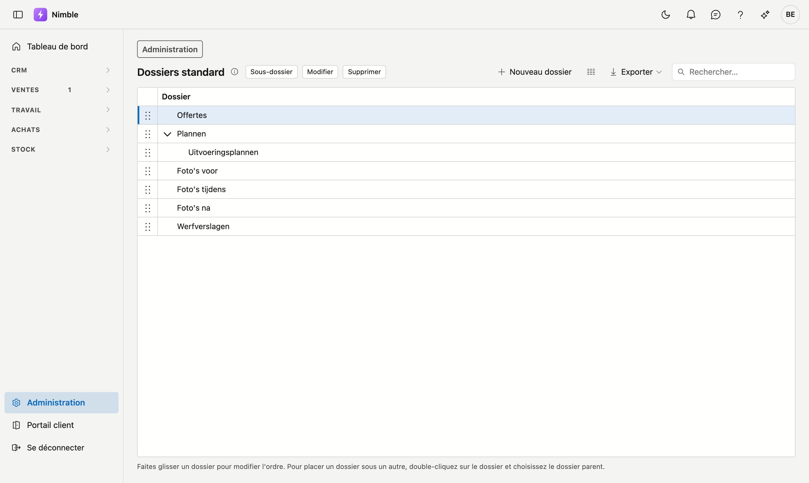

# Dossiers standard

Les **dossiers standard** sont les dossiers que chaque nouveau projet reçoit dans son onglet
[Documents](../work/projects.md#onglet-documents). Chaque projet dispose ainsi d'emblée du même classement, par
exemple *Devis*, *Plans* et *Photos avant*.

## Ouvrir l'écran

1. Cliquez en bas de la barre latérale sur **Administration**.
2. Dans le groupe **Projets**, cliquez sur la tuile **Dossiers standard**.

## Ajouter un dossier

- **Nouveau dossier** crée un dossier au niveau principal.
- **Sous-dossier** crée un dossier sous le dossier que vous avez choisi.

Un dossier n'a qu'un nom. Deux dossiers portant le même nom sous le même dossier ne sont pas possibles.

## Modifier l'ordre

Faites glisser un dossier par la poignée à gauche vers sa nouvelle place. Il se place toujours **à côté** du
dossier où vous le déposez, au même niveau — le glisser-déposer ne place jamais un dossier sous un autre.

## Placer un dossier sous un autre

Double-cliquez sur le dossier, ou choisissez-le et cliquez sur **Modifier**. Dans la fenêtre, vous modifiez le
nom et choisissez le **Dossier parent**. Si vous le laissez vide, le dossier se trouve au niveau principal. Un
dossier ne peut pas se trouver sous lui-même ni sous l'un de ses propres sous-dossiers ; ceux-ci ne figurent donc
pas dans la liste.

## Supprimer un dossier

**Supprimer** n'est possible que pour un dossier sans sous-dossiers. Supprimez-les ou déplacez-les d'abord.

!!! info "Une modification ne concerne que les nouveaux projets"
    Un projet qui a déjà reçu un dossier le conserve — même si vous renommez ou supprimez le dossier ici. Sur un
    projet existant, **Insérer les dossiers standard** dans l'onglet Documents complète ce qui manque encore.

## Voir aussi

- [Projets](../work/projects.md) — l'onglet Documents
- [Administration](platform-management.md) — tous les écrans d'administration
