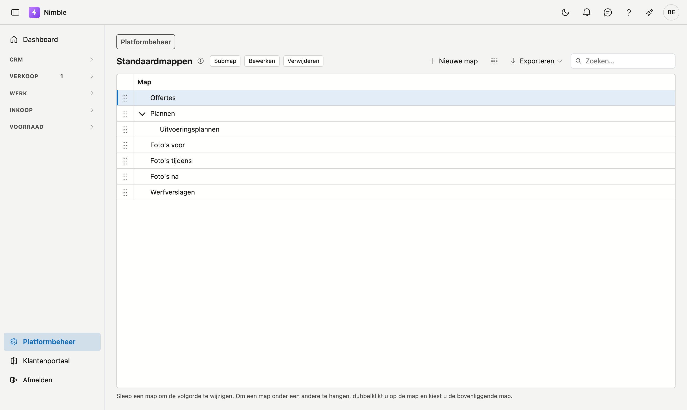

# Standaardmappen

De **standaardmappen** zijn de mappen die elk nieuw project krijgt in zijn tabblad
[Documenten](../work/projects.md#tabblad-documenten). Zo staat bij elk project meteen dezelfde indeling klaar,
bijvoorbeeld *Offertes*, *Plannen* en *Foto's voor*.

## Het scherm openen

1. Klik onderaan in de zijbalk op **Platformbeheer**.
2. Klik in de groep **Projecten** op de tegel **Standaardmappen**.

## Een map toevoegen

- **Nieuwe map** maakt een map op het hoogste niveau.
- **Submap** maakt een map onder de map die u gekozen hebt.

Een map heeft enkel een naam. Twee mappen met dezelfde naam onder dezelfde map kan niet.

## De volgorde wijzigen

Sleep een map aan het handvat links naar haar nieuwe plaats. Ze komt altijd **naast** de map waar u ze
loslaat, op hetzelfde niveau — slepen hangt een map nooit onder een andere.

## Een map onder een andere hangen

Dubbelklik op de map, of kies ze en klik **Bewerken**. In het venster wijzigt u de naam en kiest u de
**Bovenliggende map**. Laat u die leeg, dan staat de map op het hoogste niveau. Een map kan niet onder zichzelf
of onder een van haar eigen submappen; die staan dan ook niet in de keuzelijst.

## Een map verwijderen

**Verwijderen** kan enkel bij een map zonder submappen. Verwijder of verplaats die eerst.

!!! info "Een wijziging raakt enkel nieuwe projecten"
    Een project dat een map al kreeg, houdt ze — ook als u de map hier hernoemt of verwijdert. Op een bestaand
    project vult **Standaardmappen invoegen** op het tabblad Documenten aan wat er nog ontbreekt.

## Zie ook

- [Projecten](../work/projects.md) — het tabblad Documenten
- [Platformbeheer](platform-management.md) — alle beheerschermen
