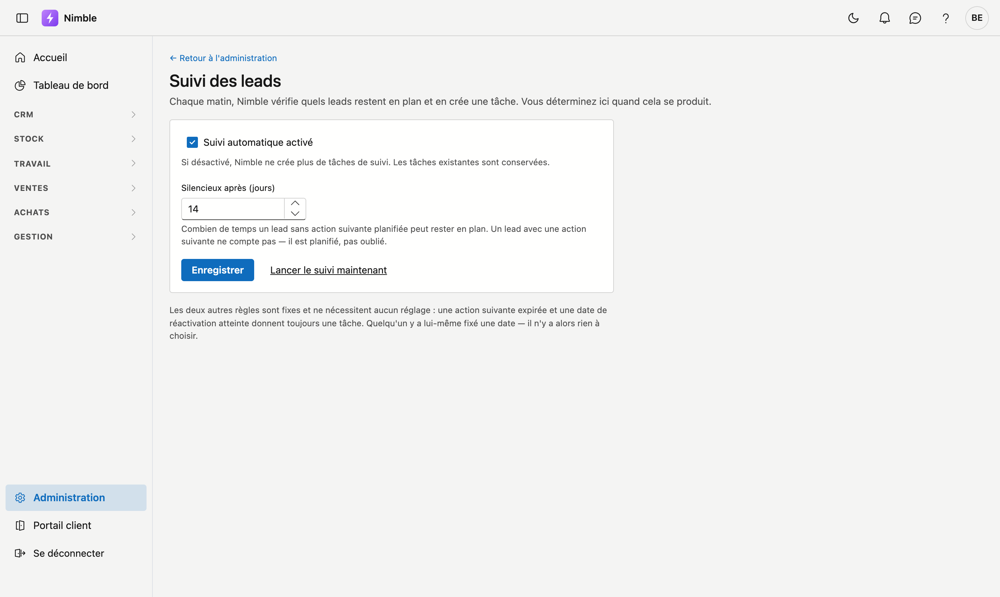

# Suivi des leads

Chaque matin, Nimble vérifie quels leads restent en plan et en crée une tâche. Cet écran détermine quand
cela se produit.

## Ouvrir l'écran

1. Cliquez sur **Administration** en bas de la barre latérale.
2. Dans le groupe **Leads**, cliquez sur la tuile **Suivi des leads**.

## Les trois règles

Nimble crée une tâche de suivi dans trois cas. Deux sont fixes, un se règle ici.

| Règle | Réglable ? |
|---|---|
| L'**action suivante** d'un lead est prévue à une date dépassée | Non |
| Un lead **En attente** a atteint sa **date de réactivation** | Non |
| Un lead sans action suivante planifiée reste trop longtemps en plan | **Oui** — voir ci-dessous |

Les deux premières ne nécessitent aucun réglage : quelqu'un y a fixé une date lui-même. Il n'y a alors rien
à choisir — cette date *est* l'accord.

## Silencieux après (jours)

Combien de temps un lead sans action suivante planifiée peut rester en plan avant de recevoir une tâche.
Par défaut **14 jours** ; de 1 à 365 autorisés.

!!! info "Un lead avec une action suivante ne compte pas"
    Si une action suivante est planifiée — même dans le futur — le lead est planifié et non oublié. Cette
    règle ne vaut que pour les leads pour lesquels personne n'a rien prévu. C'est précisément le lead qui
    disparaîtrait autrement sans bruit.

Le bon chiffre dépend de votre métier. Si vous vendez quelque chose sur quoi les gens réfléchissent des
semaines, 14 jours est court et vous obtiendrez des tâches que personne ne lit. S'il s'agit de demandes
tranchées rapidement, 30 jours est trop tard. Commencez à 14 et adaptez selon ce que vous constatez.

## Suivi automatique activé ou désactivé

Si vous **désactivez** le suivi, Nimble ne crée plus de nouvelles tâches. Les tâches existantes sont
conservées — désactiver ne peut pas faire disparaître du travail déjà attribué à quelqu'un.

## Lancer le suivi maintenant

Vous lancez ainsi un cycle immédiatement au lieu d'attendre le lendemain matin. Pratique juste après avoir
modifié le délai : vous voyez directement combien de tâches cela donne.

Le message affiche trois chiffres : combien de leads ont été examinés, combien de nouvelles tâches sont
apparues et combien existaient déjà.

!!! info "Enregistrez d'abord"
    Le bouton s'exécute avec ce qui se trouve dans la base de données, pas avec ce qui est à l'écran. Si
    vous modifiez le délai et cliquez immédiatement sur **Lancer le suivi maintenant**, il s'exécute encore
    avec la valeur précédente. Cliquez d'abord sur **Enregistrer**.

!!! info "Vous ne recevez jamais deux fois le même rappel"
    Si une tâche est déjà ouverte pour un lead, il n'y en a pas de deuxième — même si vous lancez le cycle
    dix fois. Si vous la clôturez et que le lead reste ensuite de nouveau en plan, une nouvelle tâche suit
    bien.

## Où arrivent les tâches

- Dans l'écran **Tâches**, sous **Toutes les tâches** — un lead sans responsable donne une tâche sans
  responsable.
- Sur la fiche du lead elle-même, dans l'onglet **Journal**.

## Voir aussi

- [Leads](../crm/leads.md)
- [Tâches](../crm/tasks.md)
