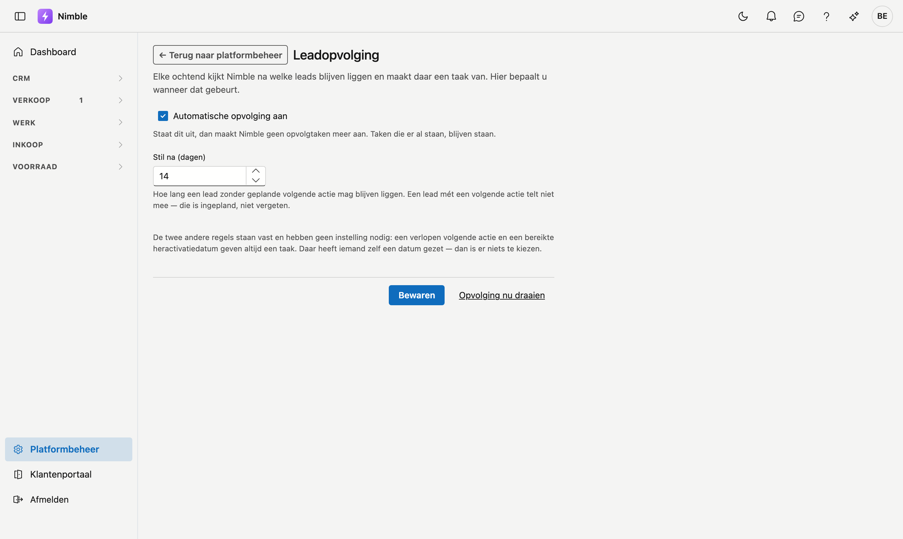

# Leadopvolging

Elke ochtend kijkt Nimble na welke leads blijven liggen en maakt daar een taak van. Op dit scherm bepaalt u
wanneer dat gebeurt.

## Het scherm openen

1. Klik onderaan in de zijbalk op **Platformbeheer**.
2. Klik in de groep **Leads** op de tegel **Leadopvolging**.

## De drie regels

Nimble maakt een opvolgtaak in drie gevallen. Twee daarvan liggen vast, één stelt u zelf in.

| Regel | Instelbaar? |
|---|---|
| De **volgende actie** van een lead staat op een datum die voorbij is | Nee |
| Een lead in een **gepauzeerde** fase heeft zijn **heractivatiedatum** bereikt | Nee |
| Een **lopende** lead zonder geplande volgende actie ligt te lang stil | **Ja** — zie hieronder |

De eerste twee hebben geen instelling nodig: daar heeft iemand zelf een datum gezet. Dan is er niets te
kiezen — die datum ís de afspraak.

## Stil na (dagen)

Hoe lang een lead zonder geplande volgende actie mag blijven liggen voor hij een taak krijgt. Standaard
**14 dagen**; toegelaten van 1 tot 365.

!!! info "Een lead met een volgende actie telt niet mee"
    Staat er een volgende actie gepland — ook een in de toekomst — dan is de lead ingepland en niet
    vergeten. Deze regel geldt alleen voor leads waar niemand iets voor plande. Dat is precies de lead die
    anders stil uit beeld verdwijnt.

Welk getal past, hangt af van uw werk. Verkoopt u iets waarover mensen weken nadenken, dan is 14 dagen
kort en krijgt u taken die niemand leest. Gaat het om aanvragen die snel beslist worden, dan is 30 dagen
te laat. Begin bij 14 en pas aan wat u in de praktijk ziet.

## Automatische opvolging aan of uit

Zet u de opvolging **uit**, dan maakt Nimble geen nieuwe taken meer aan. Taken die er al staan, blijven
gewoon staan — uitzetten mag geen werk laten verdwijnen dat al aan iemand toegewezen is.

## Opvolging nu draaien

Hiermee draait u meteen een ronde in plaats van tot morgenochtend te wachten. Handig net nadat u de termijn
gewijzigd hebt: u ziet direct hoeveel taken dat oplevert.

De melding toont drie getallen: hoeveel leads bekeken zijn, hoeveel nieuwe taken er kwamen, en hoeveel er
al bestonden.

!!! info "Sla eerst op"
    De knop draait met wat er in de databank staat, niet met wat er op het scherm staat. Wijzigt u de
    termijn en klikt u meteen op **Opvolging nu draaien**, dan draait hij nog met de vorige waarde. Klik
    eerst op **Opslaan**.

!!! info "U krijgt nooit twee keer dezelfde herinnering"
    Staat een taak al open voor een lead, dan komt er geen tweede bij — ook niet als u de ronde tien keer
    draait. Werkt u de taak af en blijft de lead daarna opnieuw liggen, dan volgt er wél een nieuwe.

## Waar de taken terechtkomen

- In het scherm **Taken**, onder **Alle taken** — een lead zonder verantwoordelijke levert een taak zonder
  verantwoordelijke.
- Op de leadfiche zelf, in het tabblad **Journaal**.

## Zie ook

- [Leads](../crm/leads.md)
- [Taken](../crm/tasks.md)
