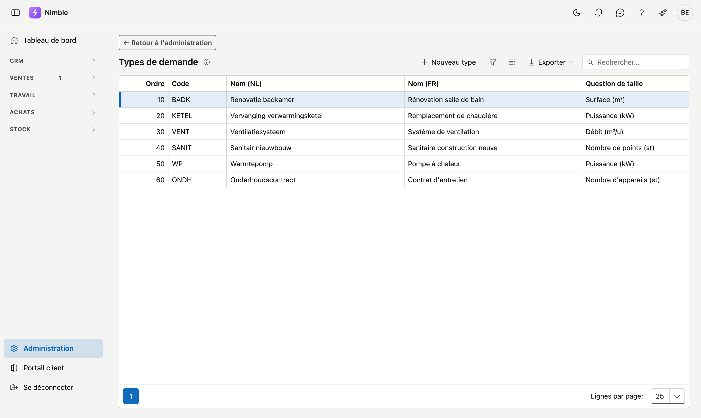

# Types de demande

Les **types de demande** indiquent ce qu'un lead demande précisément : une toiture, un sauna, une conduite … Chaque type porte optionnellement sa propre **question de taille** — par exemple des mètres carrés pour une toiture, un nombre de personnes pour un sauna, ou un mètre courant pour une conduite.

## Ouvrir l'écran

1. Cliquez sur **Administration** en bas de la barre latérale.
2. Dans le groupe **Leads**, cliquez sur la tuile **Types de demande**.

## La liste

| Colonne | Signification |
|---|---|
| **Code** | Code court et unique |
| **Nom (NL)** | Nom néerlandais |
| **Nom (FR)** | Nom français |
| **Question de taille** | Résumé du champ de taille (libellé + unité), ou « — pas demandé — » |
| **Ordre** | Détermine l'ordre dans les listes de choix |

Double-cliquez une ligne pour ouvrir le type, ou cliquez sur **Nouveau type**. Chaque type a sa propre adresse web : copiez la barre d'adresse et votre collègue ouvre exactement ce type.

## Créer ou modifier un type

1. Remplissez le **Code**.
2. Remplissez le nom dans la **langue de base de votre entreprise** — ce champ est obligatoire ; l'autre langue est optionnelle.
3. Configurez optionnellement la **question de taille** :
     - **Libellé (NL)** / **Libellé (FR)** — le nom du champ sur la fiche du lead (p. ex. « Superficie »).
     - **Unité** — p. ex. `m²`, `personnes`, `ml`.
     - Laissez le libellé vide si la taille n'a pas de sens pour ce type ; le champ n'apparaît alors pas sur la fiche du lead.
4. Sous le bloc **Question de taille**, un aperçu montre immédiatement le nom du champ sur la fiche du lead.
5. Cliquez en bas à droite sur **Enregistrer**. Vous revenez ensuite à la liste.

!!! tip "Modifications non enregistrées"
    Si vous quittez la page avec des modifications non enregistrées, votre navigateur vous demande d'abord confirmation.

## Supprimer

Ouvrez le type et cliquez en bas à droite sur **Supprimer**. La question « Archiver ? » apparaît d'abord, avec le nom. Le type est **archivé** (corbeille) ; les leads existants avec ce type sont conservés.

## Erreurs fréquentes

!!! warning
    - **Nom français oublié** — les utilisateurs francophones voient alors l'autre langue en repli.
    - **Unité sans libellé** — l'unité n'apparaît que si un libellé est également renseigné.
    - **Supprimer un type encore utilisé** — les leads existants conservent leur type, mais les nouveaux leads ne peuvent plus le choisir.

## Voir aussi

- [Administration](platform-management.md)
- [Sources de leads](lead-sources.md)
- [Statut de lead](lead-status.md)
- [Leads](../crm/leads.fr.md)
