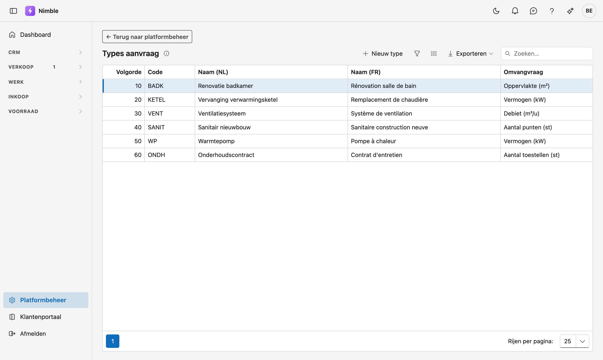
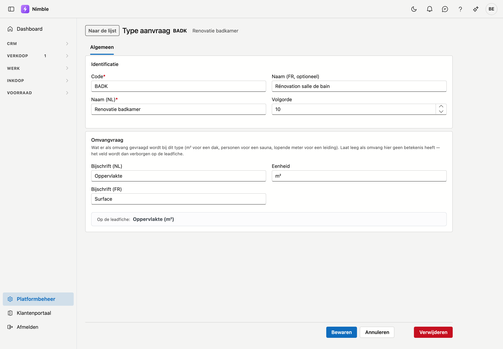

# Types aanvraag

**Types aanvraag** geven aan wat een lead precies vraagt: een dakwerk, een sauna, een leiding … Elk type draagt optioneel zijn eigen **omvangvraag** — bijvoorbeeld vierkante meter voor een dak, aantal personen voor een sauna, of lopende meter voor een leiding.

## Het scherm openen

1. Klik onderaan in de zijbalk op **Platformbeheer**.
2. Klik in de groep **Leads** op de tegel **Types aanvraag**.

## De lijst

| Kolom | Betekenis |
|---|---|
| **Volgorde** | Bepaalt de volgorde in de keuzelijsten (laag = bovenaan) |
| **Code** | Korte, unieke code |
| **Naam (NL)** | Nederlandstalige naam |
| **Naam (FR)** | Franstalige naam |
| **Omvangvraag** | Het bijschrift met de eenheid, bv. *Oppervlakte (m²)*, of "— niet gevraagd —" |

Dubbelklik op een rij om het type te openen, of klik op **Nieuw type**. Met **Exporteren** haalt u de lijst binnen in een bestand.

## De fiche van een type

Een type opent op een eigen pagina met een eigen webadres: kopieer de adresbalk en uw collega opent precies dat type. Bovenaan staan de code en de naam van het type, met links de knop **Naar de lijst**. De fiche heeft één tabblad, **Algemeen**, met twee kaarten.

### Identificatie

| Veld | Wat u invult |
|---|---|
| **Code** | Verplicht |
| **Naam (NL)** en **Naam (FR)** | De naam in de basistaal van uw bedrijf is verplicht; de andere taal draagt het label *optioneel* |
| **Volgorde** | De plaats in de keuzelijst. Een nieuw type krijgt een voorstel achteraan |

### Omvangvraag

| Veld | Wat u invult |
|---|---|
| **Bijschrift (NL)** / **Bijschrift (FR)** | Hoe het veld heet op de leadfiche, bv. "Oppervlakte" |
| **Eenheid** | Bv. `m²`, `personen`, `lm` |

Laat het bijschrift leeg als omvang voor dit type geen betekenis heeft; het veld verschijnt dan niet op de leadfiche.

Onder de velden ziet u meteen hoe het veld op de leadfiche zal heten, bijvoorbeeld **Op de leadfiche: Oppervlakte (m²)**.

### Bewaren

Klik onderaan op **Bewaren**. U komt daarna terug in de lijst. Met **Annuleren** gaat u terug zonder te bewaren.

Ontbreekt er iets, dan noemt een melding bovenaan de fiche welke velden nog leeg zijn.

!!! tip "Onbewaarde wijzigingen"
    Sluit of herlaadt u het tabblad met onbewaarde wijzigingen, dan vraagt uw browser eerst of u dat zeker wil.

## Verwijderen

Open het type en klik onderaan, na **Annuleren**, op **Verwijderen**. Na bevestiging komt het type in de [prullenbak](recycle-bin.md); bestaande leads met dit type blijven behouden. Terughalen kan via de prullenbak.

## Veelgemaakte fouten

!!! warning
    - **Naam in de andere taal vergeten** — gebruikers in die taal zien dan de naam in de basistaal.
    - **Eenheid zonder bijschrift** — de eenheid verschijnt enkel wanneer er ook een bijschrift is ingevuld.
    - **Types verwijderen die nog in gebruik zijn** — bestaande leads behouden hun type, maar nieuwe leads kunnen het niet meer kiezen.

## Zie ook

- [Platformbeheer](platform-management.md)
- [Leadbronnen](lead-sources.md)
- [Leadfases](lead-status.md)
- [Leads](../crm/leads.md)
