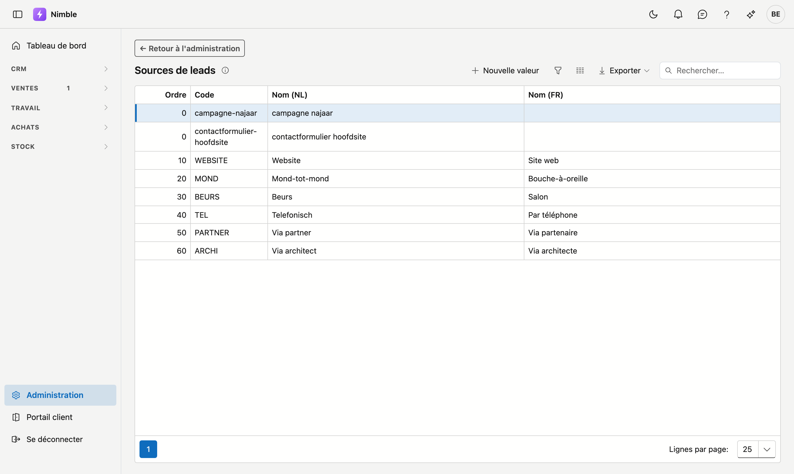

# Sources de leads

Les **sources de leads** indiquent d'où provient un lead : Google, le site web, le bouche-à-oreille, un panneau de chantier … Cette liste sert à rapporter les leads par origine.

## Ouvrir l'écran

1. Cliquez sur **Administration** en bas de la barre latérale.
2. Dans le groupe **Leads**, cliquez sur la tuile **Sources de leads**.

## La liste

| Colonne | Signification |
|---|---|
| **Ordre** | Détermine l'ordre dans les listes de choix (petit = en haut) |
| **Code** | Code court et unique |
| **Nom (NL)** | Nom néerlandais |
| **Nom (FR)** | Nom français |

Double-cliquez sur une ligne pour la modifier, ou cliquez sur **Nouvelle valeur**. **Exporter** récupère la liste dans un fichier.

## Créer ou modifier une source

Une fenêtre **Nouvelle valeur** ou **Modifier** s'ouvre.

1. L'**Ordre** est proposé automatiquement (le plus élevé + 10) ; ajustez-le pour déplacer la valeur.
2. Remplissez le **Code** — obligatoire.
3. Remplissez le nom dans la **langue de base de votre entreprise** — obligatoire. L'autre langue porte la mention **optionnel**.
4. Cliquez sur **Enregistrer**, ou sur **Annuler** pour fermer la fenêtre sans enregistrer.

!!! tip "Pas de 10"
    L'ordre progresse par défaut de 10 en 10 (10, 20, 30 …). Vous pouvez ainsi insérer facilement une valeur plus tard sans tout renuméroter.

## Les sources que Nimble crée lui-même

Lorsqu'une demande arrive via un formulaire de votre site web, Nimble cherche la source de ce formulaire. Si
elle n'existe pas encore, Nimble la crée lui-même :

- le **nom** est le nom du formulaire, par exemple *contactformulier hoofdsite* ;
- le **code** est ce même nom en minuscules avec des traits d'union, par exemple `contactformulier-hoofdsite` ;
- l'**ordre** est à 0, donc en haut de la liste, et le nom français est vide.

Vous pouvez tout à fait mettre une telle source en ordre : donnez-lui un nom clair, remplissez l'autre langue
et choisissez un ordre. Nimble reconnaît la source à son **code**. Un nouveau nom ne crée donc pas de seconde
source.

Si une demande arrive sans nom de formulaire, le lead reçoit la source **Website**.

## Supprimer

Ouvrez la source et cliquez à droite dans la fenêtre sur **Supprimer**. Après confirmation, la source va dans la [corbeille](recycle-bin.md) ; les leads existants qui l'utilisent sont conservés. Vous pouvez la récupérer via la corbeille.

!!! info "Une source ne peut pas être supprimée : **Website**"
    Cette source n'a pas de bouton **Supprimer**, et son code n'est pas modifiable. Sous le champ figure
    **Cette ligne est utilisée par Nimble même — le code ne peut pas changer. Le nom, si.** Nimble recherche ce
    code lui-même quand une demande arrive via votre site web. Le **nom**, lui, se modifie librement :
    mettez-y « Notre site » ou votre nom de domaine.

## Erreurs fréquentes

!!! warning
    - **Modifier le code d'une source créée par Nimble** — Nimble ne la reconnaît alors plus à son code. Si vous avez aussi modifié le nom, Nimble crée une nouvelle source à la prochaine demande via ce formulaire. Adaptez le nom, pas le code.
    - **Nom dans l'autre langue oublié** — les utilisateurs de cette langue voient alors le nom dans la langue de base.
    - **Supprimer une source encore utilisée** — les leads existants conservent leur source, mais les nouveaux leads ne peuvent plus la choisir.

## Voir aussi

- [Administration](platform-management.md)
- [Types de demande](lead-request-types.md)
- [Phases de lead](lead-status.md)
- [Leads](../crm/leads.fr.md)
