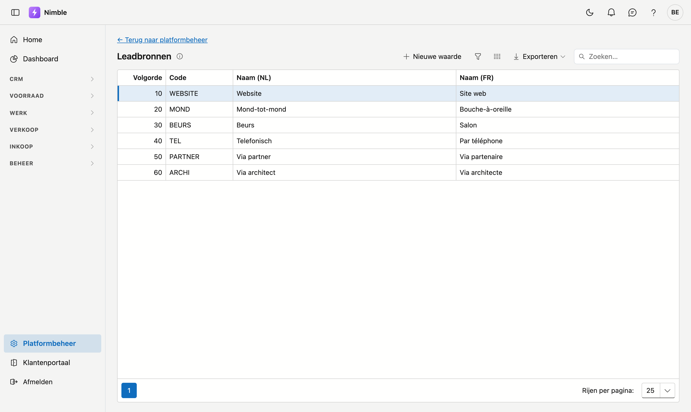

# Leadbronnen

**Leadbronnen** geven aan waar een lead vandaan komt: Google, de website, mond-tot-mondreclame, een werfbord … Deze lijst gebruikt u om leads te rapporteren per herkomst.

## Het scherm openen

1. Klik onderaan in de zijbalk op **Platformbeheer**.
2. Klik in de groep **Leads** op de tegel **Leadbronnen**.

## De lijst

| Kolom | Betekenis |
|---|---|
| **Volgorde** | Bepaalt de volgorde in de keuzelijsten (laag = bovenaan) |
| **Code** | Korte, unieke code |
| **Naam (NL)** | Nederlandstalige naam |
| **Naam (FR)** | Franstalige naam |

Dubbelklik op een rij om te bewerken, of klik op **Nieuwe waarde**.

## Een leadbron aanmaken of bewerken

1. De **Volgorde** wordt automatisch voorgesteld (laatste + 10); pas ze aan om de waarde te verplaatsen.
2. Vul de **Code** in.
3. Vul de naam in de **basistaal van uw kantoor** — dat veld is verplicht; de andere taal is optioneel.
4. Klik op **Opslaan**.

!!! tip "Stappen van 10"
    De volgorde springt standaard met 10 (10, 20, 30 …). Zo kunt u later makkelijk een waarde tussenvoegen zonder alles te hernummeren.

## Verwijderen

Open de leadbron en klik op **Verwijderen**. De bron wordt gearchiveerd (prullenbak); bestaande leads die ze gebruiken blijven behouden.

## Veelgemaakte fouten

!!! warning
    - **Franse naam vergeten** — Franstalige gebruikers zien dan de andere taal als terugval.
    - **Bronnen verwijderen die nog in gebruik zijn** — bestaande leads behouden hun bron, maar nieuwe leads kunnen ze niet meer kiezen.

## Zie ook

- [Platformbeheer](platform-management.md)
- [Types aanvraag](lead-request-types.md)
- [Leadstatus](lead-status.md)
- [Leads](../crm/leads.md)
