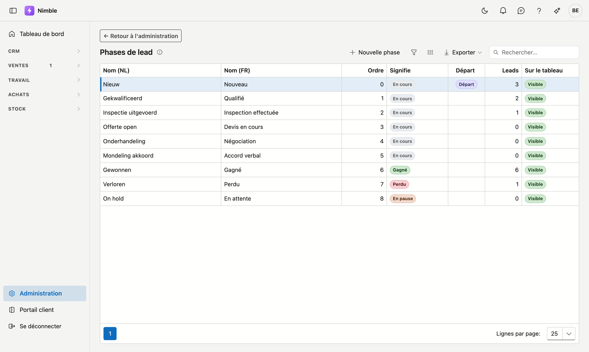

# Phases de lead

Les phases de votre pipeline de vente — les colonnes du tableau des leads. **Vous les composez vous-même** :
ajoutez une phase, renommez-en une, choisissez l'ordre, ou masquez ce que vous n'utilisez pas.

## Ouvrir l'écran

1. Cliquez en bas de la barre latérale sur **Gestion de la plateforme**.
2. Cliquez dans le groupe **Leads** sur la tuile **Phases de lead**.

## La liste

| Colonne | Signification |
|---|---|
| **Clé (fixe)** | Nom technique — créé lors de l'ajout et inchangé ensuite |
| **Nom (NL)** et **Nom (FR)** | Ce que l'utilisateur voit |
| **Ordre** | Position de la colonne sur le tableau (bas = le plus à gauche) |
| **Signifie** | Ce que cette phase signifie pour Nimble — voir ci-dessous |
| **Départ** | La phase dans laquelle commence un nouveau lead |
| **Leads** | Combien de leads s'y trouvent actuellement |
| **Sur le tableau** | Visible ou masquée |

Double-cliquez sur une ligne pour l'ouvrir, ou cliquez sur **Nouvelle phase**.

## Le champ le plus important : ce qu'une phase *signifie*

Chaque phase reçoit l'une de quatre significations. **C'est elle qui détermine le comportement — pas le nom.**

| Signification | Ce que Nimble en fait |
|---|---|
| **En cours** | Le lead est vivant et compte pour le [suivi](lead-follow-up.md) quotidien |
| **Gagné** | Phase finale. Plus de suivi. C'est ici qu'arrive un lead que vous convertissez en client |
| **Perdu** | Phase finale. Plus de suivi |
| **En pause** | Dort jusqu'à une date ; ce jour-là, le lead réapparaît dans le suivi |

!!! tip "C'est pourquoi vous pouvez créer plusieurs phases finales"
    Comme c'est la signification qui fait le travail, vous pouvez en avoir deux de même nature. Par exemple
    **Perdu au concurrent** à côté de **Annulé par le client** — toutes deux avec la signification *Perdu*.
    Dans vos rapports, vous voyez la différence ; pour le suivi, les deux comptent comme clôturées.

!!! warning "Deux exigences sont fixes et ne se désactivent pas"
    - Une phase qui signifie **Perdu** demande toujours un **motif de perte**.
    - Une phase qui signifie **En pause** demande toujours une **date de réactivation** — sans cette date,
      personne ne sait quand le lead revient, et « en pause » veut simplement dire « disparu ».

## Champs obligatoires par phase

Sous **Champs obligatoires pour cette phase**, vous choisissez ce qui doit être rempli avant qu'un lead puisse
passer à cette phase. Par exemple : un **responsable** à partir de *Qualifié*, pour qu'aucun lead n'avance
sans que quelqu'un le suive.

Vous choisissez parmi les champs qui existent sur la fiche du lead ; vous ne pouvez pas en inventer.

## La phase de départ

Exactement une phase est la **phase de départ** : c'est là que commence chaque nouveau lead. Si vous en
désignez une autre, la précédente est retirée automatiquement — il y en a toujours exactement une.

## Ajouter une phase

1. Cliquez sur **Nouvelle phase**.
2. Indiquez un **nom** dans votre langue de base (l'autre langue est facultative mais recommandée).
3. Choisissez ce que la phase **signifie**.
4. Cliquez sur **Enregistrer**. La phase apparaît en fin de tableau ; avec **Ordre**, vous la placez.

## Masquer ou supprimer

Ce sont deux choses différentes.

**Masquer** retire la colonne du tableau, mais la phase continue d'exister : rapports, filtres et chiffres
restent valables. Utilisez ceci pour une étape dont vous n'avez pas besoin.

**Supprimer** n'est possible que pour une phase que vous avez **créée vous-même** et qui ne contient **aucun
lead**. Les neuf phases standard peuvent être renommées et masquées, mais pas supprimées — des leads existants
portent cette clé.

!!! tip "Soupape de sécurité"
    Une phase masquée qui contient encore des leads reste malgré tout visible sur le tableau — avec ces leads.
    Ainsi, un lead ne disparaît jamais silencieusement. Ce n'est qu'une fois le dernier lead sorti que la
    colonne disparaît réellement.

## Erreurs fréquentes

!!! warning
    - **Confondre la signification et le nom.** Une phase que vous appelez « Clôturé » mais qui signifie
      *En cours* continuera de générer des tâches de suivi. Le nom est pour vous ; la signification est pour
      Nimble.
    - **Oublier le nom néerlandais** — les utilisateurs néerlandophones voient alors le texte français en
      repli.
    - **Confondre masquer et supprimer** — une phase masquée continue d'exister et compte encore.
    - **Vouloir désactiver la phase de départ.** Ce n'est pas possible : désignez une *autre* phase comme
      départ, celle-ci se retire alors d'elle-même.

## Voir aussi

- [Gestion de la plateforme](platform-management.md)
- [Suivi des leads](lead-follow-up.md)
- [Sources de leads](lead-sources.md)
- [Leads](../crm/leads.md)
