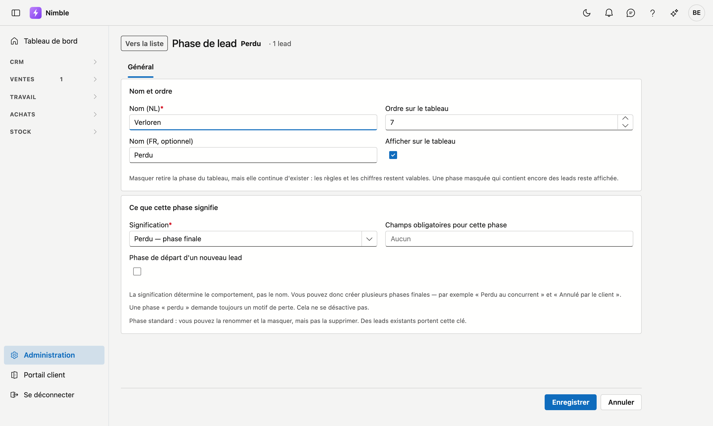

# Phases de lead

Les phases de votre pipeline de vente — les colonnes du tableau des leads. **Vous les composez vous-même** :
ajoutez une phase, renommez-en une, choisissez l'ordre, ou masquez ce que vous n'utilisez pas.

## Ouvrir l'écran

1. Cliquez en bas de la barre latérale sur **Administration**.
2. Cliquez dans le groupe **Leads** sur la tuile **Phases de lead**.

## La liste

| Colonne | Signification |
|---|---|
| **Nom (NL)** et **Nom (FR)** | Ce que l'utilisateur voit |
| **Ordre** | Position de la colonne sur le tableau (petit = le plus à gauche) |
| **Signifie** | Ce que cette phase signifie pour Nimble : En cours, Gagné, Perdu ou En pause — voir ci-dessous |
| **Départ** | Le libellé **Départ** figure à côté de la phase dans laquelle commence un nouveau lead |
| **Leads** | Combien de leads s'y trouvent actuellement |
| **Sur le tableau** | **Visible** ou **Masqué** |

Double-cliquez sur une ligne pour ouvrir la phase, ou cliquez sur **Nouvelle phase**. **Exporter** récupère la liste dans un fichier.

## La fiche d'une phase

Une phase s'ouvre sur sa propre page. En haut figurent le nom de la phase et le nombre de leads qu'elle
contient, avec à gauche le bouton **Vers la liste**. La fiche a un seul onglet, **Général**, avec deux cartes.

### Nom et ordre

| Champ | Ce que vous saisissez |
|---|---|
| **Nom (NL)** et **Nom (FR)** | Le nom dans la langue de base de votre entreprise est obligatoire ; l'autre langue porte la mention *optionnel* |
| **Ordre sur le tableau** | Un nombre de 0 à 99 ; petit est à gauche |
| **Afficher sur le tableau** | Décochez pour masquer la phase — voir **Masquer ou supprimer** ci-dessous |

### Ce que cette phase signifie

| Champ | Ce que vous saisissez |
|---|---|
| **Signification** | Obligatoire : *En cours — le lead est vivant*, *Gagné — phase finale*, *Perdu — phase finale* ou *En pause — jusqu'à une date* |
| **Phase de départ d'un nouveau lead** | Cochez pour faire de cette phase la phase de départ |
| **Champs obligatoires pour cette phase** | Ce qui doit être rempli avant qu'un lead puisse passer à cette phase |

Cliquez en bas sur **Enregistrer** ; vous revenez ensuite à la liste. **Annuler** vous ramène sans enregistrer.

## Le champ le plus important : ce qu'une phase *signifie*

Chaque phase reçoit l'une de quatre significations. **C'est elle qui détermine le comportement — pas le nom.**

| Signification | Ce que Nimble en fait |
|---|---|
| **En cours** | Le lead est vivant et compte pour le [suivi](lead-follow-up.md) quotidien |
| **Gagné** | Phase finale. Plus de suivi. C'est ici qu'arrive un lead que vous convertissez en client |
| **Perdu** | Phase finale. Plus de suivi |
| **En pause** | Dort jusqu'à une date ; ce jour-là, le lead réapparaît dans le suivi |

!!! tip "C'est pourquoi vous pouvez créer plusieurs phases finales"
    Comme c'est la signification qui fait le travail, vous pouvez en avoir deux de même nature. Par exemple
    **Perdu au concurrent** à côté de **Annulé par le client** — toutes deux avec la signification *Perdu*.
    Dans vos rapports, vous voyez la différence ; pour le suivi, les deux comptent comme clôturées.

!!! warning "Deux exigences sont fixes et ne se désactivent pas"
    - Une phase qui signifie **Perdu** demande toujours un **motif de perte**.
    - Une phase qui signifie **En pause** demande toujours une **date de réactivation** — sans cette date,
      personne ne sait quand le lead revient, et « en pause » veut simplement dire « disparu ».

    La fiche affiche cette exigence dès que vous choisissez l'une de ces deux significations.

## Champs obligatoires par phase

Sous **Champs obligatoires pour cette phase**, vous choisissez ce qui doit être rempli avant qu'un lead puisse
passer à cette phase. Vous choisissez parmi ces champs de la fiche du lead : **Responsable**, **Budget**,
**Timing**, **Type de demande**, **Téléphone**, **E-mail** et **Prochaine action**.

Par exemple : un **Responsable** à partir de *Qualifié*, pour qu'aucun lead n'avance sans que quelqu'un le
suive.

## La phase de départ

Exactement une phase est la **phase de départ** : c'est là que commence chaque nouveau lead. Si vous en
désignez une autre, la précédente est retirée automatiquement — il y en a toujours exactement une. Sur la
phase de départ actuelle, la case ne peut donc pas être décochée.

## Ajouter une phase

1. Cliquez sur **Nouvelle phase**.
2. Indiquez un **nom** dans votre langue de base (l'autre langue est facultative mais recommandée).
3. Choisissez ce que la phase **signifie**.
4. Cliquez sur **Enregistrer**. La phase reçoit un ordre en fin de tableau ; avec **Ordre sur le tableau**, vous la placez.

## Masquer ou supprimer

Ce sont deux choses différentes.

**Masquer** retire la colonne du tableau, mais la phase continue d'exister : rapports, filtres et chiffres
restent valables. Utilisez ceci pour une étape dont vous n'avez pas besoin.

**Supprimer** n'est possible que pour une phase que vous avez **créée vous-même**, qui ne contient **aucun
lead** et qui n'est pas la phase de départ. Le bouton **Supprimer** n'apparaît que sur la fiche d'une phase que
vous avez créée ; si elle contient encore des leads ou si c'est la phase de départ, Nimble refuse avec un
message. Les leads dans la corbeille comptent aussi. Après confirmation, la phase disparaît réellement : elle ne va pas dans la corbeille et ne peut pas
être récupérée.

Les phases standard peuvent être renommées et masquées, mais pas supprimées — des leads existants les portent.
Leur fiche le dit aussi : **Phase standard : vous pouvez la renommer et la masquer, mais pas la supprimer.**

!!! tip "Soupape de sécurité"
    Une phase masquée qui contient encore des leads reste malgré tout visible sur le tableau — avec ces leads.
    Ainsi, un lead ne disparaît jamais silencieusement. Ce n'est qu'une fois le dernier lead sorti que la
    colonne disparaît réellement.

## Erreurs fréquentes

!!! warning
    - **Confondre la signification et le nom.** Une phase que vous appelez « Clôturé » mais qui signifie
      *En cours* continuera de générer des tâches de suivi. Le nom est pour vous ; la signification est pour
      Nimble.
    - **Nom dans l'autre langue oublié** — les utilisateurs de cette langue voient alors le nom dans la langue
      de base.
    - **Confondre masquer et supprimer** — une phase masquée continue d'exister et compte encore. Une phase
      supprimée a définitivement disparu.
    - **Vouloir désactiver la phase de départ.** Ce n'est pas possible : désignez une *autre* phase comme
      départ, celle-ci se retire alors d'elle-même.

## Voir aussi

- [Administration](platform-management.md)
- [Suivi des leads](lead-follow-up.md)
- [Sources de leads](lead-sources.md)
- [Leads](../crm/leads.md)
