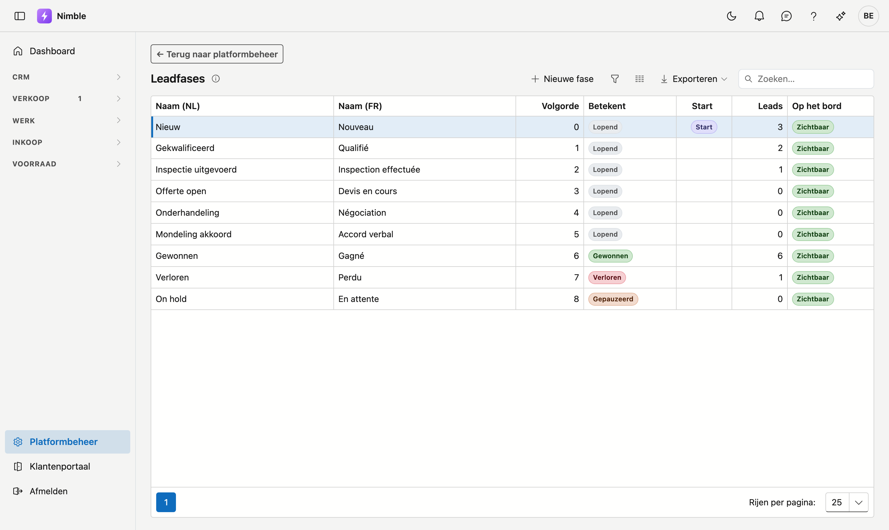

# Leadfases

De fases van uw verkooppijplijn — de kolommen op het leadbord. **U stelt ze zelf samen**: voeg een eigen fase
toe, hernoem er een, kies de volgorde, of verberg wat u niet gebruikt.

## Het scherm openen

1. Klik onderaan in de zijbalk op **Platformbeheer**.
2. Klik in de groep **Leads** op de tegel **Leadfases**.

## De lijst

| Kolom | Betekenis |
|---|---|
| **Sleutel (vast)** | Technische naam — wordt bij het aanmaken gemaakt en verandert daarna niet |
| **Naam (NL)** en **Naam (FR)** | Wat de gebruiker ziet |
| **Volgorde** | Positie van de kolom op het leadbord (laag = meest links) |
| **Betekent** | Wat deze fase voor Nimble betekent — zie hieronder |
| **Start** | De fase waarin een nieuwe lead begint |
| **Leads** | Hoeveel leads er nu in die fase staan |
| **Op het bord** | Zichtbaar of verborgen |

Dubbelklik op een rij om ze te openen, of klik op **Nieuwe fase**.

## Het belangrijkste veld: wat een fase *betekent*

Elke fase krijgt één van vier betekenissen. **Die bepaalt het gedrag — niet de naam.**

| Betekenis | Wat Nimble ermee doet |
|---|---|
| **Lopend** | De lead leeft nog en telt mee voor de dagelijkse [opvolging](lead-follow-up.md) |
| **Gewonnen** | Eindfase. Geen opvolging meer. Hier komt een lead terecht die u omzet naar klant |
| **Verloren** | Eindfase. Geen opvolging meer |
| **Gepauzeerd** | Slaapt tot een datum; op die dag verschijnt de lead weer in de opvolging |

!!! tip "Daarom kunt u meerdere eindfases maken"
    Omdat de betekenis het werk doet, mag u er twee van dezelfde soort hebben. Bijvoorbeeld **Verloren aan
    concurrent** naast **Geannuleerd door klant** — allebei met betekenis *Verloren*. In uw rapportering ziet
    u het verschil; voor de opvolging tellen ze allebei als afgesloten.

!!! warning "Twee eisen liggen vast en zijn niet uit te zetten"
    - Een fase die **Verloren** betekent, vraagt altijd een **verliesreden**.
    - Een fase die **Gepauzeerd** betekent, vraagt altijd een **heractivatiedatum** — zonder die datum weet
      niemand wanneer de lead terugkomt, en dan betekent "gepauzeerd" gewoon "verdwenen".

## Verplichte velden per fase

Onder **Verplichte velden bij deze fase** kiest u wat ingevuld moet zijn vóór een lead naar die fase mag.
Bijvoorbeeld: een **verantwoordelijke** vanaf *Gekwalificeerd*, zodat geen enkele lead verder gaat zonder dat
iemand hem opvolgt.

U kiest uit de velden die op de leadfiche bestaan; u kunt er geen verzinnen.

## De startfase

Precies één fase is de **startfase**: daar begint elke nieuwe lead. Duidt u een andere aan, dan gaat de vorige
vanzelf af — er is er altijd exact één.

## Een fase toevoegen

1. Klik op **Nieuwe fase**.
2. Geef een **naam** in uw basistaal (de andere taal is optioneel maar aanbevolen).
3. Kies wat de fase **betekent**.
4. Klik op **Opslaan**. De fase verschijnt achteraan op het bord; met **Volgorde** zet u ze op haar plaats.

## Verbergen versus verwijderen

Dat zijn twee verschillende dingen.

**Verbergen** haalt de kolom van het bord, maar de fase blijft bestaan: rapportage, filters en cijfers blijven
kloppen. Gebruik dit voor een stap die u niet nodig hebt.

**Verwijderen** kan alleen bij een fase die u **zelf gemaakt** hebt en waar **geen enkele lead** in staat. De
negen standaardfases kunt u hernoemen en verbergen, maar niet verwijderen — bestaande leads dragen die
sleutel.

!!! tip "Veiligheidsklep"
    Een verborgen fase waar op dit moment nog leads in staan, blijft tóch zichtbaar op het bord — met die
    leads erin. Zo verdwijnt een lead nooit stilletjes uit beeld. Pas wanneer de laatste lead eruit is,
    verdwijnt de kolom ook echt.

## Veelgemaakte fouten

!!! warning
    - **De betekenis verwarren met de naam.** Een fase die u *"Afgesloten"* noemt maar die *Lopend* betekent,
      blijft opvolgtaken opleveren. De naam is voor u; de betekenis is voor Nimble.
    - **Franse naam vergeten** — Franstalige gebruikers zien dan de Nederlandse tekst als terugval.
    - **Verbergen verward met verwijderen** — een verborgen fase blijft bestaan en telt nog mee.
    - **De startfase willen uitzetten.** Dat kan niet: duid een ándere fase aan als start, dan gaat deze
      vanzelf af.

## Zie ook

- [Platformbeheer](platform-management.md)
- [Leadopvolging](lead-follow-up.md)
- [Leadbronnen](lead-sources.md)
- [Leads](../crm/leads.md)
