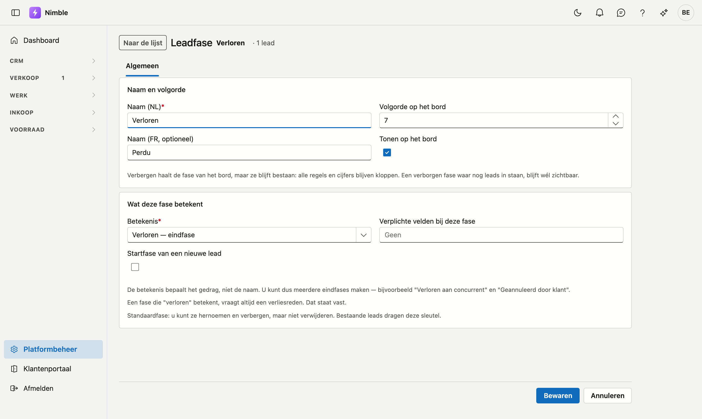

# Leadfases

De fases van uw verkooppijplijn — de kolommen op het leadbord. **U stelt ze zelf samen**: voeg een eigen fase
toe, hernoem er een, kies de volgorde, of verberg wat u niet gebruikt.

## Het scherm openen

1. Klik onderaan in de zijbalk op **Platformbeheer**.
2. Klik in de groep **Leads** op de tegel **Leadfases**.

## De lijst

| Kolom | Betekenis |
|---|---|
| **Naam (NL)** en **Naam (FR)** | Wat de gebruiker ziet |
| **Volgorde** | Positie van de kolom op het leadbord (laag = meest links) |
| **Betekent** | Wat deze fase voor Nimble betekent: Lopend, Gewonnen, Verloren of Gepauzeerd — zie hieronder |
| **Start** | Het label **Start** staat bij de fase waarin een nieuwe lead begint |
| **Leads** | Hoeveel leads er nu in die fase staan |
| **Op het bord** | **Zichtbaar** of **Verborgen** |

Dubbelklik op een rij om de fase te openen, of klik op **Nieuwe fase**. Met **Exporteren** haalt u de lijst binnen in een bestand.

## De fiche van een fase

Een fase opent op een eigen pagina. Bovenaan staan de naam van de fase en het aantal leads erin, met links de
knop **Naar de lijst**. De fiche heeft één tabblad, **Algemeen**, met twee kaarten.

### Naam en volgorde

| Veld | Wat u invult |
|---|---|
| **Naam (NL)** en **Naam (FR)** | De naam in de basistaal van uw bedrijf is verplicht; de andere taal draagt het label *optioneel* |
| **Volgorde op het bord** | Een getal van 0 tot 99; laag staat links |
| **Tonen op het bord** | Vink uit om de fase te verbergen — zie [Verbergen versus verwijderen](#verbergen-versus-verwijderen) |

### Wat deze fase betekent

| Veld | Wat u invult |
|---|---|
| **Betekenis** | Verplicht: *Lopend — de lead leeft nog*, *Gewonnen — eindfase*, *Verloren — eindfase* of *Gepauzeerd — tot een datum* |
| **Startfase van een nieuwe lead** | Vink aan om deze fase de startfase te maken |
| **Verplichte velden bij deze fase** | Wat ingevuld moet zijn vóór een lead naar deze fase mag |

Klik onderaan op **Bewaren**; u komt daarna terug in de lijst. Met **Annuleren** gaat u terug zonder te bewaren.

## Het belangrijkste veld: wat een fase *betekent*

Elke fase krijgt één van vier betekenissen. **Die bepaalt het gedrag — niet de naam.**

| Betekenis | Wat Nimble ermee doet |
|---|---|
| **Lopend** | De lead leeft nog en telt mee voor de dagelijkse [opvolging](lead-follow-up.md) |
| **Gewonnen** | Eindfase. Geen opvolging meer. Hier komt een lead terecht die u omzet naar klant |
| **Verloren** | Eindfase. Geen opvolging meer |
| **Gepauzeerd** | Slaapt tot een datum; op die dag verschijnt de lead weer in de opvolging |

!!! tip "Daarom kunt u meerdere eindfases maken"
    Omdat de betekenis het werk doet, mag u er twee van dezelfde soort hebben. Bijvoorbeeld **Verloren aan
    concurrent** naast **Geannuleerd door klant** — allebei met betekenis *Verloren*. In uw rapportering ziet
    u het verschil; voor de opvolging tellen ze allebei als afgesloten.

!!! warning "Twee eisen liggen vast en zijn niet uit te zetten"
    - Een fase die **Verloren** betekent, vraagt altijd een **verliesreden**.
    - Een fase die **Gepauzeerd** betekent, vraagt altijd een **heractivatiedatum** — zonder die datum weet
      niemand wanneer de lead terugkomt, en dan betekent "gepauzeerd" gewoon "verdwenen".

    De fiche toont die eis zodra u een van beide betekenissen kiest.

## Verplichte velden per fase

Onder **Verplichte velden bij deze fase** kiest u wat ingevuld moet zijn vóór een lead naar die fase mag.
U kiest uit deze velden van de leadfiche: **Verantwoordelijke**, **Budget**, **Timing**, **Type aanvraag**,
**Telefoon**, **E-mail** en **Volgende actie**.

Bijvoorbeeld: een **Verantwoordelijke** vanaf *Gekwalificeerd*, zodat geen enkele lead verder gaat zonder dat
iemand hem opvolgt.

## De startfase

Precies één fase is de **startfase**: daar begint elke nieuwe lead. Duidt u een andere aan, dan gaat de vorige
vanzelf af — er is er altijd exact één. Op de huidige startfase kunt u het vinkje daarom niet uitzetten.

## Een fase toevoegen

1. Klik op **Nieuwe fase**.
2. Geef een **naam** in uw basistaal (de andere taal is optioneel maar aanbevolen).
3. Kies wat de fase **betekent**.
4. Klik op **Bewaren**. De fase krijgt een volgorde achteraan op het bord; met **Volgorde op het bord** zet u ze op haar plaats.

## Verbergen versus verwijderen

Dat zijn twee verschillende dingen.

**Verbergen** haalt de kolom van het bord, maar de fase blijft bestaan: rapportage, filters en cijfers blijven
kloppen. Gebruik dit voor een stap die u niet nodig hebt.

**Verwijderen** kan alleen bij een fase die u **zelf gemaakt** hebt, waar **geen enkele lead** in staat en die
niet de startfase is. De knop **Verwijderen** staat enkel op de fiche van een fase die u zelf maakte; staan er
nog leads in of is het de startfase, dan weigert Nimble met een melding. Ook leads in de prullenbak tellen mee. Na bevestiging is de fase echt weg:
ze komt niet in de prullenbak en is niet terug te halen.

De standaardfases kunt u hernoemen en verbergen, maar niet verwijderen — bestaande leads dragen ze. Hun fiche
zegt dat ook: **Standaardfase: u kunt ze hernoemen en verbergen, maar niet verwijderen.**

!!! tip "Veiligheidsklep"
    Een verborgen fase waar op dit moment nog leads in staan, blijft tóch zichtbaar op het bord — met die
    leads erin. Zo verdwijnt een lead nooit stilletjes uit beeld. Pas wanneer de laatste lead eruit is,
    verdwijnt de kolom ook echt.

## Veelgemaakte fouten

!!! warning
    - **De betekenis verwarren met de naam.** Een fase die u *"Afgesloten"* noemt maar die *Lopend* betekent,
      blijft opvolgtaken opleveren. De naam is voor u; de betekenis is voor Nimble.
    - **Naam in de andere taal vergeten** — gebruikers in die taal zien dan de naam in de basistaal.
    - **Verbergen verward met verwijderen** — een verborgen fase blijft bestaan en telt nog mee. Een
      verwijderde fase is definitief weg.
    - **De startfase willen uitzetten.** Dat kan niet: duid een ándere fase aan als start, dan gaat deze
      vanzelf af.

## Zie ook

- [Platformbeheer](platform-management.md)
- [Leadopvolging](lead-follow-up.md)
- [Leadbronnen](lead-sources.md)
- [Leads](../crm/leads.md)
