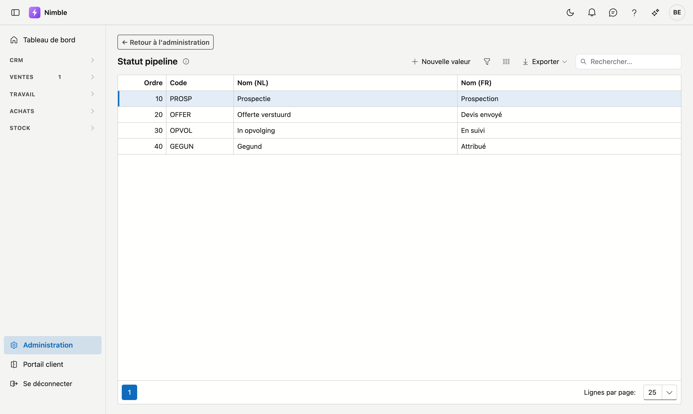

# Statut pipeline

Le **statut pipeline** indique où en est une affaire sur le plan commercial : prospection, devis envoyé,
en suivi, attribué … Vous déterminez vous-même les étapes que parcourt votre processus de vente.

## Ouvrir l'écran

1. Cliquez en bas de la barre latérale sur **Administration**.
2. Cliquez dans le groupe **Projets** sur la tuile **Statuts pipeline**.

## Statut pipeline ou statut de production ?

Deux listes qui se ressemblent, mais qui disent autre chose :

| | Indique | Exemple |
|---|---|---|
| **Statut de production** | l'avancement du **travail** | en attente de matériel, en cours |
| **Statut pipeline** | l'avancement de la **vente** | devis envoyé, attribué |

Un projet peut être attribué et encore en préparation. Ce sont donc deux champs distincts, et toutes les
entreprises n'utilisent pas les deux.

## Où le statut est utilisé

- Sur la **fiche projet**, dans la colonne de droite sous Type de projet.
- Comme **colonne dans la liste des projets**, où vous pouvez trier et filtrer dessus.

## Ajouter ou modifier une étape

Cliquez sur **Nouvelle valeur**, ou double-cliquez sur une ligne existante. Une fenêtre s'ouvre avec les champs ci-dessous et les boutons **Enregistrer** et **Annuler** ; pour une valeur existante, **Supprimer** figure aussi à droite. **Exporter**, au-dessus de la liste, récupère la liste dans un fichier.

| Champ | Remarque |
|---|---|
| **Ordre** | Détermine la place dans la liste de choix ; le plus petit nombre en haut |
| **Code** | Votre propre clé courte — obligatoire et unique |
| **Nom (NL)** et **Nom (FR)** | Le nom dans la langue de base de votre entreprise est obligatoire ; l'autre langue porte la mention *optionnel*. Si elle reste vide, le nom dans la langue de base s'affiche |

!!! tip "Suivez le chemin de l'affaire"
    Classez les étapes dans l'ordre où une affaire les parcourt, du premier contact à l'attribution. Le tri
    vous montre alors l'avancement de vos affaires en cours.

## Et si vous n'utilisez pas cette liste ?

Si vous laissez la liste vide, le **champ Statut pipeline disparaît** de la fiche projet et de la liste des
projets. Il n'y a rien à désactiver : c'est la liste elle-même qui détermine si le champ est là.

L'inverse est vrai aussi. Si vous ajoutez plus tard une première étape, le champ réapparaît
automatiquement.

## Supprimer une étape

**Supprimer** archive l'étape : elle disparaît de la liste de choix, mais les projets qui la portent déjà
la conservent. Les informations anciennes restent ainsi lisibles. La récupération se fait via la [corbeille](recycle-bin.md).
