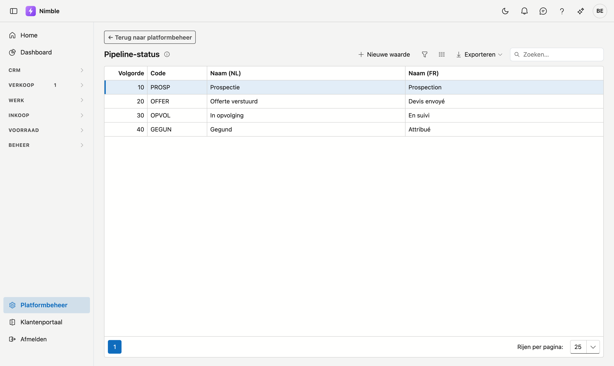

# Pipeline-status

De **pipeline-status** zegt waar een zaak commercieel staat: prospectie, offerte verstuurd, in opvolging,
gegund … U bepaalt zelf welke stappen uw verkoop doorloopt.

## Het scherm openen

1. Klik onderaan in de zijbalk op **Platformbeheer**.
2. Klik in de groep **Projecten** op de tegel **Pipeline-status**.

## Pipeline-status of productiestatus?

Twee lijsten die op elkaar lijken, maar iets anders zeggen:

| | Zegt iets over | Voorbeeld |
|---|---|---|
| **Productiestatus** | hoever het **werk** staat | wacht op materiaal, in uitvoering |
| **Pipeline-status** | hoever de **verkoop** staat | offerte verstuurd, gegund |

Een project kan gegund zijn en tegelijk nog in voorbereiding. Daarom staan het twee aparte velden, en
gebruikt niet elk bedrijf ze allebei.

## Waar de status gebruikt wordt

- Op de **projectfiche**, in de rechterkolom onder Projecttype.
- Als **kolom in de projectenlijst**, waar u erop kunt sorteren en filteren.

## Een stap toevoegen of wijzigen

Klik **Nieuwe waarde**, of dubbelklik een bestaande rij.

| Veld | Opmerking |
|---|---|
| **Volgorde** | Bepaalt de plaats in de keuzelijst; laagste getal bovenaan |
| **Code** | Uw eigen korte sleutel — verplicht en uniek |
| **Naam (NL)** | Verplicht; dit is wat men ziet op een Nederlandstalig scherm |
| **Naam (FR)** | Optioneel; leeg laten betekent dat de Nederlandse naam ook in het Frans verschijnt |

!!! tip "Volg de weg van de zaak"
    Zet de stappen in de volgorde waarin een zaak ze doorloopt, van eerste contact tot gunning. Dan ziet u
    aan de sortering hoever uw lopende zaken staan.

## Wat als u deze lijst niet gebruikt?

Laat u de lijst leeg, dan **verdwijnt het veld Pipeline-status** van de projectfiche en uit de
projectenlijst. Er valt niets uit te schakelen: de lijst zelf bepaalt of het veld er staat.

Dat geldt ook omgekeerd. Voegt u later een eerste stap toe, dan verschijnt het veld vanzelf.

## Een stap verwijderen

**Verwijderen** archiveert de stap: ze verdwijnt uit de keuzelijst, maar projecten die ze al dragen houden
ze gewoon. Zo blijft oude informatie leesbaar. Terughalen kan via de prullenbak.
