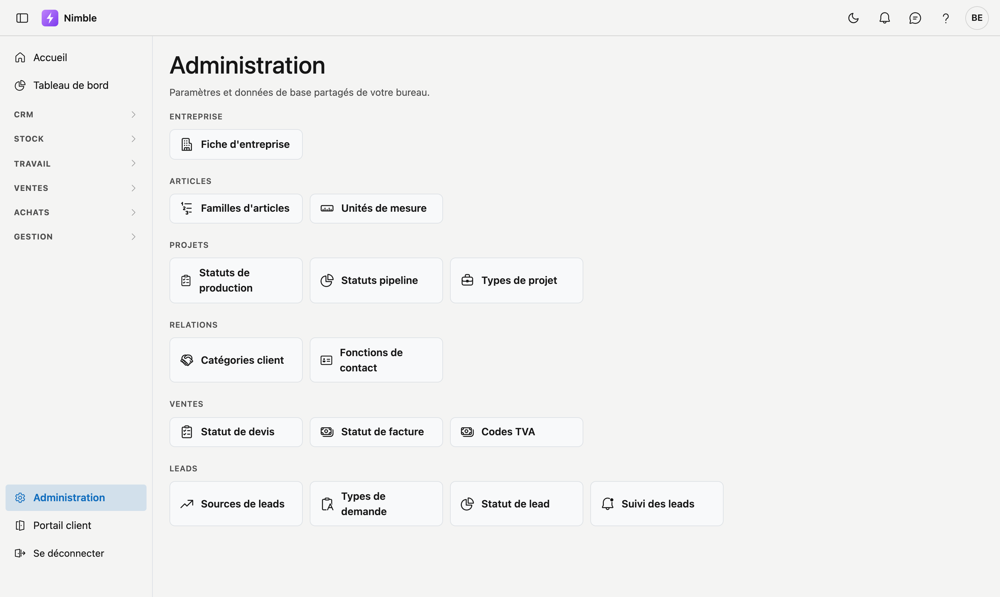

# Administration

L'écran **Administration** regroupe tous les paramètres partagés et les données de base de votre bureau, organisés en tuiles : la fiche d'entreprise, les familles d'articles, les unités et les listes de choix pour les projets et les relations.

## Ouvrir l'écran

Cliquez sur **Administration** en bas de la barre latérale.

!!! info "Droits"
    Vous ne voyez que les tuiles pour lesquelles vous avez des droits. Si une tuile manque, demandez à votre administrateur d'attribuer le droit correspondant via **Gestion → Rôles**.

## Les groupes

| Groupe | Tuiles |
|---|---|
| **Entreprise** | Fiche d'entreprise |
| **Articles** | Familles d'articles, Unités de mesure |
| **Projets** | Statuts de production, Statuts pipeline, Types de projet |
| **Relations** | Catégories client, Fonctions de contact |

Chaque tuile ouvre un écran de gestion. En haut de chaque écran, **← Retour à l'administration** vous ramène à ce hub.

## Erreurs fréquentes

!!! warning
    - **Aucun tenant choisi** (opérateurs uniquement) — choisissez d'abord un tenant via **Tenants → Utiliser** ; sans tenant actif, vous ne pouvez pas gérer les données de base.
    - **Tuile manquante** — il vous manque le droit pour cette partie ; ce n'est pas une erreur de l'application.

## Voir aussi

- [Fiche d'entreprise](../settings/company-profile.md)
- [Familles d'articles](article-families.md)
- [Unités de mesure](units.md)
- [Données de base (listes de choix)](master-data.md)
