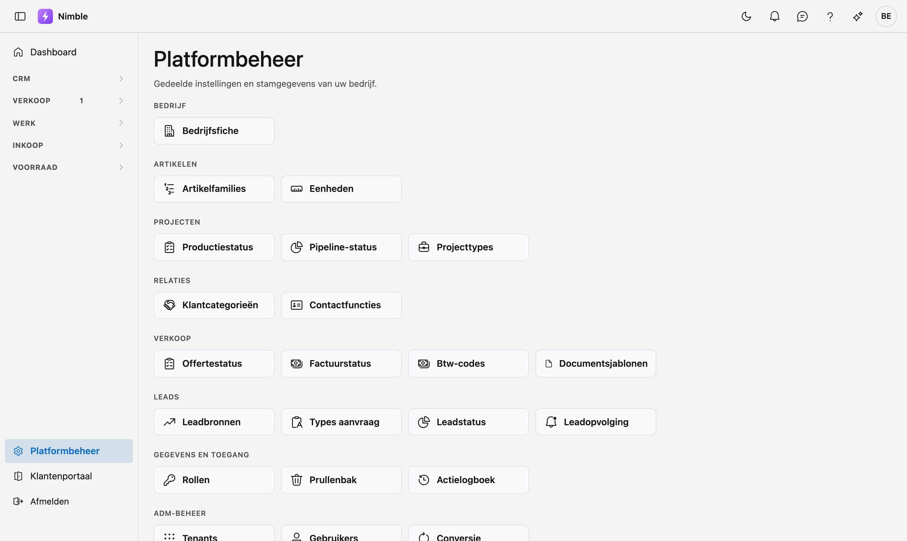

# Platformbeheer

Op het scherm **Platformbeheer** vindt u alle gedeelde instellingen en stamgegevens van uw bedrijf, gegroepeerd in tegels: de bedrijfsfiche, artikelfamilies, eenheden, de keuzelijsten voor projecten en relaties, en het beheer van rollen, verwijderde gegevens en het actielogboek.

## Het scherm openen

Klik onderaan in de zijbalk op **Platformbeheer**.

!!! info "Rechten"
    U ziet enkel de tegels waarvoor u rechten hebt. Ziet u een tegel niet, vraag dan uw beheerder om het bijbehorende recht toe te kennen via **Platformbeheer → Rollen**.

## De groepen

| Groep | Tegels |
|---|---|
| **Bedrijf** | Bedrijfsfiche |
| **Artikelen** | Artikelfamilies, Eenheden |
| **Projecten** | Productiestatus, Pipeline-status, Projecttypes |
| **Relaties** | Klantcategorieën, Contactfuncties |
| **Verkoop** | Offertestatus, Factuurstatus, Btw-codes, Documentsjablonen |
| **Leads** | Leadbronnen, Types aanvraag, Leadstatus, Leadopvolging |
| **Gegevens en toegang** | Rollen, Prullenbak, Actielogboek |
| **ADM-beheer** | Enkel voor ADM-operators — u ziet deze groep niet |

Elke tegel opent een beheerscherm. Bovenaan elk scherm brengt **← Terug naar platformbeheer** u terug naar deze hub.

## Een rode melding bovenaan

Bij het starten werkt Nimble de structuur van elke databank bij. Lukt dat voor één databank niet, dan staat
bovenaan deze pagina een rode melding met de databank, het onderdeel en de reden.

Schermen die op die structuur rekenen, kunnen dan stuklopen — soms pas dagen later, wanneer iemand toevallig
het juiste scherm opent. Geef de tekst van de melding door aan uw beheerder; die bevat de oorzaak. Zelf hoeft
u niets te doen.

Staat er geen melding, dan zijn alle databanken bij.

## Veelgemaakte fouten

!!! warning
    - **Geen tenant gekozen** (enkel operators) — kies eerst een tenant via **Platformbeheer → Tenants → Gebruiken**; zonder actieve tenant kunt u geen stamgegevens beheren.
    - **Tegel ontbreekt** — u mist het recht voor dat onderdeel; dit is geen fout in de toepassing.

## Zie ook

- [Bedrijfsfiche](../settings/company-profile.md)
- [Artikelfamilies](article-families.md)
- [Eenheden](units.md)
- [Stamgegevens (keuzelijsten)](master-data.md)
