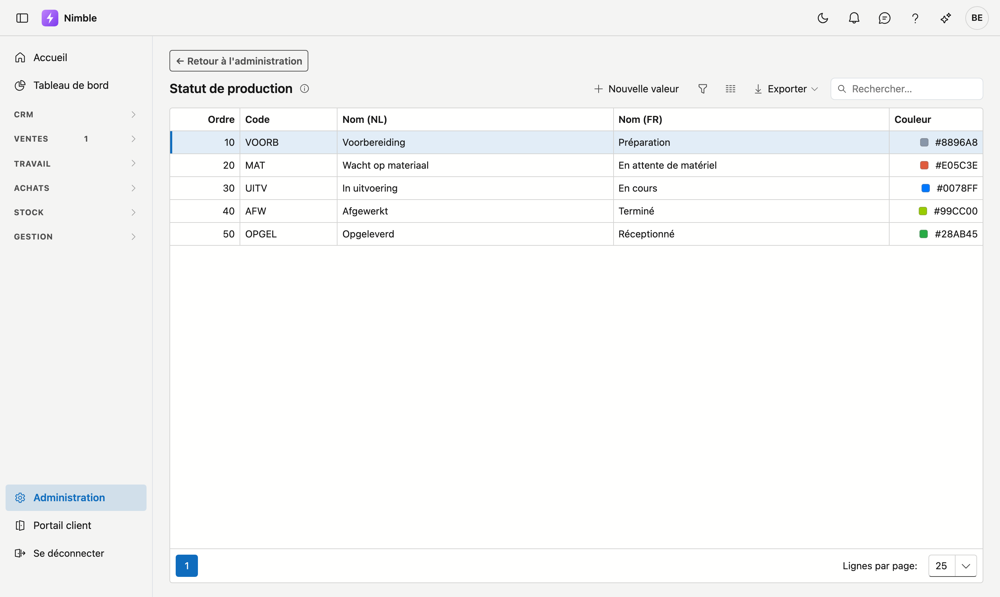
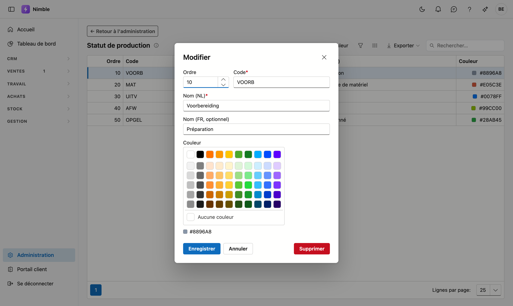

# Statut de production

Le **statut de production** indique où en est le travail dans l'exécution : en préparation, en attente de
matériel, en cours, réceptionné … Vous déterminez vous-même les étapes de votre entreprise et leur nom.

## Ouvrir l'écran

1. Cliquez en bas de la barre latérale sur **Administration**.
2. Cliquez dans le groupe **Projets** sur la tuile **Statut de production**.

## Où le statut est utilisé

- Sur la **fiche projet**, dans la colonne de droite sous Statut.
- Comme **colonne dans la liste des projets**, où vous pouvez trier et filtrer dessus.

## Ajouter ou modifier une étape

Cliquez sur **Nouvelle valeur**, ou double-cliquez une ligne existante.

| Champ | Remarque |
|---|---|
| **Ordre** | Détermine la place dans la liste de choix ; le plus petit nombre en haut |
| **Code** | Votre propre clé courte — obligatoire et unique |
| **Nom (NL)** | Obligatoire ; c'est ce qui s'affiche sur un écran néerlandophone |
| **Nom (FR)** | Facultatif ; laisser vide signifie que le nom néerlandais apparaît aussi en français |
| **Couleur** | Facultatif ; choisissez une tuile du palet ou cliquez sur **Aucune couleur** |

!!! tip "Classez les étapes dans l'ordre du travail"
    Utilisez l'ordre du déroulement — préparation, exécution, réception. La liste de choix se lit alors
    comme une progression et non comme une énumération alphabétique.

## La couleur

La couleur apparaît sous forme de carré coloré devant le statut dans la **liste des projets**. Vous voyez
ainsi d'un coup d'œil où en est chaque projet, sans lire chaque ligne.

Une échelle fonctionne le mieux : une couleur d'alerte pour les étapes qui demandent de l'attention, une
couleur neutre pour le travail en cours, et du vert à mesure qu'un projet se termine.

!!! info "La couleur est facultative"
    Si vous ne choisissez pas de couleur, aucun carré n'apparaît. Le statut lui-même fonctionne
    normalement.

## Et si vous n'utilisez pas cette liste ?

Si vous laissez la liste vide, le **champ Statut de production disparaît** de la fiche projet et de la
liste des projets. Il n'y a rien à désactiver : c'est la liste elle-même qui détermine si le champ est là.

L'inverse est vrai aussi. Si vous ajoutez plus tard une première étape, le champ réapparaît
automatiquement.

## Supprimer une étape

**Supprimer** archive l'étape : elle disparaît de la liste de choix, mais les projets qui la portent déjà
la conservent. Les informations anciennes restent ainsi lisibles. La récupération se fait via la corbeille.
