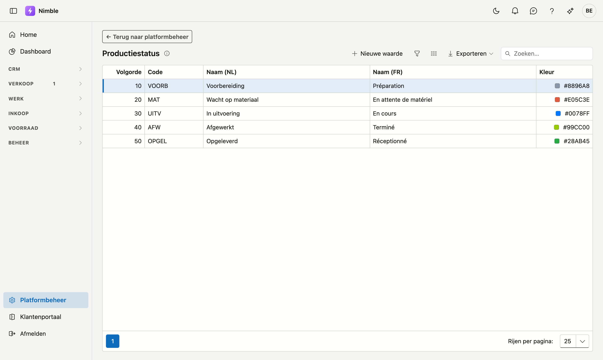
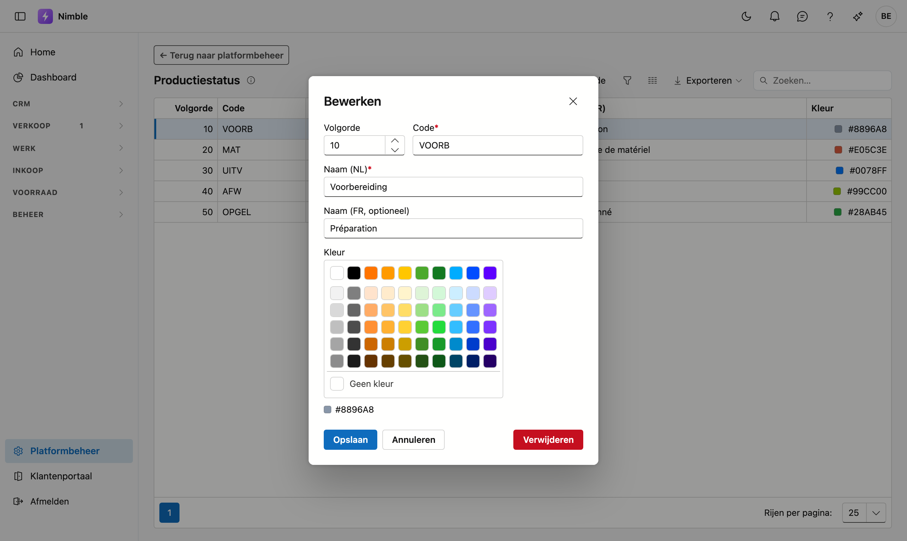

# Productiestatus

De **productiestatus** zegt waar het werk staat in de uitvoering: in voorbereiding, wacht op materiaal,
bezig, opgeleverd … U bepaalt zelf welke stappen uw bedrijf hanteert en hoe ze heten.

## Het scherm openen

1. Klik onderaan in de zijbalk op **Platformbeheer**.
2. Klik in de groep **Projecten** op de tegel **Productiestatus**.

## Waar de status gebruikt wordt

- Op de **projectfiche**, in de rechterkolom onder Status.
- Als **kolom in de projectenlijst**, waar u erop kunt sorteren en filteren.

## Een stap toevoegen of wijzigen

Klik **Nieuwe waarde**, of dubbelklik een bestaande rij.

| Veld | Opmerking |
|---|---|
| **Volgorde** | Bepaalt de plaats in de keuzelijst; laagste getal bovenaan |
| **Code** | Uw eigen korte sleutel — verplicht en uniek |
| **Naam (NL)** | Verplicht; dit is wat men ziet op een Nederlandstalig scherm |
| **Naam (FR)** | Optioneel; leeg laten betekent dat de Nederlandse naam ook in het Frans verschijnt |
| **Kleur** | Optioneel; kies een tegel uit het palet of klik **Geen kleur** |

!!! tip "Zet de stappen in de volgorde van het werk"
    Gebruik de volgorde zoals het werk verloopt — voorbereiding, uitvoering, oplevering. Dan leest de
    keuzelijst als een verloop en niet als een alfabetische opsomming.

## De kleur

De kleur verschijnt als een gekleurd blokje vóór de status in de **projectenlijst**. Zo ziet u in één
oogopslag waar elk project staat, zonder elke regel te lezen.

Een schaal werkt het best: een waarschuwende kleur voor stappen die aandacht vragen, een neutrale voor
werk dat loopt, en groen naarmate een project klaar raakt.

!!! info "Kleur is optioneel"
    Kiest u geen kleur, dan staat er gewoon geen blokje. De status zelf werkt onveranderd.

## Wat als u deze lijst niet gebruikt?

Laat u de lijst leeg, dan **verdwijnt het veld Productiestatus** van de projectfiche en uit de
projectenlijst. Er valt niets uit te schakelen: de lijst zelf bepaalt of het veld er staat.

Dat geldt ook omgekeerd. Voegt u later een eerste stap toe, dan verschijnt het veld vanzelf.

## Een stap verwijderen

**Verwijderen** archiveert de stap: ze verdwijnt uit de keuzelijst, maar projecten die ze al dragen
houden ze gewoon. Zo blijft oude informatie leesbaar. Terughalen kan via de prullenbak.
