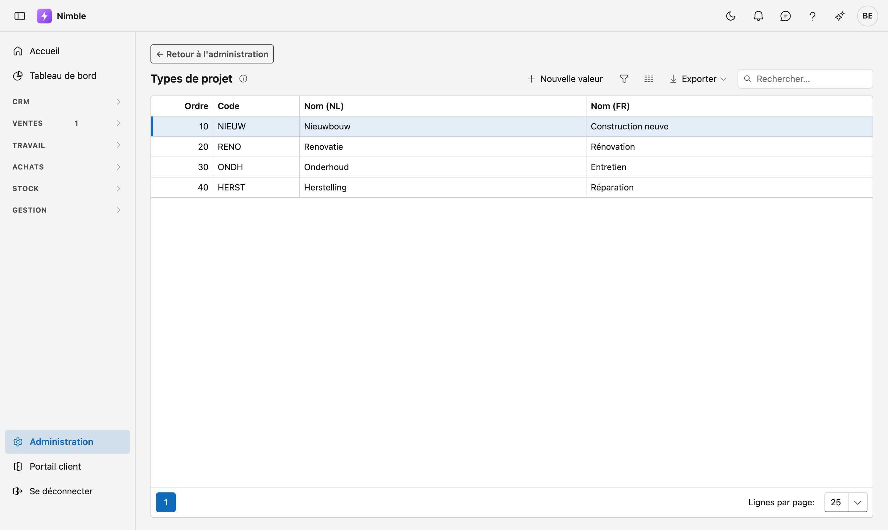

# Types de projet

Les **types de projet** vous permettent de classer vos projets par nature de travail : construction neuve,
rénovation, entretien, réparation … Vous choisissez vous-même la classification utile à votre entreprise.

## Ouvrir l'écran

1. Cliquez en bas de la barre latérale sur **Administration**.
2. Cliquez dans le groupe **Projets** sur la tuile **Types de projet**.

## Où le type est utilisé

- Sur la **fiche projet**, dans la colonne de droite sous Statut de production.
- Comme **colonne dans la liste des projets**, où vous pouvez trier et filtrer dessus.

Le type sert purement à votre propre classement : Nimble n'en calcule rien. Il est pratique pour filtrer
et pour voir comment votre travail se répartit.

## Ajouter ou modifier un type

Cliquez sur **Nouvelle valeur**, ou double-cliquez une ligne existante.

| Champ | Remarque |
|---|---|
| **Ordre** | Détermine la place dans la liste de choix ; le plus petit nombre en haut |
| **Code** | Votre propre clé courte — obligatoire et unique |
| **Nom (NL)** | Obligatoire ; c'est ce qui s'affiche sur un écran néerlandophone |
| **Nom (FR)** | Facultatif ; laisser vide signifie que le nom néerlandais apparaît aussi en français |

!!! tip "Gardez la liste courte"
    Quatre à six types suffisent généralement. Une longue liste signifie le plus souvent que deux
    classifications se mélangent — par exemple la nature du travail et le type de client. Cette seconde
    appartient à la fiche client.

## Et si vous n'utilisez pas cette liste ?

Si vous laissez la liste vide, le **champ Type de projet disparaît** de la fiche projet et de la liste des
projets. Il n'y a rien à désactiver : c'est la liste elle-même qui détermine si le champ est là.

L'inverse est vrai aussi. Si vous ajoutez plus tard un premier type, le champ réapparaît automatiquement.

## Supprimer un type

**Supprimer** archive le type : il disparaît de la liste de choix, mais les projets qui le portent déjà le
conservent. Les informations anciennes restent ainsi lisibles. La récupération se fait via la corbeille.
