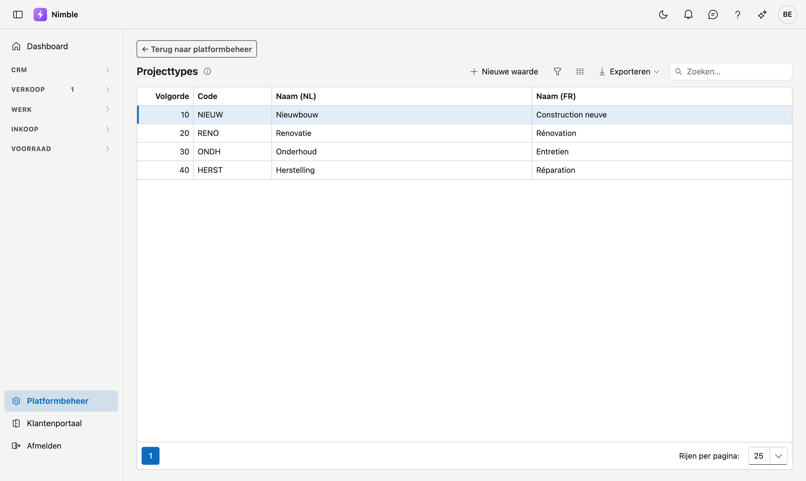

# Projecttypes

Met **projecttypes** deelt u uw projecten in naar soort werk: nieuwbouw, renovatie, onderhoud,
herstelling … U kiest zelf welke indeling zinvol is voor uw bedrijf.

## Het scherm openen

1. Klik onderaan in de zijbalk op **Platformbeheer**.
2. Klik in de groep **Projecten** op de tegel **Projecttypes**.

## Waar het type gebruikt wordt

- Op de **projectfiche**, in de rechterkolom onder Productiestatus.
- Als **kolom in de projectenlijst**, waar u erop kunt sorteren en filteren.

Het type is puur voor uw eigen indeling: Nimble rekent er niets mee. Het is handig om te filteren en om
te zien hoe uw werk verdeeld is.

## Een type toevoegen of wijzigen

Klik op **Nieuwe waarde**, of dubbelklik op een bestaande rij. Er opent een venster met onderstaande velden en de knoppen **Bewaren** en **Annuleren**; bij een bestaande waarde staat rechts ook **Verwijderen**. Met **Exporteren** boven de lijst haalt u de lijst binnen in een bestand.

| Veld | Opmerking |
|---|---|
| **Volgorde** | Bepaalt de plaats in de keuzelijst; laagste getal bovenaan |
| **Code** | Uw eigen korte sleutel — verplicht en uniek |
| **Naam (NL)** en **Naam (FR)** | De naam in de basistaal van uw bedrijf is verplicht; de andere taal draagt het label *optioneel*. Blijft die leeg, dan verschijnt de naam in de basistaal |

!!! tip "Houd de lijst kort"
    Vier tot zes types volstaan meestal. Een lange lijst betekent doorgaans dat er twee indelingen door
    elkaar lopen — bijvoorbeeld het soort werk én de klantsoort. Die tweede hoort op de klantenfiche.

## Wat als u deze lijst niet gebruikt?

Laat u de lijst leeg, dan **verdwijnt het veld Projecttype** van de projectfiche en uit de projectenlijst.
Er valt niets uit te schakelen: de lijst zelf bepaalt of het veld er staat.

Dat geldt ook omgekeerd. Voegt u later een eerste type toe, dan verschijnt het veld vanzelf.

## Een type verwijderen

**Verwijderen** archiveert het type: het verdwijnt uit de keuzelijst, maar projecten die het al dragen
houden het gewoon. Zo blijft oude informatie leesbaar. Terughalen kan via de [prullenbak](recycle-bin.md).
