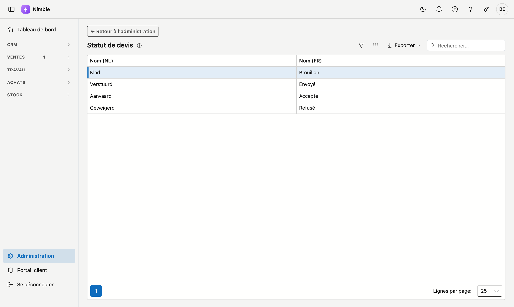

# Statuts de devis

Les quatre statuts d'un devis portent un libellé que vous choisissez vous-même. Le **nombre** de statuts et
leur **signification** sont fixes — le comportement de l'écran des devis en dépend — mais leur nom vous
appartient.

## Ouvrir l'écran

1. Cliquez sur **Administration** en bas de la barre latérale.
2. Dans le groupe **Ventes**, cliquez sur la tuile **Statut de devis**.

## La liste

La liste affiche pour chaque statut le **Nom (NL)** et le **Nom (FR)**. Il n'y a pas de bouton pour ajouter un
statut : les quatre statuts sont fixes. **Exporter** récupère la liste dans un fichier.

| Statut | Libellé par défaut | Quand un devis s'y trouve |
|---|---|---|
| Brouillon | **Brouillon** | Vous êtes en train de l'établir |
| Envoyé | **Envoyé** | Il est chez le client ; vous attendez sa réponse |
| Accepté | **Accepté** | Le client marque son accord. Le devis est clôturé |
| Refusé | **Refusé** | Le client a refusé. Le devis est clôturé |

## Adapter un libellé

1. Double-cliquez sur le statut. Une fenêtre **Modifier** s'ouvre.
2. Remplissez le **Nom (NL)** et le **Nom (FR)**. Le nom dans la langue de base de votre entreprise est
   obligatoire ; l'autre langue porte la mention *optionnel*.
3. Cliquez sur **Enregistrer**, ou sur **Annuler** pour fermer la fenêtre sans enregistrer.

Ce libellé apparaît dans les en-têtes du tableau des devis, dans la colonne Statut de la liste, et sur les
boutons d'un devis.

!!! tip "Utilisez vos propres mots"
    Si en interne vous appelez un devis envoyé « En traitement », inscrivez-le. L'application suit votre
    vocabulaire, et non l'inverse.

!!! warning "Complétez les deux langues"
    Si le champ de l'autre langue reste vide, l'application se rabat sur la langue de base. Un utilisateur
    francophone verra alors « Klad » au milieu d'écrans par ailleurs en français — cela se lit comme une erreur
    de traduction alors qu'il s'agit d'un champ vide.

## Voir aussi

- [Devis](../sales/quotes.md)
- [Statut de facture](invoice-status.md) — le même écran, pour les factures
- [Administration](platform-management.md)
