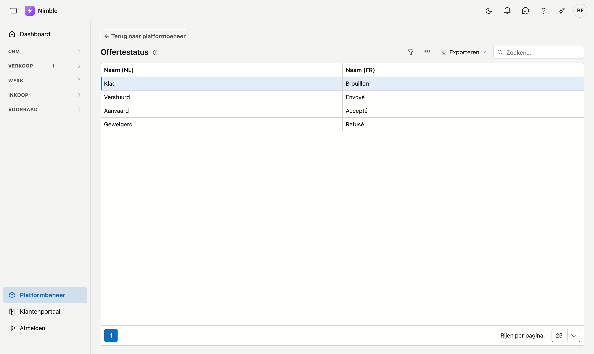

# Offertestatus

De vier statussen van een offerte dragen een tekst die u zelf kunt kiezen. Het **aantal** statussen en hun
**betekenis** liggen vast — daar hangt het gedrag van het offertescherm aan — maar hoe ze heten, bepaalt u.

## Het scherm openen

1. Klik onderaan in de zijbalk op **Platformbeheer**.
2. Klik in de groep **Verkoop** op de tegel **Offertestatus**.

## De lijst

De lijst toont per status de **Naam (NL)** en de **Naam (FR)**. Er is geen knop om een status toe te voegen:
de vier statussen liggen vast. Met **Exporteren** haalt u de lijst binnen in een bestand.

| Status | Standaardtekst | Wanneer een offerte hier staat |
|---|---|---|
| Klad | **Klad** | U bent ze aan het opmaken |
| Verstuurd | **Verstuurd** | Ze is bij de klant; u wacht op antwoord |
| Aanvaard | **Aanvaard** | De klant is akkoord. De offerte is afgesloten |
| Geweigerd | **Geweigerd** | De klant heeft afgewezen. De offerte is afgesloten |

## Een tekst aanpassen

1. Dubbelklik op de status. Er opent een venster **Bewerken**.
2. Vul de **Naam (NL)** en de **Naam (FR)** in. De naam in de basistaal van uw bedrijf is verplicht; de andere
   taal draagt het label *optioneel*.
3. Klik op **Bewaren**, of op **Annuleren** om het venster te sluiten zonder te bewaren.

Die tekst verschijnt in de kolomkoppen van het offertebord, in de statuskolom van de lijst, en op de knoppen
van een offerte.

!!! tip "Gebruik uw eigen woorden"
    Noemt u een verstuurde offerte intern "In behandeling", zet dat er dan. De app volgt uw taal, niet
    andersom.

!!! warning "Vul beide talen in"
    Blijft het veld in de andere taal leeg, dan valt de app terug op de basistaal. Een Franstalige gebruiker
    ziet dan "Klad" staan tussen verder Franse schermteksten — dat leest als een vertaalfout terwijl het een
    leeg veld is.

## Zie ook

- [Offertes](../sales/quotes.md)
- [Factuurstatus](invoice-status.md) — hetzelfde scherm, voor facturen
- [Platformbeheer](platform-management.md)
