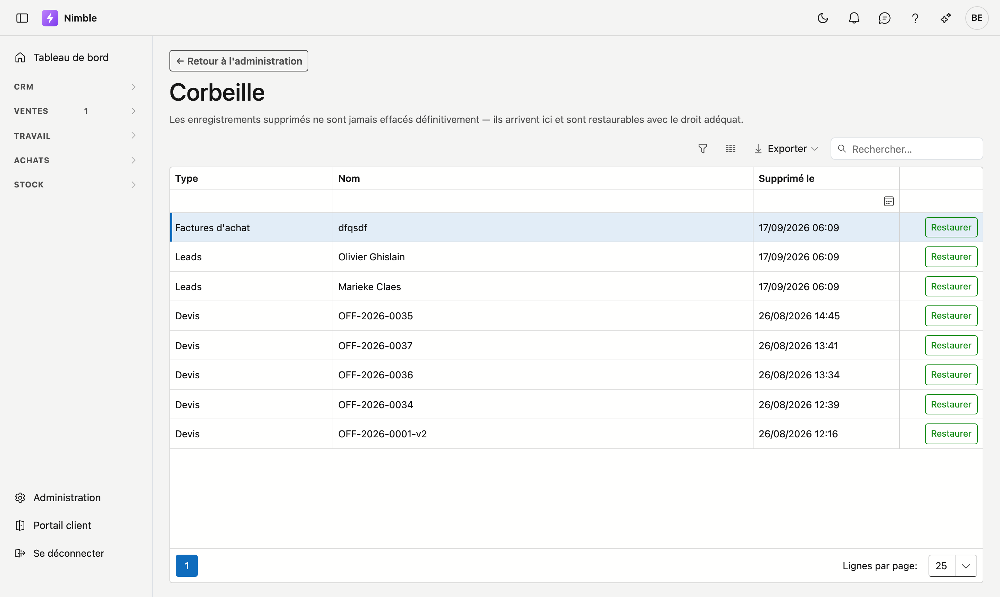

# Corbeille

Ce que vous supprimez dans Nimble n'est pas détruit mais mis de côté. L'élément arrive dans la corbeille et y reste restaurable. Sur cet écran, vous remettez un enregistrement à sa place.

## Ouvrir l'écran

1. Cliquez sur **Administration** en bas de la barre latérale.
2. Dans le groupe **Données et accès**, cliquez sur la tuile **Corbeille**.

## La liste

La liste affiche trois colonnes par enregistrement supprimé :

| Colonne | Ce que vous voyez |
|---|---|
| **Type** | De quel type d'enregistrement il s'agit, p. ex. *Leads*, *Devis* ou *Codes TVA* |
| **Nom** | La description à laquelle vous reconnaissez l'enregistrement |
| **Supprimé le** | La date et l'heure de la mise de côté |

Filtrez par colonne pour limiter la liste, par exemple à un seul type. **Exporter** récupère la liste dans un
fichier. Si rien n'a été supprimé, la mention **La corbeille est vide.** s'affiche.

## Ce qui arrive dans la corbeille

Relations, personnes de contact, leads, devis, factures de vente, commandes, factures d'achat, articles,
projets, ordres de travail, bons de travail, collaborateurs et équipes — ainsi que les listes de choix de
l'Administration : familles d'articles, unités, statuts de production, statuts pipeline, types de projet,
catégories client, fonctions de contact, sources de leads, types de demande et codes TVA.

Une [phase de lead](lead-status.md) que vous supprimez ne va **pas** dans la corbeille : elle disparaît
définitivement.

## Restaurer un enregistrement

Cliquez en fin de ligne sur **Restaurer**. L'enregistrement retrouve sa place et disparaît de la corbeille.

La corbeille ne propose que **Restaurer**. Il n'est pas possible d'y effacer définitivement des
enregistrements.

## Erreurs fréquentes

!!! warning
    **Restaurez ensemble les enregistrements liés.** Si vous avez supprimé une relation *et* ses personnes de contact, et que vous ne restaurez que les personnes de contact, celles-ci renvoient à une relation encore dans la corbeille. Dans ce cas, cherchez d'abord l'enregistrement parent et restaurez-le en premier.

!!! info
    Vous avez besoin du droit de restaurer. Si le bouton **Restaurer** n'apparaît pas, demandez à votre administrateur d'ajouter ce droit à votre rôle.

## Voir aussi

- [Rôles](roles.md) — attribuer le droit de restaurer
- [Administration](platform-management.md)
