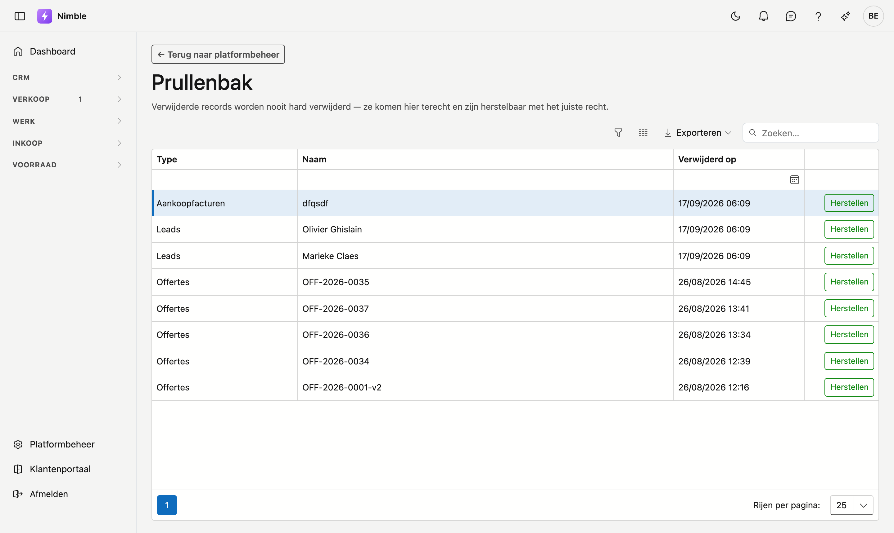

# Prullenbak

Wat u in Nimble verwijdert, wordt niet vernietigd maar weggelegd. Het komt in de prullenbak terecht en blijft daar herstelbaar. Op dit scherm zet u een record terug op zijn plaats.

## Het scherm openen

1. Klik onderaan in de zijbalk op **Platformbeheer**.
2. Klik in de groep **Gegevens en toegang** op de tegel **Prullenbak**.

## De lijst

De lijst toont per verwijderd record drie kolommen:

| Kolom | Wat u ziet |
|---|---|
| **Type** | Om wat voor record het gaat, bv. *Leads*, *Offertes* of *Btw-codes* |
| **Naam** | De omschrijving waaraan u het record herkent |
| **Verwijderd op** | Datum en uur waarop het weggelegd is |

Filter per kolom om de lijst te beperken, bijvoorbeeld tot één type. Met **Exporteren** haalt u de lijst
binnen in een bestand. Is er niets verwijderd, dan staat er **De prullenbak is leeg.**

## Wat er in de prullenbak komt

Relaties, contactpersonen, leads, offertes, verkoopfacturen, bestellingen, aankoopfacturen, artikelen,
projecten, werkorders, werkbonnen, medewerkers en ploegen — en ook de keuzelijsten uit Platformbeheer:
artikelfamilies, eenheden, productiestatus, pipeline-status, projecttypes, klantcategorieën, contactfuncties,
leadbronnen, types aanvraag en btw-codes.

Een [leadfase](lead-status.md) die u verwijdert, komt **niet** in de prullenbak: die is meteen definitief weg.

## Een record herstellen

Klik achteraan de rij op **Herstellen**. Het record staat daarna terug op zijn plaats en verdwijnt uit de
prullenbak.

De prullenbak kent enkel **Herstellen**. Records definitief wissen kan hier niet.

## Veelgemaakte fouten

!!! warning
    **Herstel samenhangende records samen.** Verwijderde u een relatie én haar contactpersonen, en herstelt u enkel de contactpersonen, dan verwijzen die naar een relatie die nog in de prullenbak ligt. Zoek in dat geval eerst het bovenliggende record en herstel dat als eerste.

!!! info
    U hebt het recht om te herstellen nodig. Ziet u de knop **Herstellen** niet staan, vraag dan aan uw beheerder om dat recht aan uw rol toe te voegen.

## Zie ook

- [Rollen](roles.md) — het recht om te herstellen toekennen
- [Platformbeheer](platform-management.md)
