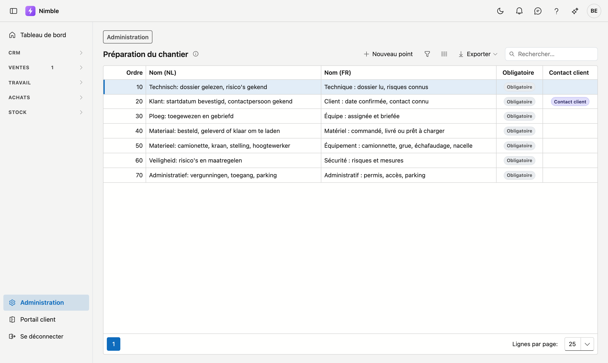

# Préparation du chantier

L'écran **Préparation du chantier** définit ce qui doit être prêt avant le début d'un chantier. Chaque nouveau
projet reçoit ces points dans son onglet [Préparation](../work/projects.md#onglet-preparation). Chaque chantier
travaille ainsi avec la même liste, par exemple *Équipe : assignée et briefée* et
*Matériel : commandé, livré ou prêt à charger*.

## Ouvrir l'écran

1. Cliquez en bas de la barre latérale sur **Administration**.
2. Dans le groupe **Projets**, cliquez sur la tuile **Préparation du chantier**.

## Ajouter ou modifier un point

Cliquez sur **Nouveau point**, ou double-cliquez sur un point de la liste. Dans la fenêtre, vous complétez :

| Champ | Ce qu'il fait |
|---|---|
| **Nom (NL)** | Le nom du point en néerlandais. Obligatoire |
| **Nom (FR)** | Le nom du point en français |
| **Ordre** | La place du point dans la liste du projet. Un nouveau point se place à la fin |
| **Obligatoire** | Un chantier n'est **prêt à démarrer** que lorsque tous les points obligatoires sont cochés |
| **Contact client** | Voir ci-dessous |

Cliquez sur **Enregistrer**.

Un projet reçoit le nom dans la langue de votre entreprise. Si cette langue est le français et que vous laissez
**Nom (FR)** vide, le projet reçoit le nom néerlandais.

## Le point Contact client

Cochez **Contact client** sur le point qui indique que le client a été contacté. Dans la liste standard, il s'agit
de *Client : date confirmée, contact connu*.

Si ce point est encore ouvert une semaine avant le début du chantier, Nimble crée pendant la nuit une
[tâche](../crm/tasks.md), avec un rappel. Un seul point peut porter **Contact client** : si vous le cochez sur un
autre point, il disparaît du point précédent.

## Supprimer un point

Double-cliquez sur le point et cliquez sur **Supprimer**. Le point va dans la [corbeille](recycle-bin.md), où vous
pouvez le restaurer.

!!! info "Une modification ne concerne que les nouveaux projets"
    Un nouveau projet que vous créez dans Nimble reçoit la liste immédiatement. Un projet qui a déjà reçu un point
    le conserve avec le texte d'origine, même si vous modifiez ou supprimez le point ici. Sur un autre projet,
    **Ajouter la liste standard** dans l'onglet Préparation complète ce qui manque encore.

## Erreurs fréquentes

!!! warning "Un projet sans points n'est jamais prêt à démarrer"
    Si vous supprimez tous les points, un nouveau projet ne reçoit aucune préparation. Un tel projet n'est jamais
    prêt à démarrer : rien n'a encore été préparé. Gardez donc au moins les points qui valent pour chaque chantier.

## Voir aussi

- [Projets](../work/projects.md) — l'onglet Préparation
- [Points ouverts](../work/open-points.md) — les points ouverts de tous les projets dans une seule liste
- [Tâches](../crm/tasks.md) — les rappels que Nimble crée
- [Administration](platform-management.md) — tous les écrans de gestion
