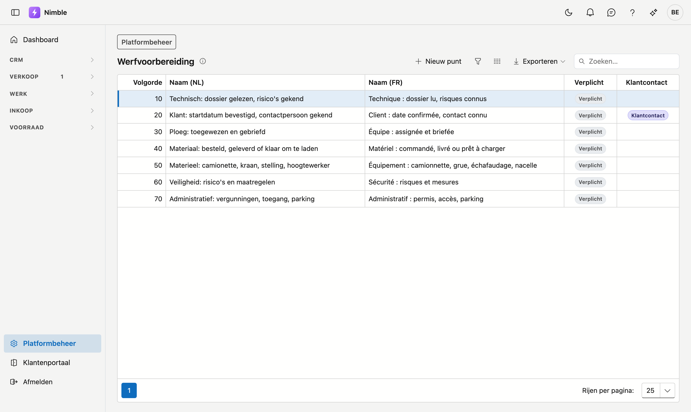

# Werfvoorbereiding

Op **Werfvoorbereiding** legt u vast wat er klaar moet zijn vóór een werf start. Elk nieuw project krijgt deze
punten op zijn tabblad [Voorbereiding](../work/projects.md#tabblad-voorbereiding). Zo werkt elke werf met dezelfde
lijst, bijvoorbeeld *Ploeg: toegewezen en gebriefd* en *Materiaal: besteld, geleverd of klaar om te laden*.

## Het scherm openen

1. Klik onderaan in de zijbalk op **Platformbeheer**.
2. Klik in de groep **Projecten** op de tegel **Werfvoorbereiding**.

## Een punt toevoegen of wijzigen

Klik **Nieuw punt**, of dubbelklik op een punt in de lijst. In het venster vult u in:

| Veld | Wat het doet |
|---|---|
| **Naam (NL)** | De naam van het punt in het Nederlands. Verplicht |
| **Naam (FR)** | De naam van het punt in het Frans |
| **Volgorde** | De plaats van het punt in de lijst van het project. Een nieuw punt komt achteraan |
| **Verplicht** | Een werf is pas **startklaar** wanneer alle verplichte punten afgevinkt zijn |
| **Klantcontact** | Zie hieronder |

Klik **Bewaren**.

Een project krijgt de naam in de taal van uw bedrijf. Is die taal Frans en laat u **Naam (FR)** leeg, dan krijgt
het project de Nederlandse naam.

## Het punt Klantcontact

Vink **Klantcontact** aan bij het punt dat zegt dat de klant gecontacteerd is. In de standaardlijst is dat
*Klant: startdatum bevestigd, contactpersoon gekend*.

Staat dat punt een week vóór de start van de werf nog open, dan maakt Nimble 's nachts een
[taak](../crm/tasks.md) aan, met een herinnering. Eén punt kan **Klantcontact** dragen: vinkt u het bij een ander
punt aan, dan verdwijnt het bij het vorige.

## Een punt verwijderen

Dubbelklik op het punt en klik **Verwijderen**. Het punt gaat naar de [prullenbak](recycle-bin.md), waar u het
kunt terugzetten.

!!! info "Een wijziging raakt enkel nieuwe projecten"
    Een nieuw project dat u in Nimble aanmaakt, krijgt de lijst meteen. Een project dat een punt al kreeg, houdt
    het met de tekst van toen, ook als u het punt hier wijzigt of verwijdert. Op een ander project vult
    **Standaardlijst toevoegen** op het tabblad Voorbereiding aan wat er nog ontbreekt.

## Veelgemaakte fouten

!!! warning "Een project zonder punten is nooit startklaar"
    Verwijdert u alle punten, dan krijgt een nieuw project geen voorbereiding. Zo'n project is nooit startklaar:
    er is dan nog niets voorbereid. Laat dus minstens de punten staan die voor elke werf gelden.

## Zie ook

- [Projecten](../work/projects.md) — het tabblad Voorbereiding
- [Openstaande punten](../work/open-points.md) — de open punten van alle projecten in één lijst
- [Taken](../crm/tasks.md) — de herinneringen die Nimble aanmaakt
- [Platformbeheer](platform-management.md) — alle beheerschermen
