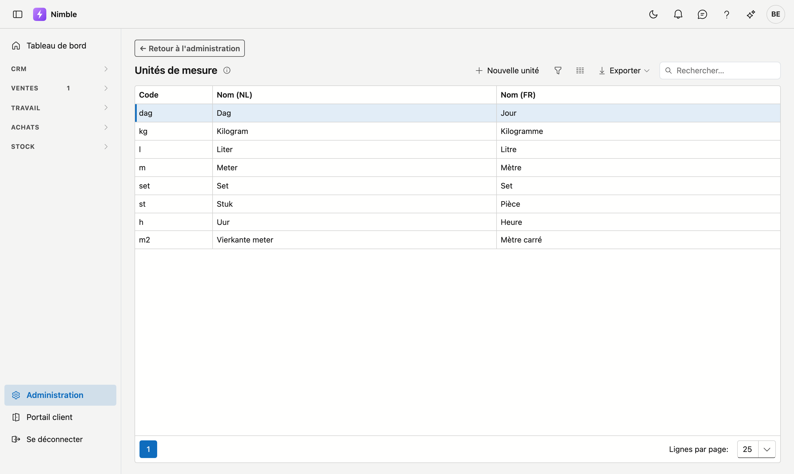

# Unités de mesure

Les **unités de mesure** sont utilisées sur les articles : pièce, mètre, mètre carré, kilogramme, litre, heure … Chaque nouveau tenant démarre avec un jeu standard ; vous pouvez en ajouter ou les adapter.

## Ouvrir l'écran

1. Cliquez sur **Administration** en bas de la barre latérale.
2. Dans le groupe **Articles**, cliquez sur la tuile **Unités de mesure**.

## La liste

| Colonne | Signification |
|---|---|
| **Code** | Code court (p. ex. `st`, `m`, `kg`) |
| **Nom (NL)** | Nom néerlandais |
| **Nom (FR)** | Nom français |

Double-cliquez sur une ligne pour la modifier, ou cliquez sur **Nouvelle unité**. **Exporter** récupère la liste dans un fichier.

## Créer ou modifier une unité

Une fenêtre **Nouvelle unité** ou **Modifier l'unité** s'ouvre.

1. Remplissez le **Code** — obligatoire.
2. Remplissez le nom dans la **langue de base de votre entreprise** — obligatoire. L'autre langue porte la mention **optionnel**, par exemple **Nom (FR, optionnel)**.
3. Cliquez sur **Enregistrer**, ou sur **Annuler** pour fermer la fenêtre sans enregistrer.

S'il manque quelque chose, un message en haut de la fenêtre indique quels champs sont encore vides.

## Supprimer

Ouvrez l'unité et cliquez à droite dans la fenêtre sur **Supprimer**. Après confirmation, l'unité va dans la [corbeille](recycle-bin.md) ; les articles existants qui l'utilisent sont conservés. Vous pouvez la récupérer via la corbeille.

## Erreurs fréquentes

!!! warning
    - **Codes en double** — gardez les codes courts et uniques ; deux unités de même signification rendent les listes d'articles confuses.
    - **Unité standard supprimée** — récupérez-la via la corbeille.

## Voir aussi

- [Administration](platform-management.md)
- [Familles d'articles](article-families.md)
