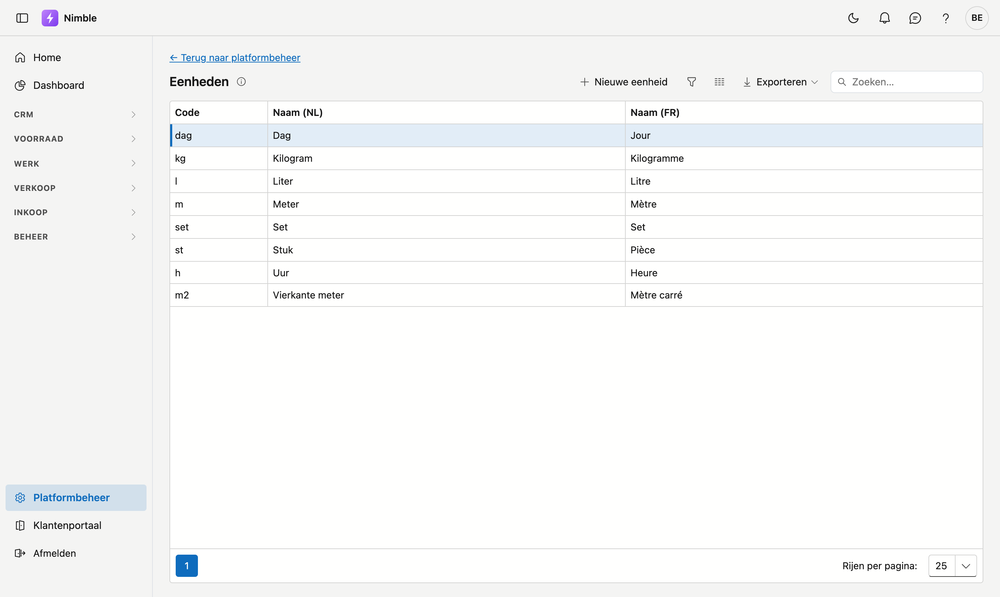

# Eenheden

**Eenheden** zijn de meeteenheden die u op artikelen gebruikt: stuk, meter, vierkante meter, kilogram, liter, uur … Elke nieuwe tenant start met een standaardset; u kunt er zelf bijmaken of aanpassen.

## Het scherm openen

1. Klik onderaan in de zijbalk op **Platformbeheer**.
2. Klik in de groep **Artikelen** op de tegel **Eenheden**.

## De lijst

| Kolom | Betekenis |
|---|---|
| **Code** | Korte code (bv. `st`, `m`, `kg`) |
| **Naam (NL)** | Nederlandstalige naam (verplicht) |
| **Naam (FR)** | Franstalige naam (optioneel) |

Dubbelklik op een rij om te bewerken, of klik op **Nieuwe eenheid**.

## Een eenheid aanmaken of bewerken

1. Vul de **Code** en de **Naam (NL)** in — beide zijn verplicht.
2. Vul optioneel de **Naam (FR)** in; die verschijnt voor Franstalige gebruikers.
3. Klik op **Opslaan**.

## Verwijderen

Open de eenheid en klik op **Verwijderen**. De eenheid wordt gearchiveerd (prullenbak); bestaande artikelen die de eenheid gebruiken blijven behouden.

## Veelgemaakte fouten

!!! warning
    - **Dubbele codes** — houd de codes kort en uniek; twee eenheden met dezelfde betekenis maken de artikellijsten verwarrend.
    - **Standaardeenheid verwijderd** — geen ramp: maak ze gewoon opnieuw aan met dezelfde code.

## Zie ook

- [Platformbeheer](platform-management.md)
- [Artikelfamilies](article-families.md)
