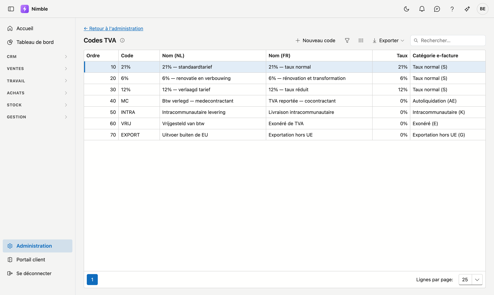

# Codes TVA

Les codes TVA que vous choisissez sur une ligne de devis ou de facture. Chaque code porte un **taux** et une
**catégorie pour la facture électronique** — et ces deux notions ne se confondent pas.

## Ouvrir l'écran

**Administration → Codes TVA**.

## Pourquoi une catégorie à côté du taux

Trois des codes courants appliquent **0 %** mais signifient des choses très différentes : exonéré, reporté
au cocontractant, ou intracommunautaire. Sur une facture, chacun exige une mention distincte, et votre
comptabilité les impute sur des comptes différents. Qui ne conserve que « 0 % » ne peut plus établir cette
facture sans deviner.

D'où la colonne **Catégorie e-facture**. Elle suit la norme Peppol, le format dans lequel les factures
électroniques sont envoyées.

## Les champs

| Champ | Signification |
|---|---|
| **Ordre** | Détermine la place dans la liste déroulante. Le premier code est celui qu'un nouveau devis propose |
| **Code** | La clé courte telle que vous la connaissez : `21%`, `6%`, `MC` |
| **Nom (NL)** et **Nom (FR)** | Ce qui apparaît dans la liste et sur les documents |
| **Taux (%)** | Le pourcentage. Zéro en cas de report, d'exonération et d'intracommunautaire |
| **Catégorie e-facture** | La catégorie Peppol — voir ci-dessous |

## Le jeu de départ

Chaque nouveau client reçoit automatiquement un jeu de départ belge :

| Code | Nom | Taux | Catégorie |
|---|---|---:|---|
| `21%` | 21% — taux normal | 21 % | Taux normal (S) |
| `6%` | 6% — rénovation et transformation | 6 % | Taux normal (S) |
| `12%` | 12% — taux réduit | 12 % | Taux normal (S) |
| `MC` | TVA reportée — cocontractant | 0 % | Autoliquidation (AE) |
| `INTRA` | Livraison intracommunautaire | 0 % | Intracommunautaire (K) |
| `VRIJ` | Exonéré de TVA | 0 % | Exonéré (E) |
| `EXPORT` | Exportation hors UE | 0 % | Exportation (G) |

Ce jeu est un **point de départ**, pas une règle. Si vous travaillez surtout en rénovation, placez `6%` à
l'ordre 10 — chaque nouveau devis proposera alors ce taux. Les codes que vous n'utilisez jamais peuvent être
supprimés.

!!! info "Le jeu de départ n'arrive qu'une fois"
    Les codes ne sont créés que chez un client qui n'en a encore aucun. Si vous en supprimez un par la suite,
    il ne réapparaîtra pas à la connexion suivante.

## Erreurs fréquentes

!!! warning
    - **Supprimer tous les codes TVA** — une ligne de devis calcule alors 0 % de TVA, sans avertissement. Vous
      ne le remarquez qu'une fois le devis chez le client.
    - **Enregistrer le cocontractant comme « 0 % »** sans la catégorie *Autoliquidation (AE)* — votre facture
      électronique perd alors la mention obligatoire et votre comptabilité ne suit plus.
    - **Modifier le taux d'un code existant** — cela ne change rien aux devis déjà établis : ceux-ci
      conservent le pourcentage tel qu'il a été calculé. C'est voulu.

## Voir aussi

- [Devis](../sales/quotes.md) — où vous choisissez ces codes ligne par ligne
- [Administration](platform-management.md)
