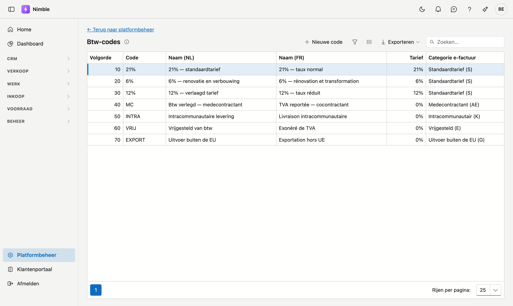

# Btw-codes

De btw-codes die u op een offerte- of factuurregel kiest. Elke code draagt een **tarief** én een
**categorie voor de e-factuur** — en die twee zijn niet hetzelfde.

## Het scherm openen

**Platformbeheer → Btw-codes**.

## Waarom er een categorie naast het tarief staat

Drie van de gangbare codes rekenen **0 %** maar betekenen iets totaal anders: vrijgesteld, verlegd naar de
medecontractant, of intracommunautair. Op een factuur hoort bij elk een andere vermelding, en uw
boekhouding boekt ze op andere rekeningen. Wie enkel "0 %" bewaart, kan die factuur niet meer opmaken
zonder te raden.

Vandaar de kolom **Categorie e-factuur**. Die volgt de Peppol-standaard, het formaat waarin elektronische
facturen verstuurd worden.

## De velden

| Veld | Betekenis |
|---|---|
| **Volgorde** | Bepaalt de plaats in de keuzelijst. De eerste code is wat een nieuwe offerte voorstelt |
| **Code** | De korte sleutel zoals u ze kent: `21%`, `6%`, `MC` |
| **Naam (NL)** en **Naam (FR)** | Wat er in de keuzelijst en op documenten verschijnt |
| **Tarief (%)** | Het percentage. Nul bij verlegging, vrijstelling en intracommunautair |
| **Categorie e-factuur** | De Peppol-categorie — zie hieronder |

## De startset

Elke nieuwe klant krijgt automatisch een Belgische startset:

| Code | Naam | Tarief | Categorie |
|---|---|---:|---|
| `21%` | 21% — standaardtarief | 21 % | Standaardtarief (S) |
| `6%` | 6% — renovatie en verbouwing | 6 % | Standaardtarief (S) |
| `12%` | 12% — verlaagd tarief | 12 % | Standaardtarief (S) |
| `MC` | Btw verlegd — medecontractant | 0 % | Verlegging (AE) |
| `INTRA` | Intracommunautaire levering | 0 % | Intracommunautair (K) |
| `VRIJ` | Vrijgesteld van btw | 0 % | Vrijgesteld (E) |
| `EXPORT` | Uitvoer buiten de EU | 0 % | Uitvoer (G) |

Die set is een **vertrekpunt**, geen wet. Werkt u vooral aan renovaties, zet dan `6%` op volgorde 10 —
dan stelt elke nieuwe offerte dat tarief voor. Codes die u nooit gebruikt, mag u verwijderen.

!!! info "De startset komt maar één keer"
    Codes worden alleen aangemaakt bij een klant die er nog geen heeft. Verwijdert u er later een, dan komt
    die niet terug bij de volgende aanmelding.

## Veelgemaakte fouten

!!! warning
    - **Alle btw-codes verwijderen** — een offerteregel rekent dan 0 % btw, zonder waarschuwing. U merkt het
      pas wanneer de klant de offerte al heeft.
    - **Medecontractant als "0 %" bewaren** zonder de categorie *Verlegging (AE)* — dan mist uw e-factuur de
      verplichte vermelding en klopt uw boekhouding niet.
    - **Het tarief van een bestaande code wijzigen** — dat verandert niets aan offertes die al opgemaakt
      zijn: die bewaren het percentage zoals het gerekend was. Dat is de bedoeling.

## Zie ook

- [Offertes](../sales/quotes.md) — waar u deze codes per regel kiest
- [Platformbeheer](platform-management.md)
