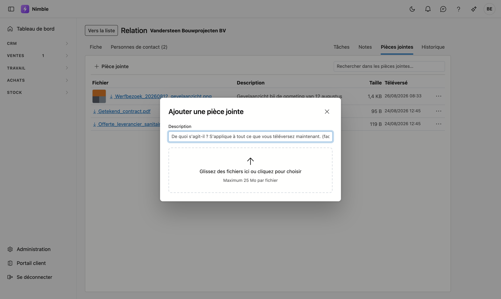
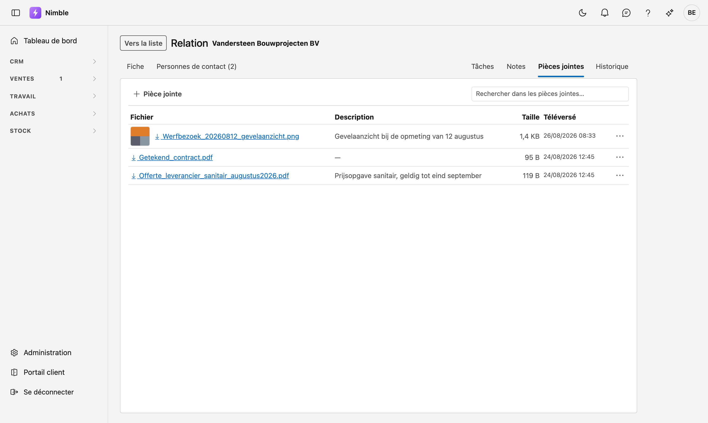

# Pièces jointes

Pour chaque client, personne de contact, lead ou projet, vous pouvez **conserver des fichiers** : un plan,
l'offre d'un fournisseur, des photos du chantier, un contrat signé. Vous les retrouvez dans le journal, sous
l'onglet **Pièces jointes**.

Le fonctionnement est identique partout ; cette page vaut donc pour tous les écrans dotés d'un journal.

## Ouvrir l'onglet

Deux chemins y mènent :

- **Sur la fiche** — ouvrez l'enregistrement (double-cliquez dessus dans la liste) et cliquez en haut à
  droite sur **Pièces jointes**.
- **Depuis la liste** — sélectionnez une ligne, cliquez à droite sur le rail **Journal**, cliquez en haut
  sur le nom de l'onglet et choisissez **Pièces jointes**.

<!-- AFBEELDING: le panneau du journal à côté de la liste des relations dans le tenant demo (Vandersteen Bouwprojecten BV sélectionnée), avec le choix d'onglet ouvert pour que Pièces jointes figure parmi Contacts, Tâches, Notes et Historique, interface en français -->

## Ajouter un fichier

Cliquez sur **+ Pièce jointe**. Une fenêtre s'ouvre où vous choisissez des fichiers ou les y glissez. Vous
pouvez en prendre **plusieurs à la fois**.

Dans cette même fenêtre, vous pouvez indiquer une **description**. Elle vaut pour toute la série téléversée
en une fois — pour les décrire séparément, ajustez-les ensuite ligne par ligne via le menu **⋯**.

!!! info "25 Mo maximum par fichier"
    Un plan de construction ou une série de photos de chantier tient largement dans cette limite. Si un
    fichier est plus volumineux, vous recevez un message mentionnant son nom, et les autres fichiers passent
    normalement.

Pour chaque fichier, vous voyez la **taille** et la **date**. Sur un écran large, elles occupent leurs
propres colonnes ; dans le panneau étroit du journal, elles passent sous le nom du fichier, de sorte qu'un
nom long tient également.

## Ouvrir un fichier

Cliquez sur son nom.

- **Ce que votre navigateur peut afficher lui-même**, comme une photo, s'ouvre dans un nouvel onglet.
- Les **autres fichiers**, comme Word ou Excel, sont téléchargés et s'ouvrent dans le programme de votre
  ordinateur.

Une photo est en outre précédée d'une vignette, pour la reconnaître dans la liste sans devoir l'ouvrir.

## Supprimer un fichier

Cliquez sur le menu **⋯** à droite de la ligne et choisissez supprimer. Le fichier disparaît de la liste.

!!! warning "Supprimer, c'est archiver"
    Le fichier n'est pas réellement effacé : il reste conservé et disparaît seulement de la vue. C'est
    volontaire — un document retiré par erreur n'est pas perdu. S'il vous manque quelque chose qui a
    disparu, demandez-le à votre administrateur.

## Qui voit quelles pièces jointes

Il n'existe **pas de droit distinct** pour consulter les pièces jointes. Qui peut ouvrir une fiche client
voit aussi les documents de ce client. C'est délibéré : pouvoir consulter une offre mais pas sa version
signée n'est pas une sécurité, c'est une confusion.

**Ajouter, modifier la description et supprimer** dépendent en revanche du droit de modification sur ce type
d'enregistrement. Si vous pouvez uniquement consulter les clients, vous ne voyez pas le bouton
**+ Pièce jointe** sur un client.

## Erreurs fréquentes

!!! warning
    - **Mauvais enregistrement sélectionné** — les pièces jointes affichées sont celles de la ligne
      sélectionnée à ce moment-là. Vérifiez le nom en haut du panneau avant de téléverser.
    - **Tout accrocher au client** — le plan d'un chantier appartient au **projet**, pas au client. Sinon,
      après quelques années, des centaines de fichiers s'entassent sur une seule fiche où plus personne ne
      retrouve rien.

## Voir aussi

- [Relations](relations.fr.md)
- [Personnes de contact](crm/contactpersonen.fr.md)
- [Leads](crm/leads.fr.md)
