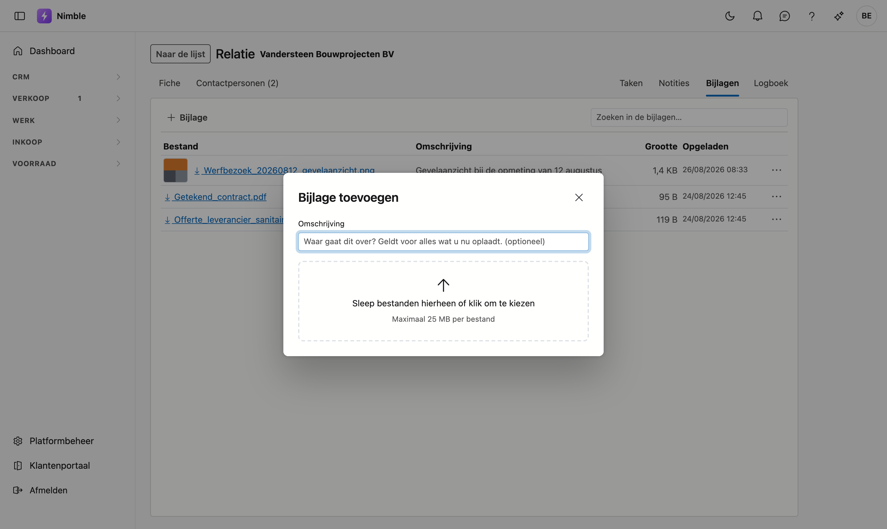

# Bijlagen

Bij elke klant, contactpersoon, lead of project kunt u **bestanden bewaren**: een plan, een offerte van een
leverancier, foto's van de werf, een getekend contract. U vindt ze in het journaal, op het tabblad
**Bijlagen**.

Dit werkt overal op dezelfde manier, dus deze pagina geldt voor alle schermen met een journaal.

## Het tabblad openen

Er zijn twee wegen naartoe:

- **Op de fiche** — open het record (dubbelklik erop in de lijst) en klik bovenaan rechts op **Bijlagen**.
- **Vanuit de lijst** — selecteer een rij, klik rechts op de rail **Journaal**, klik bovenaan op de naam van
  het tabblad en kies **Bijlagen**.

<!-- AFBEELDING: het journaalpaneel naast de relatielijst in tenant demo (Vandersteen Bouwprojecten BV geselecteerd), met de tabkeuze open zodat Bijlagen tussen Contacten, Taken, Notities en Logboek staat -->

## Een bestand toevoegen

Klik op **+ Bijlage**. Er opent een venster waar u bestanden kiest of ze ernaartoe sleept. U mag er
**meerdere tegelijk** nemen.

In datzelfde venster kunt u een **omschrijving** meegeven. Die geldt voor de hele reeks die u in één keer
oplaadt — wilt u ze apart omschrijven, dan past u dat achteraf per regel aan via het **⋯**-menu.

!!! info "Maximaal 25 MB per bestand"
    Een bouwplan of een reeks werffoto's past daar ruim in. Is een bestand groter, dan krijgt u een melding
    met de naam erbij en gaan de andere bestanden gewoon door.

Bij elk bestand ziet u de **grootte** en de **datum**. Op een breed scherm staan die in eigen kolommen; in
het smalle journaalpaneel schuiven ze onder de bestandsnaam, zodat ook een lange naam past.

## Een bestand openen

Klik op de naam.

- **Wat uw browser zelf kan tonen**, zoals een foto, opent in een nieuw tabblad.
- **Andere bestanden**, zoals Word of Excel, worden gedownload en openen in het programma van uw computer.

Bij een foto staat er ook een kleine afbeelding voor de naam, zodat u ze in de lijst herkent zonder ze te
moeten openen.

## Een bestand verwijderen

Klik op het **⋯**-menu rechts van de regel en kies verwijderen. Het bestand verdwijnt uit de lijst.

!!! warning "Verwijderen is archiveren"
    Het bestand wordt niet echt gewist — het blijft bewaard en verdwijnt alleen uit het zicht. Dat is met
    opzet: een document dat iemand per ongeluk weghaalt, is niet verloren. Hebt u iets nodig dat verdwenen
    is, vraag het dan aan uw beheerder.

## Wie ziet welke bijlagen

Er is **geen apart recht** om bijlagen te bekijken. Wie een klantenfiche mag openen, ziet ook de documenten
van die klant. Dat is bewust zo: een offerte mogen bekijken maar de getekende versie niet, is geen
beveiliging maar verwarring.

**Toevoegen, de omschrijving aanpassen en verwijderen** hangen wel aan het bewerkrecht op dat soort record.
Mag u klanten enkel bekijken, dan ziet u op een klant de knop **+ Bijlage** niet.

## Veelgemaakte fouten

!!! warning
    - **Het verkeerde record geselecteerd** — de bijlagen die u ziet, horen bij de rij die op dat moment
      geselecteerd is. Controleer bovenaan het paneel welke naam er staat vóór u iets oplaadt.
    - **Alles op de klant hangen** — een plan van één werf hoort bij het **project**, niet bij de klant.
      Anders staan er na een paar jaar honderden bestanden op één fiche waar niemand nog iets in vindt.

## Zie ook

- [Relaties](relations.md)
- [Contactpersonen](crm/contactpersonen.md)
- [Leads](crm/leads.md)
