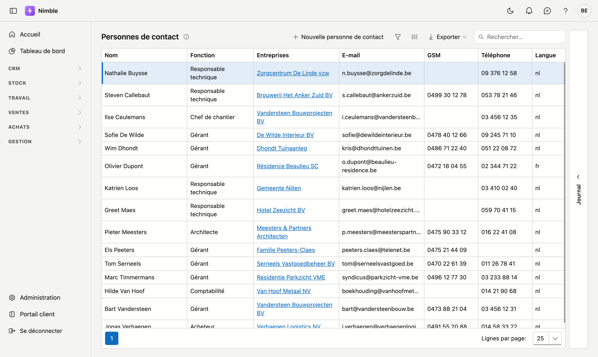
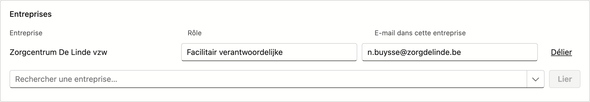

# Personnes de contact

Sur l'écran **Personnes de contact**, vous gérez les personnes derrière vos clients et fournisseurs : qui vous appelez, qui reçoit le devis, qui suit le chantier.

Une même personne peut être liée à **plusieurs entreprises**, chaque fois avec un rôle propre. Celui qui est gérant dans une entreprise peut être chef de chantier dans une autre.

## Ouvrir l'écran

Cliquez sur **CRM → Personnes de contact** dans la barre latérale.

!!! tip "Également depuis le client"
    Si vous travaillez à partir d'un client précis, c'est plus rapide via [Relations](../relations.fr.md) : l'onglet **Personnes de contact** sur la fiche, ou l'onglet **Contacts** dans le rail Journal.

## La liste

| Colonne | Signification |
|---|---|
| **Nom** | Prénom et nom de famille |
| **Fonction** | Le titre de fonction, issu de la liste [Fonctions de contact](../administration/contact-functions.fr.md) |
| **Entreprises** | Toutes les entreprises auxquelles cette personne est liée |
| **E-mail** | L'adresse personnelle |
| **GSM** et **Téléphone** | Les numéros |
| **Langue** | La langue de cette personne |

La recherche porte sur toutes les colonnes, y compris **Entreprises** — tapez un nom d'entreprise pour voir qui y travaille. Une personne liée à aucune entreprise affiche le message *liée à aucune entreprise* ; vous la retrouvez donc également ici.

- **Nouveau** — cliquez sur **Nouvelle personne de contact**.
- **Modifier** — **double-cliquez** une ligne.
- **Aller au client** — cliquez un nom d'entreprise dans la colonne **Entreprises** ; la fiche client s'ouvre directement.
- **Exporter** — la liste vers Excel ou CSV.
- **Journal** — cliquez à droite sur le rail **Journal** pour le côté de la personne sélectionnée :
    - **Tâches** — ce qui doit encore être fait pour cette personne.
    - **Journal** — ce qui s'est passé : notes et appels.
    - **Pièces jointes** — documents et photos liés à cette personne. Voir [Pièces jointes](../bijlagen.fr.md).

## La fiche de contact

### Bloc Personne

| Champ | Explication |
|---|---|
| **Prénom** | Optionnel. |
| **Nom de famille** | Obligatoire. |
| **Fonction** | Liste de choix ; recherchez en tapant. Gérée via **Administration → Fonctions de contact**. |

### Bloc Coordonnées

| Champ | Explication |
|---|---|
| **E-mail** | Optionnel, mais s'il est rempli, il doit être valide — le message apparaît pendant la saisie. |
| **GSM** et **Téléphone** | Texte libre. Le GSM figure en premier, car c'est en pratique le numéro qui est renseigné. |
| **Langue** | Pour une nouvelle personne, la langue de votre bureau est déjà proposée. |
| **Actif** | Décocher est un marqueur de statut, pas une suppression. |

### Bloc Adresse privée

Rue, code postal, commune et pays. Le code postal et la commune sont des listes de recherche qui se complètent. Ce bloc reste généralement vide pour quelqu'un que vous joignez à une adresse professionnelle ; il est surtout utile pour les clients particuliers.

### Bloc Entreprises

Vous liez ici la personne aux entreprises où elle travaille.

| Colonne | Explication |
|---|---|
| **Entreprise** | La relation. |
| **Rôle** | Ce que cette personne fait dans **cette** entreprise — indépendamment de son titre de fonction ci-dessus. |
| **E-mail dans cette entreprise** | Une adresse différente de l'adresse personnelle. Laissez vide pour utiliser l'adresse personnelle ; elle apparaît en gris dans le champ. |

- **Lier** — choisissez une entreprise dans la liste de recherche et cliquez sur **Lier**.
- **Délier** — supprime le lien. La personne elle-même subsiste.

!!! note "Tout est enregistré avec Enregistrer"
    Les liens, les rôles et les adresses e-mail ne sont écrits qu'au moment où vous cliquez sur **Enregistrer**. **Annuler** laisse tout en l'état — y compris les liens.

## En bas de la fiche

- **Enregistrer** — actif dès qu'un nom de famille est saisi et que toutes les adresses e-mail sont valides.
- **Annuler** — revient à la liste sans conserver.
- **Supprimer** — uniquement pour une personne existante. La fiche est **archivée** dans la **Corbeille** ; les liens avec les entreprises subsistent, si bien que la restauration ramène la personne avec ses entreprises.

## Erreurs fréquentes

!!! warning
    - **Confondre fonction et rôle** — la **fonction** est ce que la personne *est* (comptable), le **rôle** est ce qu'elle fait dans une entreprise précise. Qui porte deux casquettes chez deux clients a une fonction et deux rôles.
    - **Remplir l'e-mail d'une entreprise avec la même adresse** — laissez vide ; l'adresse personnelle suivra automatiquement, même si elle change plus tard.
    - **Supprimer une personne pour la retirer d'un client** — utilisez **Délier**. Supprimer archive la personne partout.
    - **Décocher Actif pour supprimer quelqu'un** — c'est **Supprimer** qui sert à cela.

## Voir aussi

- [Relations](../relations.fr.md) — les entreprises auxquelles ces personnes sont liées
- [Fonctions de contact](../administration/contact-functions.fr.md) — la liste des titres de fonction
- [Travailler avec une fiche](../fiches.md) — adresse propre, onglets, enregistrer et archiver
