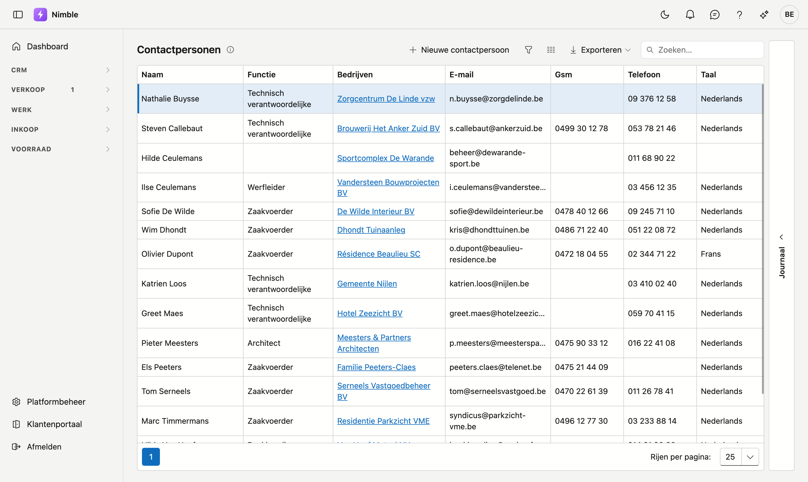
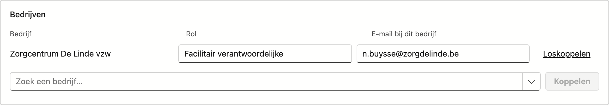

# Contactpersonen

Op het scherm **Contactpersonen** beheert u de mensen achter uw klanten en leveranciers: wie u belt, wie de offerte krijgt, wie de werf opvolgt.

Eén persoon kan aan **meerdere bedrijven** hangen, telkens met een eigen rol. Wie bij het ene bedrijf zaakvoerder is, kan bij het andere werfleider zijn.

## Het scherm openen

Klik in de zijbalk op **CRM → Contactpersonen**.

!!! tip "Ook vanuit de klant"
    Werkt u vanuit een bepaalde klant, dan gaat het sneller via [Relaties](../relations.md): het tabblad **Contactpersonen** op de fiche, of het tabblad **Contacten** in de journaal-rail.

## De lijst

| Kolom | Betekenis |
|---|---|
| **Naam** | Voornaam en achternaam |
| **Functie** | De functietitel, uit de lijst [Contactfuncties](../administration/contact-functions.md) |
| **Bedrijven** | Alle bedrijven waar deze persoon aan hangt |
| **E-mail** | Het persoonlijke adres |
| **Gsm** en **Telefoon** | De nummers |
| **Taal** | De taal van deze persoon |

<!-- AFBEELDING: de journaal-rail open met de Taken-tab, naast de contactenlijst -->

De zoekbalk zoekt over alle kolommen, ook over **Bedrijven** — typ een bedrijfsnaam om te zien wie daar werkt. Een persoon die aan geen enkel bedrijf hangt, toont de melding *aan geen bedrijf gekoppeld*; ook die vindt u hier terug.

- **Nieuw** — klik op **Nieuwe contactpersoon**.
- **Bewerken** — **dubbelklik** een rij.
- **Naar de klant springen** — klik een bedrijfsnaam in de kolom **Bedrijven** aan; de klantenfiche opent meteen.
- **Exporteren** — de lijst naar Excel of CSV.
- **Journaal** — klik rechts op de rail **Journaal** voor de zijkant van de geselecteerde persoon:
    - **Taken** — wat er voor deze persoon nog moet gebeuren.
    - **Logboek** — wat er gebeurd is: notities en oproepen.
    - **Bijlagen** — documenten en foto's bij deze persoon. Zie [Bijlagen](../bijlagen.md).

## De contactfiche

### Blok Persoon

| Veld | Uitleg |
|---|---|
| **Voornaam** | Optioneel. |
| **Achternaam** | Verplicht. |
| **Functie** | Keuzelijst; zoek door te typen. Beheerd via **Platformbeheer → Contactfuncties**. |

### Blok Bereikbaarheid

| Veld | Uitleg |
|---|---|
| **E-mail** | Optioneel, maar ingevuld moet het geldig zijn — u ziet de melding tijdens het typen. |
| **Gsm** en **Telefoon** | Vrije tekst. Gsm staat eerst, omdat dat in de praktijk het nummer is dat ingevuld raakt. |
| **Taal** | Bij een nieuwe persoon staat de taal van uw bedrijf al voorgesteld. |
| **Actief** | Uitvinken is een statusmarkering, geen verwijdering. |

### Blok Privéadres

Straat, postcode, gemeente en land. Postcode en gemeente zijn zoeklijsten die elkaar aanvullen. Dit blok blijft meestal leeg voor iemand die u op een bedrijfsadres bereikt; het is vooral nuttig bij particuliere klanten.

### Blok Bedrijven

Hier koppelt u de persoon aan de bedrijven waar hij werkt.

| Kolom | Uitleg |
|---|---|
| **Bedrijf** | De relatie. |
| **Rol** | Wat deze persoon bij **dit** bedrijf doet — los van zijn functietitel hierboven. |
| **E-mail bij dit bedrijf** | Een adres dat afwijkt van het persoonlijke. Laat het leeg om het persoonlijke adres te gebruiken; dat staat als grijze suggestie in het veld. |

- **Koppelen** — kies een bedrijf in de zoeklijst en klik op **Koppelen**.
- **Loskoppelen** — haalt de koppeling weg. De persoon zelf blijft bestaan.

!!! note "Alles gaat pas mee bij Opslaan"
    Ook koppelingen, rollen en e-mailadressen worden pas weggeschreven wanneer u op **Opslaan** klikt. **Annuleren** laat alles zoals het was — ook de koppelingen.

## Onderaan de fiche

- **Opslaan** — actief zodra er een achternaam staat en alle e-mailadressen geldig zijn.
- **Annuleren** — gaat terug naar de lijst zonder te bewaren.
- **Verwijderen** — alleen bij een bestaande persoon. De fiche wordt **gearchiveerd** naar de **Prullenbak**; de koppelingen met bedrijven blijven bestaan, zodat herstellen de persoon mét zijn bedrijven terugbrengt.

## Veelgemaakte fouten

!!! warning
    - **Functie en rol verwarren** — de **functie** is wat de persoon ís (boekhouder), de **rol** is wat hij bij één bepaald bedrijf doet. Wie bij twee klanten een andere pet draagt, heeft één functie en twee rollen.
    - **Het e-mailadres bij een bedrijf invullen met hetzelfde adres** — laat het leeg; dan volgt het automatisch het persoonlijke adres, ook als dat later wijzigt.
    - **Een persoon verwijderen om hem van een klant te halen** — gebruik **Loskoppelen**. Verwijderen archiveert de persoon overal.
    - **Actief uitvinken om iemand te verwijderen** — daarvoor dient **Verwijderen**.

## Zie ook

- [Relaties](../relations.md) — de bedrijven waar deze personen aan hangen
- [Contactfuncties](../administration/contact-functions.md) — de lijst met functietitels
- [Werken met een fiche](../fiches.md) — eigen adres, tabbladen, opslaan en archiveren
