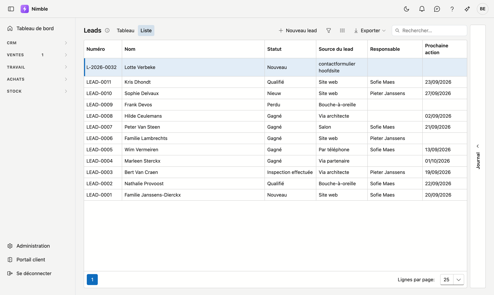
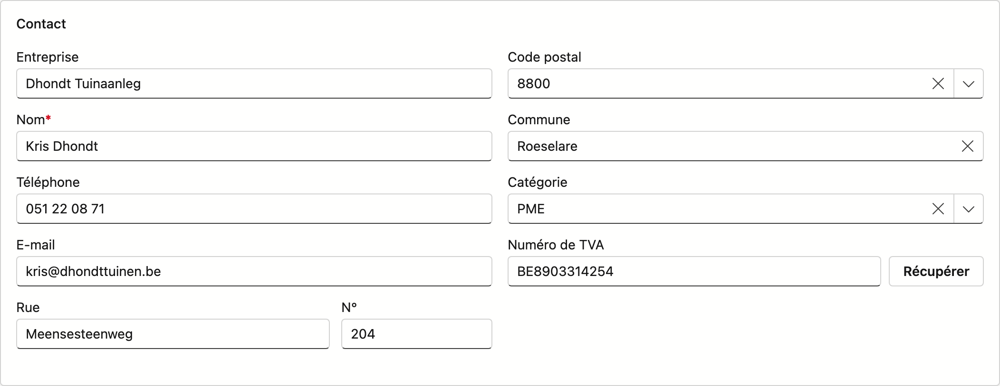
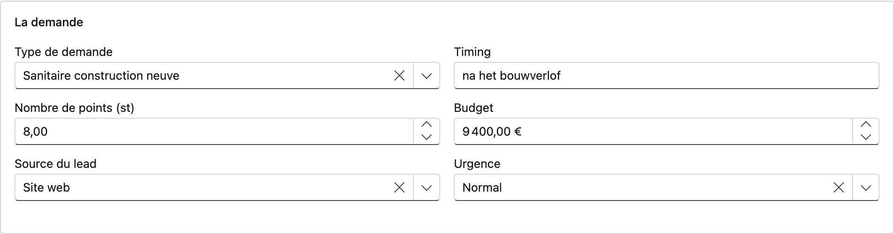
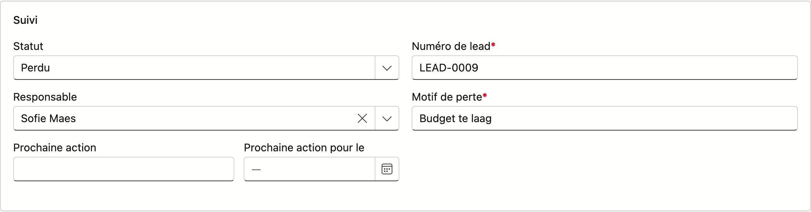

# Leads

L'écran **Leads** vous permet de suivre chaque demande, du premier contact jusqu'à la conversion en
client. Un lead traverse une série fixe de statuts (le pipeline) ; vous choisissez vous-même de le
consulter sous forme de tableau ou de liste.

## Ouvrir l'écran

Cliquez dans la barre latérale sur **CRM → Leads**.

## Vue tableau ou liste

En haut, basculez entre **Tableau** et **Liste** — les deux affichent les mêmes leads, seule la forme
diffère.

### Tableau

Chaque colonne est un statut du pipeline (Nouveau, Qualifié, Offre, Perdu …). Le nom de chaque colonne
est retraduisible via **Administration → Statut de lead** ; un statut marqué « Masqué » là-bas n'apparaît
pas ici comme colonne — sauf s'il contient encore un lead.

- Chaque carte affiche : le nom, la commune (ou le numéro de lead s'il n'y a pas de commune), le
  responsable et le budget.
- **Glissez** une carte vers une autre colonne pour changer le statut. Cliquez une carte pour ouvrir la
  fiche complète.
- En bas de chaque colonne figure la somme du budget des leads qu'elle contient.
- Une carte avec un avertissement jaune demande de l'attention : la prochaine action est échue, ou la
  date de réactivation (En attente) est dépassée. C'est purement visuel — rien n'est enregistré en plus.
- Cliquez sur l'icône d'information à côté du titre pour un rappel rapide du fonctionnement du tableau.

!!! warning "Perdu et En attente demandent une étape supplémentaire"
    Glisser une carte vers **Perdu** demande d'abord un **motif de perte** ; glisser une carte vers **En
    attente** demande une **date de réactivation**. Sans ces informations, le déplacement n'a pas lieu —
    la carte reste dans sa colonne d'origine.

### Liste

La vue tableau classique, avec les colonnes **Numéro**, **Nom**, **Statut**, **Source du lead**,
**Responsable** et **Prochaine action**. Double-cliquez une ligne pour ouvrir la fiche, ou utilisez
**Nouveau lead** pour en créer un. Cette vue se prête mieux au filtrage, au tri et à l'export que le
tableau.

## La fiche du lead

Un double-clic sur une carte comme sur une ligne de la liste ouvre la même fiche — une page à part
entière, avec sa propre adresse, que vous pouvez transmettre. À gauche l'onglet **Fiche**, à droite
**Tâches**, **Journal** et **Pièces jointes**. Les boutons du bas appartiennent à la fiche ; sur un
onglet du journal, ils ne s'affichent pas. Voir [Travailler avec une fiche](../fiches.md).

L'onglet **Fiche** est structuré en trois blocs — dans l'ordre où vous recevez généralement ces
informations au téléphone.

### Bloc Contact

| Champ | Remarque |
|---|---|
| **Nom** | Obligatoire |
| **Téléphone** | |
| **E-mail** | Optionnel, mais doit être valide si renseigné — une alerte s'affiche immédiatement en cas d'adresse invalide |
| **Rue / N°** | |
| **Code postal / Commune** | Tapez dans l'un des deux champs et cherchez dans la liste ; l'autre champ se complète automatiquement |
| **Catégorie** | Catégorie client optionnelle |
| **Numéro de TVA** | Optionnel — voir ci-dessous |

**Récupérer les données depuis la BCE :** saisissez le numéro de TVA et cliquez sur **Récupérer**. Nimble
complète automatiquement le nom et l'adresse depuis la Banque-Carrefour des Entreprises (KBO/BCE), dans
la langue de votre écran. Si rien n'est trouvé, un message s'affiche et les champs restent tels que vous
les avez saisis.

### Bloc La demande

| Champ | Remarque |
|---|---|
| **Type de demande** | Ce que le lead demande précisément (toiture, sauna, conduite …) — géré via **Administration → Types de demande** |
| **Question de taille** | N'apparaît que si le type sélectionné en a une (p. ex. m², nombre de personnes, mètre courant) ; le libellé et l'unité suivent le type |
| **Source du lead** | D'où provient le lead — géré via **Administration → Sources de leads** |
| **Timing** | Texte libre, p. ex. « printemps 2027 » |
| **Budget** | Montant estimé |
| **Urgence** | Faible / Normal / Élevé — réglé par défaut sur **Normal** pour un nouveau lead |

### Bloc Suivi

| Champ | Remarque |
|---|---|
| **Statut** | Le statut du pipeline ; les statuts masqués sans lead n'apparaissent pas dans la liste |
| **Responsable** | L'utilisateur qui suit le lead |
| **Numéro de lead** | Proposé automatiquement pour un nouveau lead — vous pouvez l'écraser, mais le champ reste obligatoire |
| **Prochaine action / Date** | Quelle est la prochaine étape et pour quand |
| **Motif de perte** | Apparaît et devient **obligatoire** dès que le statut est **Perdu** |
| **Date de réactivation** | Apparaît et devient **obligatoire** dès que le statut est **En attente** |

### Onglet Journal

Vous y trouvez tout ce qui s'est passé autour de ce lead, en trois listes que vous basculez en haut :

<!-- AFBEELDING: la fiche du lead avec l'onglet Tâches ouvert -->

- **Tâches** — ce qui doit encore être fait. Les tâches de suivi que Nimble crée lui-même (voir
  ci-dessous) s'y trouvent aussi.
- **Journal** — ce qui s'est passé : les notes que vous ajoutez, les appels que vous enregistrez, et le
  texte complet des demandes arrivées via le site web.
- **Pièces jointes** — documents et photos liés à ce lead : un plan envoyé par le client, une photo de la
  situation existante. Voir [Pièces jointes](../bijlagen.fr.md).

L'onglet n'apparaît que pour un lead **existant** — un nouveau lead n'a pas encore de numéro auquel
rattacher des tâches ou des notes. Enregistrez-le d'abord.

## Suivi automatique

Chaque matin, Nimble vérifie lui-même quels leads restent en plan et en crée une tâche. Vous retrouvez
ces tâches dans le **Journal** du lead et dans l'écran **Tâches**.

| Quand | Ce que vous recevez |
|---|---|
| L'**action suivante** était prévue à une date dépassée et le lead ne bouge pas | Tâche *« Action suivante expirée »* |
| Un lead **En attente** a atteint sa **date de réactivation** | Tâche *« Reprendre le lead »* |
| Aucune **action suivante** n'est prévue et il ne s'est rien passé depuis un moment | Tâche *« Lead à l'arrêt »* |

!!! info "Vous ne recevez jamais deux fois le même rappel"
    Si la tâche est déjà ouverte, Nimble n'en crée pas une seconde. Si vous la clôturez et que le lead
    reste ensuite de nouveau en plan, une nouvelle tâche suit bien.

## Leads via votre site web

Lorsqu'une personne remplit le formulaire de contact de votre site web, cette demande arrive directement
dans Nimble — vous n'avez rien à recopier.

<!-- AFBEELDING: le Journal d'un lead avec une demande arrivée du site web — nécessite un lead venu du site, absent du tenant de démo -->

- Un lead est créé au statut **Nouveau**. La **source** est le nom de la clé de site web avec laquelle
  le formulaire a posté — vous voyez ainsi de quel formulaire le lead provient. Voir
  [Les leads depuis votre site web](leads-webformulier.md).
- Le **contenu complet du formulaire** est repris dans le **Journal** de ce lead, y compris les champs
  propres à votre formulaire. Ainsi, rien ne se perd.
- Une **tâche** est ajoutée et un **e-mail** part vers l'adresse configurée dans
  [Fiche d'entreprise → Leads du site web vers](../settings/company-profile.md).

!!! info "Une deuxième demande de la même adresse ne devient pas un deuxième lead"
    Si quelqu'un utilisant la même adresse e-mail demande encore quelque chose alors que son lead
    précédent est toujours en cours, la nouvelle demande arrive comme **ligne de journal sur ce lead
    existant** — avec une tâche. Vous n'avez donc pas deux cartes de la même personne dans votre
    pipeline.

    Si son lead précédent était déjà **gagné, perdu ou converti en client**, il s'agit bien d'un nouveau
    lead. Qui revient après un dossier clôturé représente une nouvelle opportunité.

    Si la personne n'a **pas indiqué d'adresse e-mail**, Nimble ne peut pas comparer et crée toujours un
    nouveau lead. Un doublon dans la liste vous coûte une minute ; une demande manquée vous coûte un
    client.

### En bas de la fiche

- **Enregistrer** — enregistre le lead. Si le statut est Perdu ou En attente sans les données
  obligatoires correspondantes, le bouton reste désactivé.
- **Annuler** — revient à la liste sans enregistrer.
- **Convertir en client** — visible uniquement pour un lead existant, pas encore converti. Transforme le
  lead en relation (client) ; la fiche affiche ensuite un message confirmant la conversion. Les
  coordonnées, l'adresse, le numéro de TVA, la catégorie, la **source du lead** et le **responsable**
  accompagnent la fiche client. Les données de la demande (type de demande, ampleur, budget, timing,
  urgence, prochaine action) restent sur le lead, mais sont lisibles sur la fiche client dans le bloc
  **Issu d'un lead** — voir [Relations](../relations.fr.md).
- **Supprimer** — uniquement pour un lead existant. Archive le lead dans la corbeille ; rien n'est
  supprimé définitivement.

## Erreurs fréquentes

!!! warning
    - **Motif de perte ou date de réactivation manquant lors du glisser-déposer** — le déplacement sur le
      tableau n'a alors pas lieu ; complétez le champ demandé dans la fenêtre contextuelle.
    - **Adresse e-mail invalide** — la fiche ne refuse pas immédiatement l'enregistrement, mais affiche un
      avertissement ; corrigez-le avant d'enregistrer.
    - **Numéro de lead vidé sans remplacement** — le champ est obligatoire ; ne laissez pas le champ vide
      après l'avoir écrasé.
    - **Tenter de convertir deux fois** — si un lead est déjà converti, le bouton **Convertir en client**
      n'est plus visible ; utilisez la fiche client elle-même pour d'autres modifications.

## Voir aussi

- [Fiche d'entreprise](../settings/company-profile.md) — configurer qui reçoit les leads du site web
- [Sources de leads](../administration/lead-sources.md)
- [Types de demande](../administration/lead-request-types.md)
- [Statut de lead](../administration/lead-status.md)
- [Relations](../relations.md)
- [Filtrer les listes](../lijsten-filteren.md) — le bouton entonnoir, le générateur de filtres et la barre de filtre
- [Travailler avec une fiche](../fiches.md) — adresse propre, onglets, enregistrer et archiver
