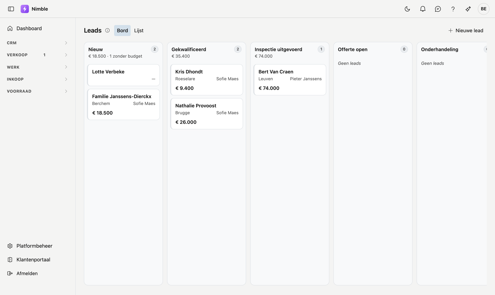
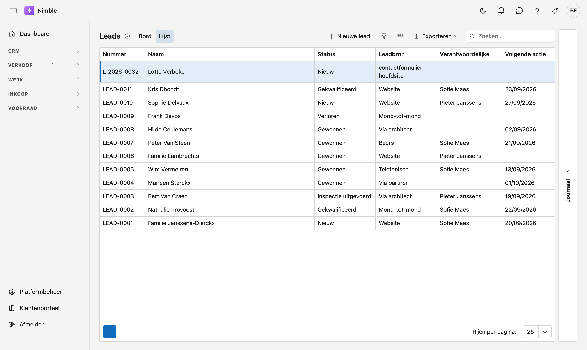
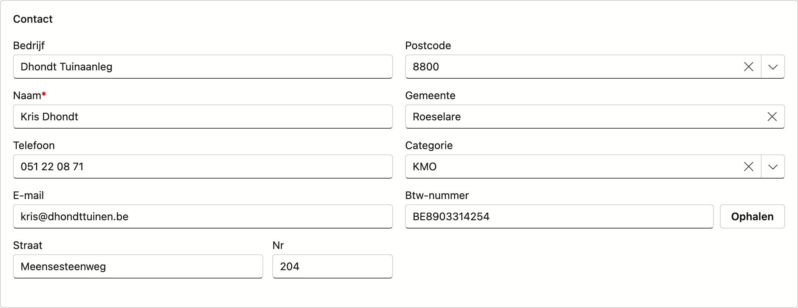
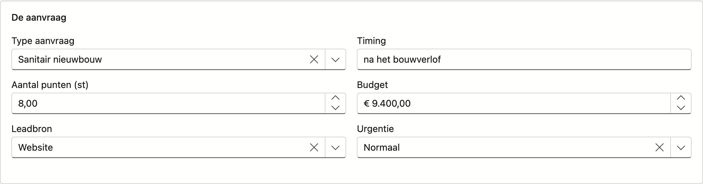
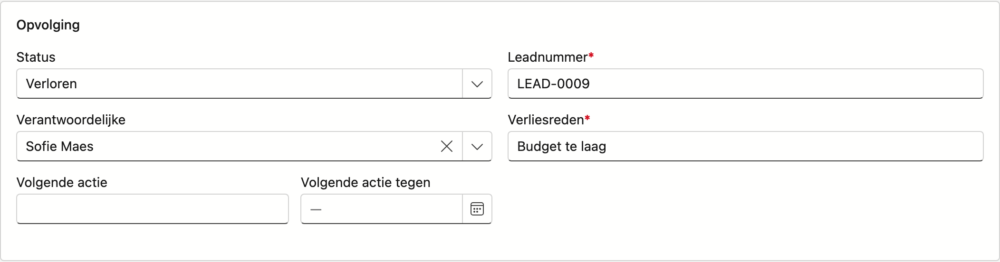

# Leads

Op het scherm **Leads** volgt u elke aanvraag op, van het eerste contact tot de omzetting naar klant.
Een lead doorloopt een vaste reeks statussen (de pijplijn); u kiest zelf of u die als bord of als lijst
bekijkt.

## Het scherm openen

Klik in de zijbalk op **CRM → Leads**.

## Bord- of lijstweergave

Bovenaan schakelt u tussen **Bord** en **Lijst** — beide tonen dezelfde leads, enkel de vorm verschilt.

### Bord

Elke kolom is een fase uit uw pijplijn (Nieuw, Gekwalificeerd, Offerte, Verloren …). Welke fases dat zijn,
stelt u zelf in — zie [Leadfases](../administration/lead-status.md). De naam van elke
kolom is hertaalbaar via **Platformbeheer → Leadstatus**; een status die daar op "Verborgen" staat, mist
u hier als kolom — tenzij er nog een lead in die status staat.

- Elke kaart toont: naam, gemeente (of leadnummer als er geen gemeente is), verantwoordelijke en budget.
- **Sleep** een kaart naar een andere kolom om de status te wijzigen. Klik een kaart om de volledige
  fiche te openen.
- Onderaan elke kolom staat de som van het budget van de leads erin.
- Een kaart met een gele waarschuwing heeft aandacht nodig: de volgende actie is verlopen, of de
  heractivatiedatum (On hold) is voorbij. Dit is puur visueel — er wordt niets extra opgeslagen.
- Klik op het info-icoon naast de titel voor een korte herinnering aan hoe het bord werkt.

!!! warning "Verloren en On hold vragen een extra stap"
    Een kaart naar **Verloren** slepen vraagt eerst een **verliesreden**; een kaart naar **On hold**
    slepen vraagt een **heractivatiedatum**. Zonder die gegevens in te vullen, gaat de verplaatsing niet
    door — de kaart blijft in de kolom waar ze stond.

### Lijst

De klassieke tabelweergave, met kolommen **Nummer**, **Naam**, **Status**, **Leadbron**,
**Verantwoordelijke** en **Volgende actie**. Dubbelklik op een rij om de fiche te openen, of gebruik
**Nieuwe lead** om er een aan te maken. Deze weergave leent zich beter voor filteren, sorteren en
exporteren dan het bord.

## De leadfiche

Zowel een dubbelklik op een kaart als op een lijstrij opent dezelfde fiche — een eigen pagina met een
eigen adres, die u kunt doorsturen. Links staat het tabblad **Fiche**, rechts staan **Taken**,
**Logboek** en **Bijlagen**. De knoppen onderaan horen bij de fiche; op een journaal-tabblad ziet u ze
niet. Zie [Werken met een fiche](../fiches.md).

Het tabblad **Fiche** is opgebouwd in drie blokken — dezelfde volgorde waarin u de informatie doorgaans
aan de telefoon te horen krijgt.

### Blok Contact

| Veld | Opmerking |
|---|---|
| **Naam** | Verplicht |
| **Telefoon** | |
| **E-mail** | Optioneel, maar moet geldig zijn als u iets invult — u krijgt meteen een melding bij een ongeldig adres |
| **Straat / Nr** | |
| **Postcode / Gemeente** | Typ in een van beide velden en zoek in de lijst; het andere veld vult automatisch aan |
| **Categorie** | Optionele klantcategorie |
| **Btw-nummer** | Optioneel — zie hieronder |

**Gegevens ophalen uit de KBO:** vul het btw-nummer in en klik op **Ophalen**. Nimble vult naam en adres
automatisch aan vanuit de Kruispuntbank van Ondernemingen (KBO/BCE), in de taal van uw scherm. Wordt er
niets gevonden, dan verschijnt een melding en blijven de velden zoals u ze zelf invulde.

### Blok De aanvraag

| Veld | Opmerking |
|---|---|
| **Type aanvraag** | Wat de lead precies vraagt (dakwerk, sauna, leiding …) — beheerd via **Platformbeheer → Types aanvraag** |
| **Omvangvraag** | Verschijnt enkel als het gekozen type er een heeft (bv. m², aantal personen, lopende meter); het bijschrift en de eenheid volgen het type |
| **Leadbron** | Waar de lead vandaan komt — beheerd via **Platformbeheer → Leadbronnen** |
| **Timing** | Vrije tekst, bv. "voorjaar 2027" |
| **Budget** | Geschat bedrag |
| **Urgentie** | Laag / Normaal / Hoog — staat standaard op **Normaal** bij een nieuwe lead |

### Blok Opvolging

| Veld | Opmerking |
|---|---|
| **Status** | De pijplijnstatus; verborgen statussen zonder leads verschijnen niet in de lijst |
| **Verantwoordelijke** | De gebruiker die de lead opvolgt |
| **Leadnummer** | Wordt bij een nieuwe lead automatisch voorgesteld — u mag het overschrijven, maar het veld is verplicht |
| **Volgende actie / Datum** | Wat de volgende stap is en tegen wanneer |
| **Verliesreden** | Verschijnt en is **verplicht** zodra de status **Verloren** is |
| **Heractivatiedatum** | Verschijnt en is **verplicht** zodra de fase *gepauzeerd* betekent (standaard: **On hold**) |

### Tabblad Journaal

Hier staat alles wat er rond deze lead gebeurd is, in drie lijsten die u bovenaan omschakelt:

<!-- AFBEELDING: de leadfiche met het tabblad Taken open -->

- **Taken** — wat er nog moet gebeuren. Opvolgtaken die Nimble zelf aanmaakt (zie hieronder) staan hier
  ook tussen.
- **Logboek** — wat er gebeurd is: notities die u zelf toevoegt, telefoongesprekken die u registreert, en
  de volledige tekst van aanvragen die via de website binnenkwamen.
- **Bijlagen** — documenten en foto's bij deze lead: een plan dat de klant meestuurde, een foto van de
  bestaande situatie. Zie [Bijlagen](../bijlagen.md).

Het tabblad verschijnt pas bij een **bestaande** lead — een nieuwe lead heeft nog geen nummer om taken of
notities aan te hangen. Bewaar ze eerst.

## Automatische opvolging

Nimble kijkt elke ochtend zelf na welke leads blijven liggen en maakt daar een taak van. U vindt die
taken in het **Journaal** van de lead en in het scherm **Taken**.

| Wanneer | Wat u krijgt |
|---|---|
| De **volgende actie** stond op een datum die voorbij is en de lead beweegt niet | Taak *"Volgende actie verlopen"* |
| Een lead op **On hold** heeft zijn **heractivatiedatum** bereikt | Taak *"Lead weer oppakken"* |
| Er staat **geen volgende actie** gepland en er gebeurde al een tijd niets | Taak *"Lead ligt stil"* |

!!! info "U krijgt nooit twee keer dezelfde herinnering"
    Staat de taak er al open, dan maakt Nimble er geen tweede bij. Werkt u de taak af en blijft de lead
    daarna opnieuw liggen, dan volgt er wél een nieuwe.

## Leads via uw website

Vult iemand het contactformulier op uw website in, dan komt die aanvraag rechtstreeks in Nimble terecht —
u hoeft niets over te typen.

<!-- AFBEELDING: het Logboek van een lead met een binnengekomen website-aanvraag — vraagt een website-lead; die staat niet in de demo-tenant -->

- Er wordt een lead aangemaakt in status **Nieuw**. De **leadbron** is de naam van de websitesleutel
  waarmee het formulier postte — zo ziet u van welk formulier de lead kwam. Zie
  [Leads vanaf uw website](leads-webformulier.md).
- De **volledige inhoud van het formulier** komt in het **Logboek** van die lead te staan, ook de velden
  die enkel op uw eigen formulier voorkomen. Zo gaat er niets verloren.
- Er komt een **taak** bij, en er vertrekt een **e-mail** naar het adres dat u instelde bij
  [Bedrijfsfiche → Website-leads naar](../settings/company-profile.md).

!!! info "Een tweede aanvraag van hetzelfde adres wordt geen tweede lead"
    Vraagt iemand met hetzelfde e-mailadres nog iets, en loopt zijn vorige lead nog, dan komt de nieuwe
    aanvraag als **logboekregel bij die bestaande lead** — met een taak erbij. Zo staat er geen tweede
    kaart van dezelfde persoon in uw pijplijn.

    Was zijn vorige lead al **gewonnen, verloren of omgezet naar klant**, dan is het wél een nieuwe lead.
    Wie na een afgesloten dossier opnieuw aanklopt, is een nieuwe kans.

    Vulde iemand **geen e-mailadres** in, dan kan Nimble niet vergelijken en wordt het altijd een nieuwe
    lead. Een dubbel in de lijst kost u een minuut; een gemiste aanvraag kost u een klant.

### Onderaan de fiche

- **Opslaan** — bewaart de lead. Betekent de fase *verloren* of *gepauzeerd* zonder de bijhorende verplichte
  gegevens, dan blijft de knop uitgeschakeld.
- **Annuleren** — gaat terug naar de lijst zonder te bewaren.
- **Omzetten naar klant** — enkel zichtbaar bij een bestaande, nog niet omgezette lead. Maakt van de lead
  een relatie (klant); de fiche toont daarna een melding dat de lead is omgezet. Contactgegevens, adres,
  btw-nummer, categorie, **leadbron** en **verantwoordelijke** gaan mee naar de klantenfiche. De
  aanvraaggegevens (type aanvraag, omvang, budget, timing, urgentie, volgende actie) blijven op de lead
  staan, maar zijn op de klantenfiche leesbaar in het blok **Afkomstig van een lead** — zie
  [Relaties](../relations.md).
- **Verwijderen** — enkel bij een bestaande lead. Archiveert de lead naar de prullenbak; niets wordt
  definitief gewist.

## Veelgemaakte fouten

!!! warning
    - **Geen verliesreden of heractivatiedatum bij het slepen** — de verplaatsing op het bord gaat dan
      niet door; vul het gevraagde veld in het popupvenster in.
    - **Ongeldig e-mailadres** — de fiche weigert dan niet meteen op te slaan, maar toont wel een
      waarschuwing; los ze op vóór u opslaat.
    - **Leadnummer verwijderen zonder vervanging** — het veld is verplicht; laat het lege veld niet staan
      na het overschrijven.
    - **Twee keer proberen om te zetten** — is een lead al omgezet, dan is de knop **Omzetten naar klant**
      niet meer zichtbaar; gebruik de klantenfiche zelf voor verdere aanpassingen.

## Zie ook

- [Bedrijfsfiche](../settings/company-profile.md) — instellen wie website-leads krijgt
- [Leadbronnen](../administration/lead-sources.md)
- [Types aanvraag](../administration/lead-request-types.md)
- [Leadstatus](../administration/lead-status.md)
- [Relaties](../relations.md)
- [Lijsten filteren](../lijsten-filteren.md) — de trechterknop, de filterbouwer en de filterbalk
- [Werken met een fiche](../fiches.md) — eigen adres, tabbladen, opslaan en archiveren
