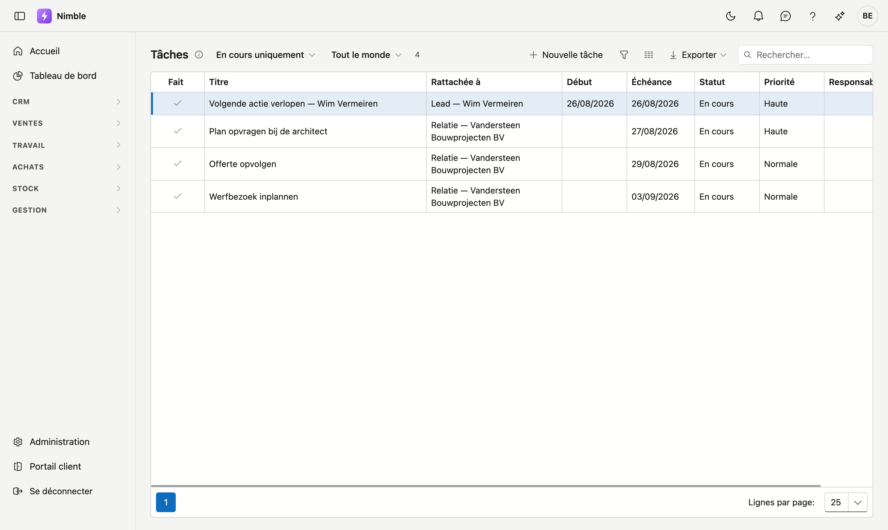

# Tâches

L'écran **Tâches** rassemble tout ce qui doit encore être fait, pour l'ensemble du logiciel : les tâches
liées à un lead, à un client, à un projet. C'est l'endroit par lequel commencer le matin.

## Ouvrir l'écran

Dans la barre latérale, cliquez sur **CRM → Tâches**.

## Filtrer la liste

En haut se trouvent deux filtres et un compteur.

- **En cours uniquement** — le réglage par défaut. Les tâches terminées restent hors de vue.
    - **Y compris terminées** les réaffiche.
    - **Tous les statuts** abandonne complètement la distinction.
- **Tout le monde** — ou un seul responsable. Vous ne voyez alors que ce qui vous revient.
- Le **compteur** à côté indique combien de tâches vous voyez. S'il y en a plus de mille, vous lisez par
  exemple « 1.000 sur 2.912 » — vous voyez alors les mille premières.

!!! info "Vous en voyez moins que prévu ?"
    Regardez les deux filtres. Une tâche sans responsable disparaît dès que vous filtrez sur une personne,
    et une tâche terminée disparaît sous **En cours uniquement**.

## Terminer une tâche

Cliquez sur la coche dans la première colonne, **Fait**. La tâche est aussitôt terminée.

Si la liste est sur **En cours uniquement**, elle disparaît de la vue. Vous avez été trop vite ? Passez le
filtre sur **Y compris terminées** et recliquez la coche — la tâche est de nouveau ouverte.

## Ouvrir ou créer une tâche

**Double-cliquez** sur une tâche pour l'ouvrir. Vous pouvez modifier :

| Champ | Remarque |
|---|---|
| **Titre** | Ce qui doit être fait. Obligatoire |
| **Description** | Texte libre avec les détails |
| **Début** et **Échéance** | Quand vous commencez et quand ce doit être prêt |
| **Statut** | Ouvert, En cours, Terminé ou Annulé |
| **Priorité** | Faible, Normale, Élevée ou Urgente |
| **Responsable** | Qui assure le suivi |

En bas de la fenêtre figure **Rattachée à** : le projet, la relation ou le lead auquel la tâche appartient.
C'est à titre indicatif — le rattachement se modifie sur la fiche elle-même.

**Nouvelle tâche** crée une tâche qui n'est rattachée à rien : une tâche libre.

!!! tip "La tâche concerne un dossier ? Créez-la depuis ce dossier"
    Une tâche créée depuis le **Journal** d'un lead, d'un client ou d'un projet est immédiatement rattachée
    au bon dossier. Elle apparaît ensuite dans cet aperçu, avec la référence dans la colonne
    **Rattachée à**.

## Les tâches qui apparaissent d'elles-mêmes

Nimble crée certaines tâches lui-même.

| D'où cela vient | Quand |
|---|---|
| Un lead dont l'**action suivante** est dépassée | Chaque matin, tant que le lead ne bouge pas |
| Un lead **En attente** dont la date de réactivation est atteinte | Le matin suivant cette date |
| Un lead avec lequel **rien ne s'est passé** depuis un certain temps | Chaque matin |
| Une demande via votre **site web** | Dès son arrivée |

Voir [Leads](leads.fr.md) pour les détails.

!!! info "Jamais deux fois le même rappel"
    Si une telle tâche est déjà ouverte, il n'y en a pas de deuxième. Si vous la terminez et que le lead
    reste ensuite de nouveau en plan, une nouvelle tâche suit bien.

## La cloche en haut

Si une tâche porte un **rappel** et que ce moment est passé, un compteur apparaît près de la cloche en haut
à droite. Un clic vous amène à cet écran.

!!! info "Le rappel se règle sur la fiche, pas ici"
    Le champ **Rappel** se trouve dans l'onglet **Tâches** du journal — sur la fiche du lead, du client ou
    du projet. Vous ne pouvez pas le régler depuis cet aperçu. Un rappel existant reste bien en place si
    vous modifiez la tâche ici.

## Emporter la liste

En haut à droite figure **Exporter** : la liste part vers Excel ou CSV, avec les filtres actifs à ce
moment-là. À côté se trouve un **champ de recherche** qui parcourt toutes les colonnes.

## Erreurs fréquentes

!!! warning
    - **Croire qu'il n'y a pas de tâches** alors qu'un filtre sur un seul responsable est actif. Mettez le
      filtre sur **Tout le monde**, surtout dans un dossier récemment repris — personne n'y a encore attribué
      de tâche.
    - **Perdre une tâche terminée** — mettez le filtre de statut sur **Y compris terminées**.
    - **Cliquer une fois en pensant ouvrir la tâche.** Une tâche s'ouvre par un **double-clic** ; un simple
      clic ne fait que sélectionner la ligne.

## Voir aussi

- [Leads](leads.fr.md) — d'où viennent les tâches de suivi automatiques
- [Relations](../relations.fr.md) — les tâches sur une fiche client
- [Notes](../notities.fr.md) — ce que vous notez vous-même sur un enregistrement
