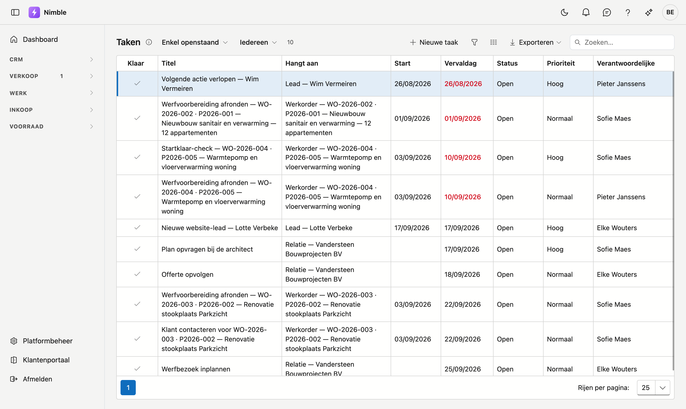
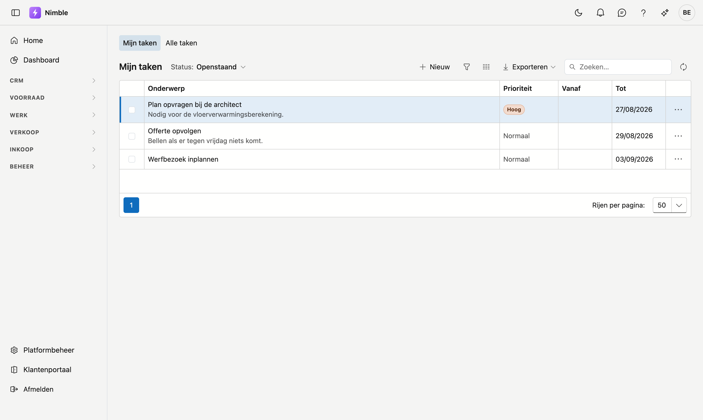

# Taken

Op het scherm **Taken** staat alles wat nog moet gebeuren, uit het hele pakket samen: taken bij een lead,
bij een klant, bij een project. Het is de plek om 's morgens te beginnen.

## Het scherm openen

Klik in de zijbalk op **CRM → Taken**.

## Mijn taken of alle taken

Bovenaan staan twee knoppen:

- **Mijn taken** — de taken waarvoor u de verantwoordelijke bent. Dit is de standaardweergave.
- **Alle taken** — alle openstaande taken van uw dossier, ongeacht wie ze opvolgt.

!!! info "Ziet u niets onder Mijn taken?"
    **Mijn taken** toont enkel de taken waarvoor u als verantwoordelijke staat. Een taak zonder
    verantwoordelijke staat er dus niet bij — die vindt u onder **Alle taken**.

    Wilt u ze verdelen, open dan een taak en vul **Verantwoordelijke** in. Vanaf dan verschijnt ze bij die
    persoon onder Mijn taken.

## Een taak afwerken

Vink het bolletje links van de taak aan. De taak verdwijnt uit de lijst.

Bent u te snel geweest, zet dan **Toon afgewerkte** rechtsboven aan: afgewerkte taken komen terug in beeld
en u kunt het vinkje weghalen.

## Een taak openen of aanmaken

Klik een taak om ze te openen. U kunt aanpassen:

| Veld | Opmerking |
|---|---|
| **Onderwerp** | Wat er moet gebeuren |
| **Omschrijving** | Vrije tekst met de details |
| **Van / Tot** | Wanneer u eraan begint en wanneer het klaar moet zijn |
| **Prioriteit** | Laag, Normaal, Hoog of Dringend — bepaalt de kleur van het label |
| **Verantwoordelijke** | Wie de taak opvolgt |
| **Herinnering** | Wanneer het belletje bovenaan moet afgaan |

Met **Nieuw** maakt u er zelf een aan.

!!! warning "Geen Nieuw-knop onder Alle taken"
    De knop **Nieuw** verschijnt alleen onder **Mijn taken**. In de volledige lijst is niet duidelijk bij
    wie een nieuwe taak zou horen, dus wordt ze daar niet aangeboden. Schakel terug naar Mijn taken om er
    een aan te maken — of maak ze aan vanuit het **Journaal** van de lead, klant of het project waar ze bij
    hoort. Dat laatste heeft de voorkeur: dan hangt de taak meteen aan het juiste dossier.

## Taken die vanzelf verschijnen

Sommige taken maakt Nimble zelf aan. U herkent ze aan het gekleurde codelabel onder het onderwerp.

| Waar het vandaan komt | Wanneer |
|---|---|
| Een lead met een verlopen **volgende actie** | Elke ochtend, zolang de lead niet beweegt |
| Een lead op **On hold** waarvan de heractivatiedatum bereikt is | De ochtend na die datum |
| Een lead waar **al een tijd niets** mee gebeurde | Elke ochtend |
| Een aanvraag via uw **website** | Zodra ze binnenkomt |

Zie [Leads](leads.md) voor de details.

!!! info "Nooit twee keer dezelfde herinnering"
    Staat zo'n taak al open, dan komt er geen tweede bij. Werkt u ze af en blijft de lead daarna opnieuw
    liggen, dan volgt er wél een nieuwe.

## Het belletje bovenaan

Staat er een herinnering op een taak en is dat moment voorbij, dan verschijnt er een teller bij het
belletje rechtsboven. Klikken brengt u naar dit scherm.

## Veelgemaakte fouten

!!! warning
    - **Denken dat er geen taken zijn** omdat Mijn taken leeg is — kijk onder **Alle taken**, zeker in een
      dossier dat pas is overgezet.
    - **Zoeken naar Nieuw onder Alle taken** — die knop staat er bewust niet.
    - **Een afgewerkte taak kwijt zijn** — zet **Toon afgewerkte** aan.

## Zie ook

- [Leads](leads.md) — waar de automatische opvolgtaken vandaan komen
- [Relaties](../relations.md) — taken op een klantenfiche
