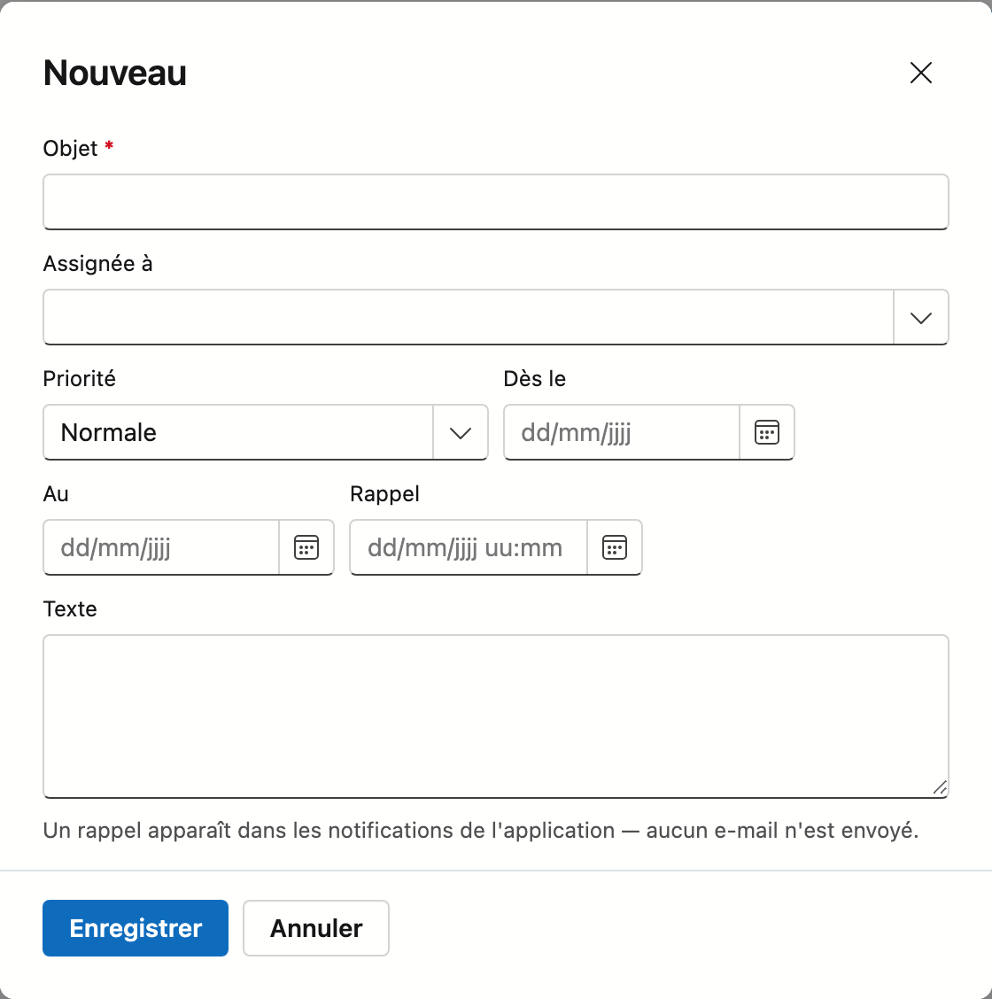
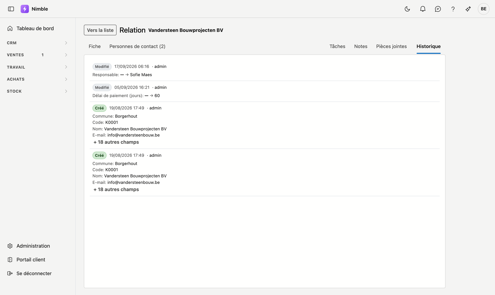

# Travailler avec une fiche

Un client, un lead, un article, une personne de contact — vous les ouvrez sur une **page dédiée** :
la fiche.

Cela fonctionne de la même manière sur **chaque fiche** de Nimble : cette page vaut donc pour tous les
écrans où vous ouvrez un enregistrement.

## Ouvrir une fiche

Double-cliquez une ligne dans la liste. Sur le tableau des leads, cliquez sur une carte.

Pour un nouvel enregistrement, utilisez le bouton en haut de la liste — **Nouvelle relation**,
**Nouvel article**, et ainsi de suite.

## Comment fonctionne une fiche

### Vous pouvez transmettre une fiche

Chaque fiche possède sa propre adresse web. Copiez la barre d'adresse et envoyez-la à un collègue :
il ouvrira exactement la même fiche.

C'est d'ailleurs le critère que nous utilisons pour décider si quelque chose mérite une fiche : *si vous
ne pouvez pas en faire un lien, ce n'est pas une entité.*

### Vers la liste

En haut à gauche se trouve **Vers la liste**. Le bouton Précédent de votre navigateur fonctionne
également et vous ramène à l'endroit de la liste d'où vous veniez.

### Modifications non enregistrées

Si vous avez modifié quelque chose et que vous quittez la page sans enregistrer, votre navigateur vous
demande d'abord confirmation.

### Onglets

En haut de la fiche se trouvent deux groupes d'onglets.

**À gauche**, les données de l'enregistrement lui-même. Sur la plupart des fiches il n'y en a qu'un —
**Général** ou **Fiche** — sur la fiche de relation il y en a deux, avec **Personnes de contact**.

**À droite**, le journal : **Tâches**, **Notes**, **Pièces jointes** et **Historique**. Ce sont les éléments rattachés
à l'enregistrement.

!!! info "Les boutons disparaissent sur un onglet du journal"
    Enregistrer et Supprimer appartiennent au formulaire. Si vous êtes sur **Pièces jointes**, ces boutons
    ne s'affichent pas — sinon « Supprimer » serait ambigu : cela supprimerait-il l'enregistrement ou la
    pièce jointe que vous consultez ?

### La barre d'outils d'un onglet du journal

Chaque onglet du journal a en haut une barre d'outils qui **reste visible** pendant que vous faites défiler
la liste. Inutile de remonter pour ajouter quelque chose.

| Onglet | Dans la barre d'outils |
|---|---|
| **Tâches** | **Nouveau**, et à droite la case **Afficher les terminées**. Par défaut, vous ne voyez que ce qui reste ouvert |
| **Notes** | **Note**, et à droite le champ **Rechercher dans les notes…** |
| **Pièces jointes** | **+ Pièce jointe**, et un champ de recherche |
| **Historique** | Rien : l'Historique est une consultation, vous n'y écrivez rien |

Vous ne voyez les boutons d'ajout que si vous pouvez modifier l'enregistrement.

### L'onglet Tâches

Chaque tâche est une carte avec le titre, la description, la priorité, la date à laquelle elle doit être
prête (**Au …**) et la personne qui la suit.

**Nouveau** ouvre une fenêtre avec ces champs :

| Champ | |
|---|---|
| **Objet** | Ce qui doit être fait. Obligatoire |
| **Attribuée à** | La personne qui suit la tâche |
| **Priorité** | Réglée par défaut sur **Normale** |
| **Dès le** et **Au** | Quand vous commencez et quand ce doit être prêt |
| **Rappel** | Une date et une heure. À ce moment, la tâche apparaît sous la cloche en haut de l'application — aucun e-mail n'est envoyé |
| **Texte** | Les détails |

Cliquez sur **Enregistrer**. La tâche apparaît aussi dans l'écran [Tâches](crm/tasks.md), rattachée à cet
enregistrement.

### L'onglet Notes

Notes est ce que vous rédigez vous-même sur cet enregistrement. Chaque note est une carte avec l'objet, le
texte et la date. **Les sauts de ligne sont conservés** : une note de trois lignes se lit comme trois
lignes. Voir [Notes](notities.fr.md).

### L'onglet Historique

L'Historique est l'**histoire de la fiche** : qui a modifié quel champ, quand, et de quelle valeur vers
quelle autre. Tout en bas figure qui a créé la fiche.

Vous n'y écrivez rien vous-même. Il n'y a pas de bouton d'ajout et vous ne pouvez rien supprimer — une
histoire dans laquelle on peut effacer n'est pas une histoire.

- Chaque ligne commence par une étiquette : **Créé**, **Modifié** ou **Supprimé**.
- En dessous figurent les champs qui ont changé, avec leur valeur avant et après.
- Si beaucoup de champs ont changé en même temps, vous voyez les quatre premiers puis
  **+ n autres champs**.
- L'historique affiche les 200 modifications les plus récentes ; s'il y en a davantage, la liste le
  signale en bas.

### L'onglet Pièces jointes

Les pièces jointes reçoivent la même barre d'outils, mais la liste est un **tableau**. La recherche porte
sur le nom et sur la description.

Le nombre de colonnes dépend de la largeur :

- **Sur un écran large**, fichier, description, taille et date figurent côte à côte.
- **Dans le panneau étroit du journal**, il reste fichier et description ; la taille et la date passent sous
  le nom du fichier. Ainsi, même un nom long comme `Vorderingsstaat_project_P2026-0004_augustus (1).xlsx`
  tient sans défilement latéral.

- **+ Pièce jointe** ouvre une fenêtre où vous choisissez des fichiers ou les y glissez. Vous pouvez en
  sélectionner **plusieurs à la fois** ; la description que vous indiquez vaut alors pour toute la série.
  Pour les décrire séparément, ajustez-les ensuite ligne par ligne via le menu **⋯**.
- Un clic sur le nom **ouvre** le fichier. Une photo s'affiche directement dans votre navigateur ;
  d'autres fichiers peuvent arriver en téléchargement. Voir [Pièces jointes](bijlagen.fr.md).
- La limite est de **25 Mo par fichier**.

## Enregistrer, annuler, supprimer

Les boutons se trouvent en bas à droite, dans cet ordre :

1. **Enregistrer** conserve, et vous restez sur la fiche. Une brève confirmation s'affiche. Un nouvel
   enregistrement a dès lors sa propre adresse, pour que vous puissiez continuer directement.
2. Les actions propres à cette fiche, comme **Convertir en client** sur un lead.
3. **Annuler** revient à la liste sans conserver.
4. **Supprimer** se trouve à part, tout à droite. Il demande d'abord une confirmation — voir ci-dessous.

S'il manque encore une donnée obligatoire lorsque vous cliquez sur **Enregistrer**, un message en haut de la
fiche indique quel champ. Les champs obligatoires portent un astérisque rouge.

!!! warning "Supprimer, c'est archiver"
    Si vous cliquez sur **Supprimer**, la question « Archiver ? » apparaît, avec le nom de
    l'enregistrement. Celui-ci disparaît de la liste et **reste conservé** ; vous le retrouvez dans la
    **Corbeille**.

## Qui peut modifier

Sur les fiches, Enregistrer et Supprimer dépendent de votre **droit de modification** — entre autres pour
les **Leads**, les **Relations**, les **Personnes de contact** et les **Articles**. Sans ce droit, vous pouvez
ouvrir et lire la fiche, mais vous ne voyez ni **Enregistrer** ni **Supprimer**. À la place d'**Annuler**
figure **Vers la liste**.

<!-- AFBEELDING: la même fiche sans droit de modification : champs en gris, seul le bouton retour — nécessite un utilisateur SANS droit de modification, absent du tenant de démo -->

Consulter relève du droit de consultation ; écrire exige le droit de modification. C'est un réglage
distinct par rôle.

## Erreurs fréquentes

!!! warning
    - **Croire que vous avez perdu l'aperçu.** La fiche occupe l'écran. **Vers la liste** ou le bouton
      Précédent de votre navigateur vous ramène à la ligne d'où vous veniez.
    - **Quitter en pensant que c'est enregistré.** Enregistrer le fait, partir non. La question de votre
      navigateur est votre dernière chance.
    - **Lire « Supprimer » comme définitif.** Il s'agit d'un archivage. Ce que vous retirez se trouve dans
      la Corbeille.

## Voir aussi

- [Filtrer les listes](lijsten-filteren.md)
- [Relations](relations.md)
- [Leads](crm/leads.md)
- [Articles](inventory/articles.md)
- [Personnes de contact](crm/contactpersonen.md)
