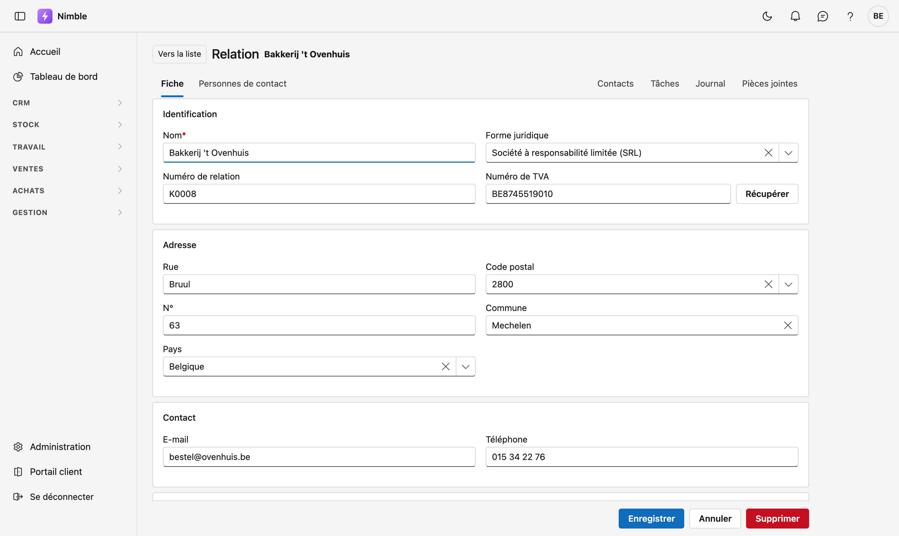

# Travailler avec une fiche

Un client, un lead, un article, une personne de contact — vous les ouvrez sur une **page à part entière**,
la fiche. Auparavant, c'était une fenêtre qui se superposait à la liste ; depuis août 2026, c'est une
véritable page avec sa propre adresse.

Cela fonctionne de la même manière sur **chaque fiche** de Nimble : cette page vaut donc pour tous les
écrans où vous ouvrez un enregistrement.

## Ouvrir une fiche

Double-cliquez une ligne dans la liste. Sur le tableau des leads, cliquez sur une carte.

Pour un nouvel enregistrement, utilisez le bouton en haut de la liste — **Nouvelle relation**,
**Nouvel article**, et ainsi de suite.

## Ce qui est nouveau

### Vous pouvez transmettre une fiche

Chaque fiche possède désormais sa propre adresse web. Copiez la barre d'adresse et envoyez-la à un
collègue : il ouvrira exactement la même fiche. Avec une fenêtre, c'était impossible — il n'y avait pas
d'adresse à partager.

C'est d'ailleurs le critère que nous utilisons pour décider si quelque chose mérite une fiche : *si vous
ne pouvez pas en faire un lien, ce n'est pas une entité.*

### Vers la liste

En haut à gauche se trouve **Vers la liste**. Le bouton Précédent de votre navigateur fonctionne
également et vous ramène à l'endroit de la liste d'où vous veniez.

### Votre travail ne se perd plus sans avertissement

Si vous avez modifié quelque chose et que vous quittez la page sans enregistrer, votre navigateur vous
demande d'abord confirmation. L'ancienne fenêtre ne le faisait pas : un clic à côté suffisait à perdre
votre saisie.

### Onglets

En haut de la fiche se trouvent deux groupes d'onglets.

**À gauche**, les données de l'enregistrement lui-même. Sur la plupart des fiches il n'y en a qu'un —
**Général** ou **Fiche** — sur la fiche de relation il y en a deux, avec **Personnes de contact**.

**À droite**, le journal : **Tâches**, **Journal**, **Pièces jointes**, et sur une relation également
**Contacts**. Ce sont les éléments rattachés à l'enregistrement.

!!! info "Les boutons disparaissent sur un onglet du journal"
    Enregistrer et Supprimer appartiennent au formulaire. Si vous êtes sur **Pièces jointes**, ces boutons
    ne s'affichent pas — sinon « Supprimer » serait ambigu : cela supprimerait-il l'enregistrement ou la
    pièce jointe que vous consultez ?

## Enregistrer, annuler, supprimer

En bas à droite.

- **Enregistrer** conserve et vous ramène à la liste. Une brève confirmation s'affiche.
- **Annuler** revient en arrière sans conserver.
- **Supprimer** demande d'abord une confirmation — voir ci-dessous.

!!! warning "Supprimer, c'est archiver, et c'est désormais annoncé"
    Si vous cliquez sur **Supprimer**, la question « Archiver ? » apparaît, avec le nom de
    l'enregistrement. Celui-ci disparaît de la liste et **reste conservé** ; vous le retrouvez dans la
    **Corbeille**.

    Dans l'ancienne fenêtre, cela se faisait sans question : un clic et l'enregistrement quittait la
    liste. D'où la confirmation.

## Qui peut modifier

Sur les fiches **Articles**, **Relations** et **Personnes de contact**, Enregistrer et Supprimer dépendent
de votre **droit de modification**. Sans ce droit, vous pouvez ouvrir et lire la fiche, mais les champs
sont en lecture seule et seul un bouton de retour vers la liste subsiste.

Consulter relève du droit de consultation ; écrire exige le droit de modification. C'est un réglage
distinct par rôle.

## Erreurs fréquentes

!!! warning
    - **Chercher la fiche là où se trouvait la fenêtre.** La fiche remplace la liste, elle ne se
      superpose plus. Vous quittez donc l'aperçu un instant — le bouton de retour vous y ramène.
    - **Quitter en pensant que c'est enregistré.** Enregistrer le fait, partir non. La question de votre
      navigateur est votre dernière chance.
    - **Lire « Supprimer » comme définitif.** Il s'agit d'un archivage. Ce que vous retirez se trouve dans
      la Corbeille.

## Voir aussi

- [Filtrer les listes](lijsten-filteren.md)
- [Relations](relations.md)
- [Leads](crm/leads.md)
- [Articles](inventory/articles.md)
- [Personnes de contact](crm/contactpersonen.md)
